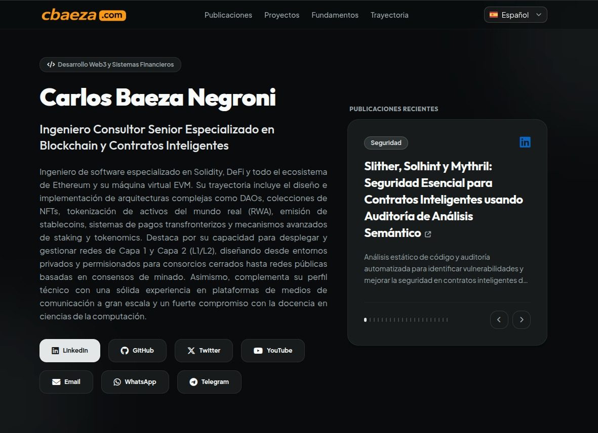

# 🌐 cbaeza.com — Portafolio Personal Profesional



Este es el repositorio oficial del sitio web y portafolio personal de **Carlos Baeza Negroni**, Ingeniero Consultor Senior especializado en Blockchain, Contratos Inteligentes (Solidity, EVM), DeFi, DAOs, NFTs, RWA y mecanismos avanzados de staking.

El sitio es una aplicación web moderna, rápida y completamente internacionalizada (soporte para 10 idiomas), construida sobre la última versión de Next.js y diseñada con una estética visual premium y responsiva.

---

## 🛠️ Pila Tecnológica

El proyecto utiliza tecnologías de vanguardia para garantizar la escalabilidad, el rendimiento óptimo y una excelente experiencia tanto de desarrollo como de usuario final:

- **Framework**: [Next.js `16.2.6`](https://nextjs.org/) utilizando la arquitectura **App Router**.
- **Motor de Renderizado**: Compilación estática optimizada (`output: "export"` en `next.config.ts`) lista para despliegues descentralizados o CDNs de alto rendimiento.
- **Runtime**: React `19.2.4` / Node.js.
- **Estilos (CSS)**: [Tailwind CSS `^4`](https://tailwindcss.com/) configurado mediante `@tailwindcss/postcss`. No requiere `tailwind.config.ts`, ya que la tematización e inline variables se gestionan directamente a nivel CSS en `app/globals.css`.
- **Componentes de Interfaz**: [shadcn/ui](https://ui.shadcn.com) (preset `base-nova`), construido sobre componentes primitivos de `@base-ui/react`.
- **Iconografía**: [Lucide React](https://lucide.dev/) y [FontAwesome v6](https://fontawesome.com/) para una amplia variedad de iconos sociales y de interfaz.
- **Tipografía**: Fuentes modernas optimizadas a través de `next/font`: *Plus Jakarta Sans* (cuerpo), *Outfit* (títulos) y *Geist Mono* (fuentes monoespaciadas).

---

## 📁 Estructura del Proyecto

El repositorio está organizado de forma modular siguiendo los estándares modernos del App Router de Next.js:

```bash
├── .agents/               # Habilidades y configuraciones para agentes de IA
├── app/                   # Directorio raíz de la aplicación (App Router)
│   ├── colors/            # Paleta de colores y tokens de diseño
│   ├── favicon.ico        # Icono de pestaña del sitio
│   ├── globals.css        # Estilos globales y variables de tema de Tailwind CSS v4
│   ├── layout.tsx         # Layout raíz del sitio (metadatos globales, SEO, tipografías y JSON-LD)
│   ├── page.tsx           # Página principal (composición de todas las secciones del portafolio)
│   ├── robots.ts          # Configuración del archivo robots.txt para buscadores
│   └── sitemap.ts         # Generación dinámica del mapa del sitio para SEO
├── components/            # Componentes de React compartidos
│   ├── Navbar.tsx         # Barra de navegación con desplazamiento suave y selector de idioma
│   ├── Slider.tsx         # Carrusel interactivo y responsivo para publicaciones del Hero
│   └── ui/                # Componentes base e independientes de shadcn/ui
│       ├── badge.tsx, button.tsx, card.tsx, checkbox.tsx, etc.
├── context/               # Contextos globales de React
│   └── I18nContext.tsx    # Sistema y proveedor de internacionalización (I18n) a nivel de cliente
├── lib/                   # Funciones utilitarias del sistema
│   └── utils.ts           # Utilidades compartidas (ej. fusión de clases con tailwind-merge)
├── messages/              # Diccionarios de traducción en formato JSON (10 idiomas)
│   ├── ar.json, de.json, en.json, es.json, fr.json, ja.json, ko.json, pt.json, ru.json, zh.json
├── public/                # Recursos estáticos (imágenes, logos, etc.)
│   └── images/
├── next.config.ts         # Configuración del compilador y comportamiento de Next.js
├── tsconfig.json          # Configuración del compilador de TypeScript
└── package.json           # Dependencias y scripts del proyecto
```

---

## 🌍 Sistema de Internacionalización (I18n)

El portafolio cuenta con un sistema personalizado de traducción a nivel de cliente, lo que permite ofrecer una experiencia nativa sin recargas de página en **10 idiomas**:

1. 🇪🇸 **Español** (`es.json`)
2. 🇺🇸 **Inglés** (`en.json`)
3. 🇨🇳 **Chino Simplificado** (`zh.json`)
4. 🇸🇦 **Árabe** (`ar.json` - *con soporte nativo para lectura RTL derecha a izquierda*)
5. 🇷🇺 **Ruso** (`ru.json`)
6. 🇯🇵 **日本語 / Japonés** (`ja.json`)
7. 🇧🇷 **Portugués** (`pt.json`)
8. 🇰🇷 **한국어 / Coreano** (`ko.json`)
9. 🇩🇪 **Deutsch / Alemán** (`de.json`)
10. 🇫🇷 **Français / Francés** (`fr.json`)

### Funcionamiento Clave:
- El contexto `I18nProvider` (en `context/I18nContext.tsx`) inicializa el idioma basándose en el valor almacenado en `localStorage`. Si no existe, utiliza español (`es`) por defecto.
- Configura automáticamente el atributo `dir` (`rtl` para árabe, `ltr` para los demás) y `lang` en la etiqueta `<html>`.
- Expone la función de traducción `t(key)` que soporta lectura de rutas anidadas con notación de punto (ej. `t("projects.items")`).

---

## 🚀 Inicio Rápido y Desarrollo

### Requisitos Previos
Asegúrate de tener instalado [Node.js](https://nodejs.org/) (versión v18 o superior recomendada) y tu gestor de paquetes favorito (`npm`, `yarn`, `pnpm` o `bun`).

### 1. Instalación de Dependencias
```bash
npm install
```

### 2. Servidor de Desarrollo
Para levantar el servidor de desarrollo local con soporte para compilación en caliente (Fast Refresh):
```bash
npm run dev
```
Luego abre [http://localhost:3000](http://localhost:3000) en tu navegador.

### 3. Compilación y Exportación Estática
Para generar la compilación de producción optimizada y exportar los archivos HTML/CSS/JS estáticos a la carpeta `out/`:
```bash
npm run build
```

---

## 🤖 Guía para Agentes de IA y Colaboradores

Si eres un desarrollador humano o un agente de inteligencia artificial colaborando en este repositorio (ej. Antigravity, Claude Code, Cursor, Copilot, etc.), **debes seguir estrictamente las directrices del archivo [AGENTS.md](AGENTS.md)**.

### Reglas Esenciales de Desarrollo:
1. **Idioma**: Toda comunicación con el usuario y cualquier cambio en los archivos de código, comentarios y documentación del repositorio debe realizarse **estrictamente en español**.
2. **Next.js 16**: Este proyecto utiliza APIs modernas de Next.js 16. Dado que el proyecto compila como exportación estática (`output: 'export'`), la gestión de páginas dinámicas y de segmentación tradicional no aplica de la misma forma que en despliegues con servidor. Respeta la estructura de App Router basada en componentes de cliente (`"use client"`) para características interactivas (carruseles, traducciones, etc.).
3. **Estilos y Componentes**: Utiliza la clase utilitaria `cn` para fusionar condicionalmente estilos de Tailwind CSS. Toda modificación visual o de componentes de UI debe realizarse sobre los componentes de `components/ui/` y no a través de soluciones inline ad-hoc no estandarizadas.
