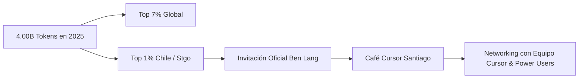
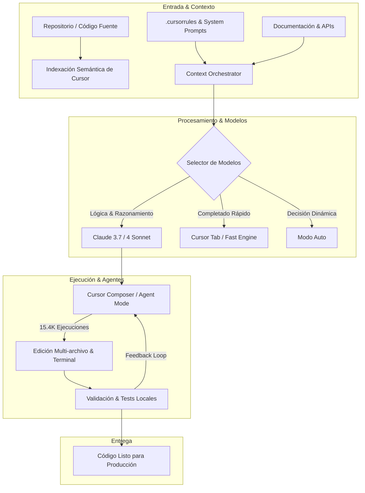

El año 2025 marcó un punto de inflexión definitivo en la manera en que los desarrolladores e ingenieros de software conceptualizamos, escribimos y mantenemos sistemas digitales. La transición de los asistentes de código reactivos hacia entornos integrados impulsados por **agentes autónomos y modelos de razonamiento avanzado** transformó por completo los flujos de trabajo diarios.

Al cierre de la temporada, la compañía detrás del editor **[Cursor](https://www.cursor.com/)** (Anysphere) liberó su informe anual personalizado **"Year in Review 2025"**. Al revisar mis métricas anuales, los datos reflejaron el nivel de adopción e integración que tuvo la inteligencia artificial en mis proyectos de consultoría, dApps Web3 y arquitectura de software: **más de 4.000 millones de tokens procesados (4.00B)**, situándome en el **Top 7% de uso a nivel mundial** y en el **Top 1% de usuarios más activos en Chile**.

---

## Métricas Clave de Cursor Year in Review 2025

A continuación, resumo las principales estadísticas arrojadas por la plataforma sobre mi actividad durante el año:

| Métrica | Registro Anual | Descripción / Contexto |
| :--- | :--- | :--- |
| **Tokens Consumidos** | **4.00 Billion (4.00B)** | Contexto, autocompletado inteligente, razonamiento y ejecuciones de agentes |
| **Posición Global** | **Top 7% Mundial** | Percentil de uso entre cientos de miles de ingenieros en todo el planeta |
| **Posición Local** | **Top 1% Chile / Santiago** | Reconocimiento oficial del equipo de Cursor |
| **Invocaciones de Agentes** | **15.400 (15.4K)** | Modos *Composer* y agentes multi-archivo ejecutados en proyectos |
| **Aceptaciones de Tab** | **2.533 (2.5K)** | Predicciones de código multilínea aceptadas con la tecla `Tab` |
| **Racha Consecutiva** | **40 días (40d Streak)** | Período ininterrumpido de desarrollo diario con el editor |
| **Antigüedad en Cursor** | **+466 días** | Adoptante temprano de la herramienta desde sus primeras versiones |
| **Modelos Principales** | **Auto, Claude 3.7 Sonnet, Claude 4 Sonnet** | Modelos líderes en lógica de software y generación de código |

---

## 1. El Impacto Global: Top 7% Mundial y 4 Billones de Tokens

El reporte anual de Cursor destacó el volumen acumulado de actividad a lo largo de los meses. Alcanzar el **Top 7% global** refleja un uso intensivo no solo en generación de fragmentos aislados, sino en la automatización completa de tareas complejas de refactorización, auditoría de código y scaffolding arquitectónico.

> *"You were one of the most active Cursor users this year. Your usage: Top 7%"* — **Cursor Year in Review 2025**

El consumo de **4 billones de tokens** no responde únicamente a la cantidad de líneas escritas, sino a la densidad del contexto procesado: lectura de repositorios completos, análisis de dependencias cruzadas, ejecución de herramientas en terminal y ciclos de depuración iterativa con modelos de frontera.

---

## 2. Reconocimiento Local: Top 1% en Chile e Invitación a Café Cursor Santiago

Uno de los hitos más gratificantes del año fue recibir la comunicación directa de **Ben Lang** y el equipo de desarrollo de Cursor, reconociendo mi posición dentro del **Top 1% de desarrolladores de Cursor en Santiago de Chile**.

Como parte de esta distinción, recibí una invitación personal y exclusiva para participar en **Café Cursor Santiago**, una jornada de coworking presencial y encuentro técnico para compartir con el equipo de la compañía y otros *power users* del país.

Este tipo de encuentros evidencia el crecimiento exponencial de la comunidad de desarrolladores en América Latina que están a la vanguardia en el uso de herramientas de inteligencia artificial aplicada al software.

---

## 3. Dinámica de Uso Mes a Mes: La Evolución de la Actividad

El reporte también incluyó un desglose de la frecuencia y estacionalidad del uso de autocompletado predictivo inteligente (`Cursor Tab`), totalizando **2.533 pulsaciones de Tab**:

Analizando la curva de distribución temporal:
- **Primer Trimestre (Marzo - 53 tabs)**: Transición hacia flujos de trabajo basados en contexto enriquecido y primeras pruebas con asistentes locales.
- **Pico de Productividad (Mayo - 735 tabs & Junio - 646 tabs)**: Coincidió con entregas de arquitectura crítica, preparación de smart contracts y despliegues en eventos internacionales como Devconnect y hackathons de Polkadot/Ethereum.
- **Segundo Semestre**: Consolidación del uso del modo **Agent** (15.4K ejecuciones), donde la intervención manual vía `Tab` da paso a la resolución autónoma de tareas multi-archivo por parte de los agentes.

---

## 4. Flujo de Trabajo y Arquitectura Agentic con Cursor

El rendimiento alcanzado durante 2025 se basó en un flujo de trabajo estructurado que combina las mejores capacidades del editor con buenas prácticas de ingeniería:

### Pilares del Flujo de Trabajo Optimizado:
1. **Reglas de Proyecto Claras (`.cursorrules`)**: Definir directrices de arquitectura, tipado estricto en TypeScript y estándares de seguridad antes de generar cualquier bloque de código.
2. **Uso Estratégico de Claude 3.7 y Claude 4 Sonnet**: Aprovechar la alta capacidad de razonamiento de los modelos de Anthropic para refactorizaciones complejas, diseño de contratos en Solidity y resolución de errores sutiles de concurrencia.
3. **Delegación a Agentes Autónomos**: Emplear el modo agente para ejecutar tareas repetitivas de scaffolding, creación de tests unitarios y migración de dependencias, reduciendo los tiempos de iteración de días a minutos.

---

## 5. Conclusiones y Mirada hacia el Futuro

Haber alcanzado el **Top 1% en Chile** y el **Top 7% a nivel mundial** en Cursor durante 2025 confirma que el desarrollo de software ha entrado en una nueva era. La inteligencia artificial no sustituye el criterio del ingeniero ni el rigor arquitectónico; por el contrario, actúa como un multiplicador de fuerza que permite a un único desarrollador operar con la velocidad y capacidad de un equipo completo.

De cara al futuro, el desafío no consiste únicamente en consumir más tokens, sino en elevar la calidad del contexto, diseñar mejores arquitecturas agentic y seguir construyendo soluciones tecnológicas con impacto real.

---

> **¿Te interesa optimizar tu flujo de trabajo con IA o integrar agentes en tus proyectos?** Puedes explorar más artículos técnicos en el [Blog](/blog) o contactarme directamente a través de mis canales en el [Inicio](/#contacto).
