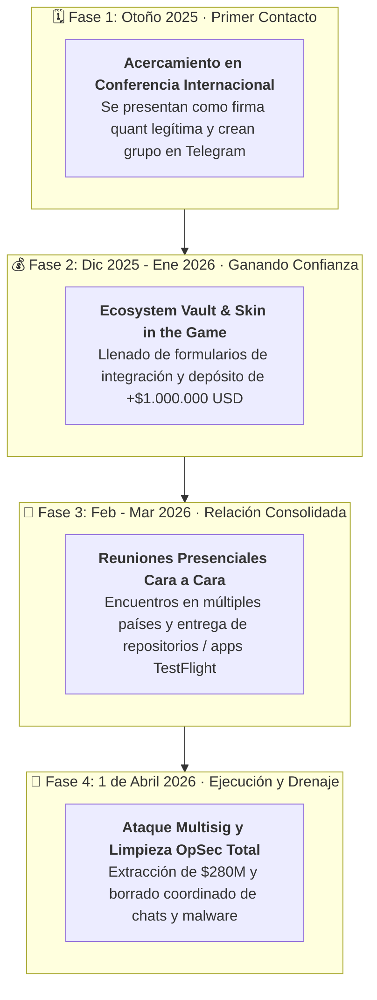
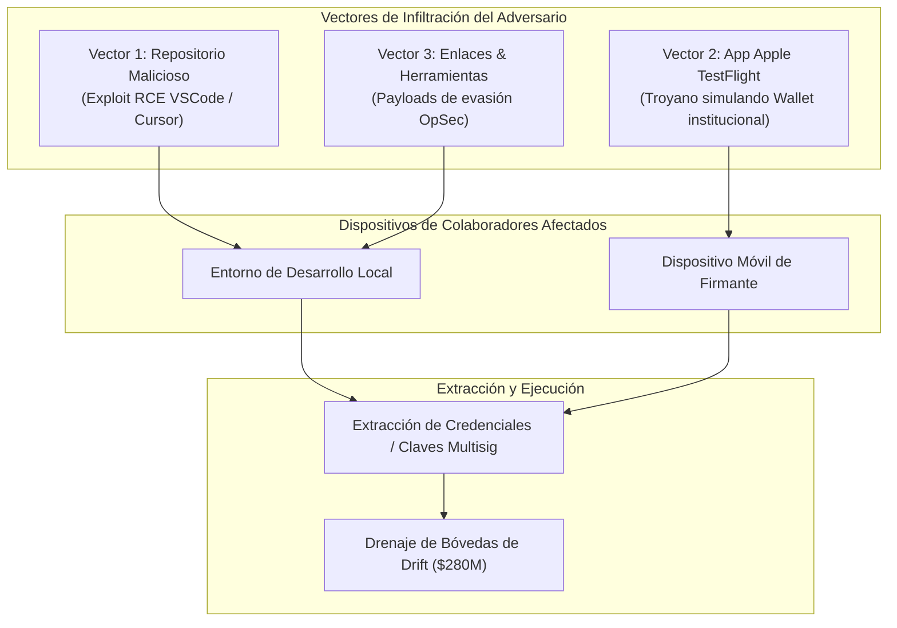
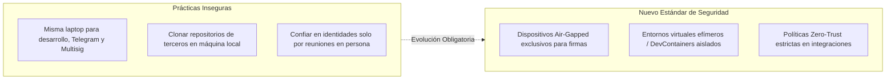

El 1 de abril de 2026, el protocolo de derivados perpetuos y finanzas descentralizadas **Drift Protocol** sufrió uno de los ataques más sofisticados y devastadores en la historia del ecosistema cripto, con un saldo estimado de **280 millones de dólares drenados**. 

Sin embargo, a diferencia de los exploits tradicionales en DeFi —que habitualmente involucran vulnerabilidades en contratos inteligentes, préstamos relámpago (*flash loans*) o manipulaciones de oráculos—, el incidente de Drift representa un **cambio de paradigma fundamental en la ciberseguridad Web3**: fue una operación de inteligencia e infiltración prolongada, ejecutada como una **Amenaza Persistente Avanzada (APT)** respaldada por recursos organizacionales a nivel estatal.

A través de las investigaciones preliminares conducidas por el equipo de Drift junto a firmas de respuesta a incidentes e inteligencia como **Mandiant**, investigadores independientes y la alianza de respuesta rápida **SEAL 911**, se ha revelado una campaña de **6 meses de preparación**, combinando espionaje humano presencial (*HUMINT*), inversión de capital real para ganar confianza, troyanos camuflados en Apple TestFlight y la explotación de vulnerabilidades de ejecución remota de código en editores de desarrollo como **VSCode y Cursor**.

---

## 1. Cronología de una Infiltración Quirúrgica: 6 Meses de Paciencia

La investigación forense demostró que este no fue un intento oportunista ni un ataque automatizado. Se trató de una operación estructurada y planificada minuciosamente desde el tercer trimestre de 2025.

### Fase 1: El Acercamiento y la Coartada Cuantitativa (Otoño 2025)
Durante una de las principales conferencias internacionales de criptomonedas en el otoño de 2025, un grupo de individuos se acercó a colaboradores clave de Drift. Se presentaron como una **firma de trading cuantitativo institucional** interesada en construir e integrar estrategias sobre los libros de órdenes y bóvedas (*vaults*) del protocolo.

Los interlocutores no eran perfiles sospechosos:
- Demostraban **pleno dominio técnico y financiero** del funcionamiento interno de Drift.
- Contaban con **trayectorias profesionales verificables**, perfiles públicos construidos con meses de antelación y redes de contactos consolidadas.
- Establecieron de inmediato un canal de comunicación en Telegram para mantener sesiones de trabajo técnico recurrentes.

### Fase 2: "Skin in the Game" y el Depósito de $1M (Diciembre 2025 – Enero 2026)
Para disipar cualquier duda sobre su legitimidad, la supuesta firma cuantitativa inició el proceso formal de incorporación (*onboarding*) de un **Ecosystem Vault** en Drift.

Completaron formularios detallados de estrategia, participaron en múltiples sesiones de arquitectura con los ingenieros del protocolo y ejecutaron una acción que desarmó cualquier sospecha: **depositaron más de $1.000.000 de dólares de capital propio en el protocolo**. Este nivel de inversión de capital operativo confirmó una capacidad financiera que solo estructuras de alto nivel u organizaciones patrocinadas por estados pueden justificar como costo de adquisición de acceso.

### Fase 3: Consolidación de Confianza "Cara a Cara" (Febrero – Marzo 2026)
Durante los meses siguientes, miembros de este grupo continuaron asistiendo a conferencias de la industria en diferentes países, reuniéndose deliberadamente y en persona con los mismos colaboradores de Drift.

Para este punto, la relación llevaba más de medio año de interacciones cotidianas. No eran desconocidos en internet: eran contrapartes comerciales habituales con las que se compartían reuniones presenciales, almuerzos de trabajo y canales de integración técnica.

---

## 2. Los Mecanismos de Infección y Vectores Técnicos

Durante el proceso continuo de integración y colaboración técnica, la supuesta firma cuantitativa compartía con frecuencia enlaces a herramientas de analítica, repositorios para desplegar frontends de bóvedas y utilidades de prueba.

El análisis forense preliminar de los dispositivos y cuentas afectadas identificó **tres vectores concurrentes de intrusión**:

### Vector A: Repositorio Malicioso y Zero-Days en VSCode / Cursor
Uno de los colaboradores de Drift fue comprometido tras clonar e inspeccionar un repositorio de código que el grupo compartió bajo la premisa de revisar el frontend para la gestión de su bóveda.

Entre diciembre de 2025 y febrero de 2026, la comunidad de ciberseguridad había estado alertando sobre vulnerabilidades críticas de ejecución remota de código (**RCE**) en editores modernos de código basados en Electron, tales como **VSCode** y **Cursor**. 

En estas fallas, el simple hecho de **abrir un directorio o repositorio** en el editor permitía la ejecución silenciosa de comandos arbitrarios en el sistema operativo del desarrollador, sin requerir clics adicionales, sin cuadros de diálogo de confirmación ni alertas del sistema. Una vez abierto el proyecto, el payload malicioso se ejecutó en segundo plano con los privilegios del desarrollador.

### Vector B: Aplicación Troyanizada en Apple TestFlight
Un segundo colaborador fue inducido a descargar una aplicación a través del programa **TestFlight de Apple**, presentada por el grupo como una versión preliminar de su producto de billetera institucional (*institutional wallet*).

El uso de TestFlight permite a los atacantes evadir en gran medida los filtros iniciales de la App Store tradicional, distribuyendo binarios directamente a probadores con un aura de legitimidad al estar alojados dentro de la infraestructura oficial de Apple.

### Vector C: Enlaces de Utilidades y Herramientas Propietarias
De manera paralela, compartieron enlaces a plataformas web y scripts de automatización de trading con librerías ofuscadas destinadas a perfilar los sistemas y recolectar credenciales en los entornos de trabajo de los desarrolladores.

---

## 3. Atribución Forense: La Huella de Corea del Norte (UNC4736 / AppleJeus)

Con un nivel de confianza medio-alto y con el respaldo de análisis efectuados por **SEAL 911** e investigadores forenses independientes (con la participación de especialistas como *@tayvano_*, *@tanuki42_*, *@pcaversaccio* y *@bax1337*), la operación ha sido vinculada al grupo de amenazas persistentes avanzadas conocido como **UNC4736**, también rastreado en la industria bajo los nombres de **AppleJeus** o **Citrine Sleet**, un actor patrocinado por el estado de Corea del Norte (DPRK).

| Factor de Atribución | Evidencia Identificada |
| :--- | :--- |
| **Trazabilidad On-Chain** | Los flujos de fondos utilizados para fondear y probar la operación ($1M+ depositados) provienen de billeteras vinculadas al hack de **Radiant Capital** de octubre de 2024 ($50M+ atribuido a Mandiant como UNC4736). |
| **Tácticas de Ingeniería Social (HUMINT)** | Creación de identidades falsas de larga duración, perfiles profesionales meticulosamente construidos y presencia en eventos presenciales. |
| **Uso de Intermediarios Externos** | Las personas que asistieron físicamente a las conferencias **no eran ciudadanos norcoreanos**. DPRK utiliza frecuentemente intermediarios y contratistas terceros para las fases de contacto humano directo. |
| **Limpieza Operacional Coordinada (OpSec)** | Inmediatamente después de ejecutar el drenaje on-chain, los atacantes eliminaron todos los canales de Telegram, purgaron repositorios y eliminaron rastros de software malicioso. |

> **Nota de rigor forense**: *Mandiant* se encuentra realizando el peritaje exhaustivo sobre el hardware afectado para emitir la atribución institucional definitiva una vez concluyan los análisis de bajo nivel.

---

## 4. Estado de Respuesta y Mitigación Inmediata

Ante la detección del compromiso el 1 de abril de 2026:

1. **Congelamiento de Funciones**: Todas las operaciones restantes y funciones del protocolo Drift fueron suspendidas de forma inmediata.
2. **Remoción de Firmantes**: Las billeteras y dispositivos comprometidos fueron revocados y removidos del esquema multifirma (*multisig*).
3. **Marcaje de Billeteras**: En coordinación con exchanges centralizados (CEXs), emisores de stablecoins y operadores de puentes entre cadenas (*bridges*), las direcciones de los atacantes fueron catalogadas en listas negras para bloquear rutas de escape de liquidez.
4. **Colaboración con SEAL 911 y Agencias**: Se activaron protocolos de respuesta a incidentes a gran escala para compartir indicadores de compromiso (IoCs) con otros proyectos del ecosistema que pudieran haber sido contactados por el mismo grupo.

---

## 5. Lecciones Críticas de Seguridad para Equipos y Desarrolladores Web3

El hack a Drift Protocol marca un antes y un después en cómo los equipos de desarrollo descentralizado deben abordar su arquitectura de seguridad y sus operaciones diarias (*OpSec*).

### 1. El Mito de la Confianza Presencial (HUMINT)
Ver a una persona cara a cara en múltiples conferencias internacionales ya no es garantía de legitimidad. Grupos patrocinados por estados cuentan con el presupuesto y la paciencia para contratar actores o intermediarios, depositar millones de dólares y mantener relaciones comerciales durante meses solo para lograr un vector de acceso.

### 2. Aislamiento Total de Dispositivos Firmantes de Multisig
Ninguna máquina utilizada para firmar transacciones de gobernanza o administración de contratos debe utilizarse para:
- Tareas de desarrollo de código diario.
- Navegación web general o uso de clientes de mensajería (Telegram, Discord, Slack).
- Descarga de aplicaciones externas, binarios de prueba o TestFlight.

Los firmantes de un multisig deben operar en **dispositivos dedicados y aislados (*air-gapped* o de uso único)**, con hardware wallets que verifiquen los datos de la transacción en pantallas seguras independientes.

### 3. Cero Confianza al Abrir Repositorios y Entornos de Código
Las vulnerabilidades recientes en editores como VSCode y Cursor demuestran que inspeccionar código de un tercero en tu máquina host es equivalente a ejecutar un binario desconocido.

- **Utilizar DevContainers y Sandboxes**: Toda inspección de código de proyectos externos debe realizarse dentro de máquinas virtuales aisladas (VMs) o entornos efímeros sin acceso a llaves SSH, variables de entorno ni credenciales locales.
- **Configuración de Workspace Trust**: Asegurar que las opciones de ejecución automática de tareas, linting y extensiones estén deshabilitadas por defecto en carpetas no confiables.

### 4. Protocolos de Triaje y Soporte Rápido con SEAL 911
Si cualquier equipo o desarrollador dentro del ecosistema DeFi sospecha haber interactuado recientemente con grupos sospechosos de trading cuantitativo bajo patrones similares, debe contactar de inmediato con la red de emergencia de **SEAL 911** (`@SEAL911`), quienes cuentan con los recursos especializados para contener amenazas activas antes de que se produzca una ejecución destructiva.

---

## Conclusión

El ataque a Drift Protocol no fue una falla de lógica en un smart contract; fue una **demostración de espionaje corporativo y guerra cibernética aplicada a las finanzas descentralizadas**. 

A medida que el valor total bloqueado en DeFi continúa escalando, los adversarios a los que se enfrenta la industria no son atacantes individuales aislados, sino agencias de inteligencia con presupuestos millonarios y horizontes de tiempo de meses o años. La seguridad de un protocolo ya no termina en una auditoría de contratos inteligentes: comienza en la disciplina operacional y la desconfianza estructural en cada dispositivo que toca la infraestructura crítica.
