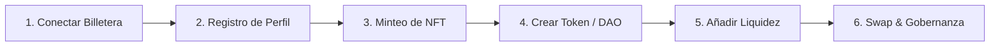

**Enanos Hub** (Enanos Club) es un ecosistema integral de finanzas descentralizadas (DeFi) y gobernanza comunitaria diseñado y desplegado en la testnet de **Polkadot Asset Hub**. Su propósito central es dotar de utilidad económica y herramientas operativas a creadores de comunidades y colecciones NFT, permitiéndoles emitir tokens ERC-20 propios, gestionar organizaciones autónomas descentralizadas (DAOs), proveer liquidez en pools automatizados y realizar intercambios de tokens (*swaps*) de manera eficiente y descentralizada.

El proyecto fue presentado y evaluado en el hackathon internacional **LATIN HACK**, organizado por **Nerdconf** y el ecosistema **Polkadot** a través de la plataforma DoraHacks.


---

## El Hackathon: LATIN HACK (Nerdconf & Polkadot)

El hackathon **LATIN HACK** congregó a desarrolladores e investigadores de toda Latinoamérica con la misión de construir soluciones de alto impacto sobre la infraestructura de Polkadot y sus parachains EVM.

La competencia reunió a **223 hackers** y un total de **101 proyectos enviados**. Tras la evaluación técnica de los jueces y mentores de Nerdconf y Polkadot, **Enanos Hub fue galardonado con una Mención Honrosa**.


- Tweet sobre la mención honrosa: https://x.com/cjbaezilla/status/1983170815429627931

Este reconocimiento valida la viabilidad técnica de una suite Web3 completa de extremo a extremo, desarrollada de manera individual (equipo unipersonal) en un plazo intensivo.

---

## Demostraciones en Video del Proyecto

A continuación se presentan las grabaciones oficiales de demostración y sustentación técnica del proyecto:

### 1. Presentación y Visión General
<iframe src="https://www.youtube-nocookie.com/embed/q1Eeodps-9E" title="Enanos Hub - Presentación" allow="accelerometer; autoplay; clipboard-write; encrypted-media; gyroscope; picture-in-picture; web-share" allowfullscreen></iframe>

### 2. Demostración y Flujo de Interacción
<iframe src="https://www.youtube-nocookie.com/embed/esQc6P4Dytc" title="Enanos Hub - Demo de Interacción" allow="accelerometer; autoplay; clipboard-write; encrypted-media; gyroscope; picture-in-picture; web-share" allowfullscreen></iframe>

### 3. Recorrido Completo de Funcionalidades y DApp
<iframe src="https://www.youtube-nocookie.com/embed/o9_mwP0P2u8" title="Enanos Hub - Walkthrough Completo" allow="accelerometer; autoplay; clipboard-write; encrypted-media; gyroscope; picture-in-picture; web-share" allowfullscreen></iframe>

---

## Enlaces y Repositorios del Proyecto

- **DApp Frontend (Next.js)**: [https://github.com/cjbaezilla/NextApp-Hackathon-Polkadot](https://github.com/cjbaezilla/NextApp-Hackathon-Polkadot)
- **Smart Contracts (Hardhat & Solidity)**: [https://github.com/cjbaezilla/Hardhat-Contratos-Hackathon-Polkadot](https://github.com/cjbaezilla/Hardhat-Contratos-Hackathon-Polkadot)
- **Ficha del Proyecto en DoraHacks BUIDL**: [https://dorahacks.io/buidl/34225/](https://dorahacks.io/buidl/34225/)
- **Nerdconf LATIN HACK en DoraHacks**: [https://dorahacks.io/hackathon/latinhack](https://dorahacks.io/hackathon/latinhack)
- **DApp en Vivo (Testnet)**: [https://polka.enanos.club](https://polka.enanos.club)

---

## Características y Módulos Principales

Enanos Hub integra múltiples componentes modulares que cubren todo el ciclo de vida de una comunidad Web3:

```text
┌─────────────────────────────────────────────────────────────┐
│                    ENANOS HUB (Next.js)                     │
│    Wagmi + RainbowKit  │  Tailwind CSS  │  shadcn/ui        │
└──────────────┬──────────────────────────────┬───────────────┘
               │                              │
        ┌──────▼──────┐                ┌──────▼──────┐
        │  NFT & DAOs │                │ DeFi Router │
        └──────┬──────┘                └──────┬──────┘
               │                              │
┌──────────────▼──────────────────────────────▼───────────────┐
│              POLKADOT ASSET HUB (Paseo Testnet)             │
│  - UsersContract               - UniswapV2Factory           │
│  - NFTContract                 - UniswapV2Router02          │
│  - ERC20MembersFactory         - WETH9 (PAS Wrapper)        │
│  - DAOMembersFactory & DAO                                  │
└─────────────────────────────────────────────────────────────┘
```

### 1. Panel de Control Principal (Dashboard)
El dashboard central proporciona una panorámica en tiempo real de toda la actividad de la plataforma:
- **Estadísticas Globales de Usuarios**: Contador en vivo de miembros registrados, tokens creados, DAOs desplegadas y piscinas de liquidez activas.
- **TVL (Total Value Locked)**: Métricas en tiempo real del valor total bloqueado en tokens PAS (activo nativo de Polkadot Asset Hub).
- **Feed de Actividad Reciente**: Registro en tiempo real de nuevos miembros, emisiones de tokens, propuestas en DAOs y nuevos pares de liquidez.
- **Accesos Rápidos**: Navegación directa hacia todos los módulos clave de la plataforma.

### 2. Registro de Identidad y Gestión de Perfiles On-Chain
- **Registro de Usuario**: Configuración de perfil Web3 con enlaces a redes sociales (X / Twitter, GitHub y Telegram), avatar e imagen de portada.
- **Páginas de Perfil Públicas**: Resumen exhaustivo que detalla los tokens emitidos por el usuario, DAOs a las que pertenece y nivel de actividad comunitaria.
- **Edición y Personalización**: Actualización de metadatos directamente interactuando con los contratos inteligentes.
- **Integración Social**: Vinculación criptográfica entre la dirección de billetera y la identidad digital del usuario.

### 3. Creación y Gestión de Tokens ERC-20
Los usuarios pueden emitir tokens ERC-20 personalizados sin necesidad de escribir código:
- **Despliegue Asistido**: Configuración instantánea de nombre, símbolo, decimales y suministro inicial.
- **Requisitos de Gobernanza**: La emisión requiere estar registrado en la plataforma y poseer un mínimo de NFTs de membresía.
- **Tarifa de Creación (*Creation Fee*)**: Pequeña comisión en tokens nativos PAS destinada a la sostenibilidad del protocolo.
- **Explorador de Tokens Integrado**: Panel para consultar información técnica, rastrear balances de tenedores y ejecutar transferencias directas.
- **Tokens Comunitarios**: Directorio para explorar e interactuar con todos los activos creados por otros miembros.

### 4. Gobernanza y Gestión de DAOs
Un sistema completo de gobernanza descentralizada que empodera a los colectivos:
- **Creación de DAOs Personalizadas**: Configuración de parámetros de gobernanza a medida (quórum mínimo, umbrales de aprobación y plazos de votación).
- **Membresía Basada en NFTs**: El acceso a la DAO y los privilegios de participación están respaldados por la posesión de NFTs del ecosistema.
- **Sistema Integral de Propuestas**: Ciclo de vida completo para redactar, debatir, votar y ejecutar propuestas de gobernanza.
- **Poder de Voto Dinámico**: Cálculo del peso del voto ponderado según los NFTs en poder del votante.
- **Parámetros Configurables**: Flexibilidad para ajustar requisitos de propuesta y umbrales de éxito según las necesidades de cada comunidad.

### 5. Gestión de Piscinas de Liquidez (Liquidity Pools)
Integración completa con el protocolo Uniswap V2 para asegurar liquidez descentralizada:
- **Creación de Piscinas**: Despliegue de nuevos pares de intercambio para cualquier token ERC-20 creado en la plataforma frente a PAS/WETH.
- **Aporte de Liquidez (*Add Liquidity*)**: Los usuarios pueden suministrar liquidez a pares existentes para recibir comisiones de intercambio (tokens LP).
- **Retiro de Liquidez (*Remove Liquidity*)**: Reclamación sencilla de los activos subyacentes quemando tokens de liquidez.
- **Explorador de Piscinas**: Vista detallada con TVL por piscina, volúmenes y ratios de precio.
- **Mecanismo de Intercambio**: Ruteo directo de swaps mediante los contratos de fábrica y enrutador de Uniswap V2.

### 6. Intercambio de Tokens (Token Swapping)
Motor avanzado de intercambio descentralizado:
- **Integración Nativa Uniswap V2**: Funcionalidad DEX sin intermediarios ni custodios.
- **Soporte WETH9 / Wrapper PAS**: Conversión transparente y automática entre el token nativo PAS y su versión envuelta ERC-20 (WETH).
- **Protección contra Deslizamiento (*Slippage Protection*)**: Tolerancia al deslizamiento ajustable para proteger a los usuarios frente a la volatilidad.
- **Gestión de Plazos (*Deadlines*)**: Configuración de límites de tiempo para evitar transacciones pendientes atrapadas en la mempool.
- **Validación Automática de Piscinas**: Verificación previa en tiempo real de la existencia y liquidez suficiente del par antes de autorizar la firma.

### 7. Acuñación y Gestión de NFTs (NFT Minting)
- **Acuñación de NFTs**: Emisión de credenciales NFT con metadatos personalizados para identificar a los miembros de la comunidad.
- **Gestión de Colecciones**: Organización y categorización de colecciones para diferentes propósitos o niveles de acceso.
- **Control de Acceso Basado en Tokens (*Token-Gating*)**: Verificación criptográfica de NFTs para desbloquear funciones avanzadas en la DApp (como creación de tokens y despliegue de DAOs).

---

## Flujo del Usuario (*User Journey*)

El diseño de la experiencia de usuario fue concebido para eliminar la fricción típica de Web3 a través de cuatro etapas bien definidas:



### Paso 1: Primeros Pasos e Identidad
1. **Conexión de Billetera**: El usuario conecta su billetera Web3 (MetaMask, Talisman, Coinbase Wallet, etc.) mediante **RainbowKit**.
2. **Registro de Perfil**: Configura su nombre de usuario, biografía y perfiles sociales almacenados en el contrato `UsersContract`.
3. **Acuñación de NFT**: Acuña su NFT de membresía para validar su condición de miembro activo y obtener permisos en la DApp.

### Paso 2: Creación y Emisión de Activos
1. **Verificación de Requisitos**: El sistema valida automáticamente que el usuario cuente con perfil activo y el NFT requerido.
2. **Despliegue del Token**: Mediante un formulario simple, despliega su propio token ERC-20 a través de `ERC20MembersFactory`.
3. **Administración**: Utiliza el explorador de tokens para revisar balances y transferir fondos a colaboradores.

### Paso 3: Activación de Gobernanza (DAO)
1. **Creación de la DAO**: Establece la DAO configurando quórum, porcentaje de aprobación y duración de votaciones mediante `DAOMembersFactory`.
2. **Afiliación de Miembros**: Los miembros de la comunidad ingresan demostrando la tenencia de NFTs específicos.
3. **Gobernanza Activa**: Se publican propuestas y los miembros emiten sus votos on-chain ponderados por su peso NFT.

### Paso 4: Actividad DeFi y Monetización
1. **Creación del Par de Liquidez**: Se crea la piscina en Uniswap V2 emparejando el nuevo token ERC-20 con PAS/WETH.
2. **Inyección de Liquidez**: El creador y la comunidad depositan fondos para respaldar el precio del token.
3. **Intercambio Abierto**: Cualquier usuario puede realizar swaps instantáneos con protección de deslizamiento.

---

## Arquitectura Técnica y Stack Tecnológico

### Stack de Frontend
- **Framework**: [Next.js 15](https://nextjs.org/) (App Router) con TypeScript para renderizado híbrido y máxima seguridad de tipos.
- **Estilos y UI**: [Tailwind CSS 4](https://tailwindcss.com/) + [shadcn/ui](https://ui.shadcn.com/) para un sistema de diseño modular, accesible y responsivo.
- **Conectividad Web3**: [Wagmi 2](https://wagmi.sh/) + [Viem](https://viem.sh/) para la comunicación JSON-RPC con la EVM de Polkadot.
- **Gestión de Billeteras**: [RainbowKit 2](https://www.rainbowkit.com/) para una experiencia de conexión multired intuitiva.

### Stack de Smart Contracts
- **Lenguaje**: Solidity `^0.8.20` con librerías estándar de [OpenZeppelin](https://www.openzeppelin.com/) (ERC20, ERC721, Ownable, ReentrancyGuard).
- **Entorno de Desarrollo**: [Hardhat](https://hardhat.org/) para compilación, testing automatizado y scripts de despliegue.

---

## Catálogo de Smart Contracts Desplegados

Todos los contratos fueron desplegados y verificados en la red de pruebas de **Polkadot Asset Hub (Paseo Testnet)**:

| Contrato | Dirección en Testnet | Responsabilidad Principal |
| :--- | :--- | :--- |
| **`UsersContract`** | `0x967C5d801e7118669ae8FFEF017D400eCA78f9C6` | Registro de usuarios, gestión de perfiles e identidades sociales on-chain. |
| **`DAOContract`** | `0xF84840a4e558a2795999D5eE4a874264B5a83E41` | Lógica de gobernanza, ciclo de vida de propuestas y votación ponderada por NFTs. |
| **`ERC20MembersFactory`** | `0x54bCb3b41CCA02A46253048Cc7b6fd49762a6fB6` | Fábrica para el despliegue dinámico de tokens ERC-20 y cobro de tarifas de creación. |
| **`DAOMembersFactory`** | `0xB2bD1555ec23c0c3759986e97e992dcC0cc22b05` | Fábrica de instancias de DAOs con configuración parametrizada (*Factory Pattern*). |
| **`UniswapV2Factory`** | `0x9783b94D24094BB1059f546254834532cacF13aa` | Fábrica de pares y piscinas de liquidez bajo el protocolo Uniswap V2. |
| **`UniswapV2Router02`** | `0x99F599DE676A64196A3fd1eDFEee584cfDB13629` | Enrutador principal para ejecución de swaps, adición/retiro de liquidez y cálculo de precios. |
| **`WETH9`** | `0x9c591C4bB63F808751A9AAbF274D18F49EDBd3D0` | Contrato envoltorio (*wrapper*) para convertir PAS nativo a formato ERC-20 compatible con Uniswap. |
| **`NFTContract`** | `0x96853087C9E364FE9554fD6FCFE13BcD942b04d5` | Emisión, administración de colecciones NFT y verificación de membresías de acceso. |

---

## Configuración de Red

La infraestructura interactúa con la testnet oficial de Polkadot Asset Hub:

- **Nombre de la Red**: Polkadot Asset Hub Testnet (Paseo)
- **RPC Endpoint**: `https://testnet-passet-hub-eth-rpc.polkadot.io`
- **Símbolo Nativo**: `PAS` (Polkadot Asset Hub)
- **Explorador de Bloques**: Subscan / Polkadot Explorer

---

## Seguridad y Resiliencia

### Seguridad en Smart Contracts
- **Control de Acceso Basado en Roles (RBAC)**: Restricción estricta de funciones administrativas mediante modificadores de OpenZeppelin.
- **Validación Exhaustiva de Entradas**: Comprobaciones de rangos, límites de suministro y verificación de no-cero en direcciones y parámetros de configuración.
- **Manejo Robusto de Errores**: Uso de errores personalizados de Solidity (`custom errors`) para optimizar el consumo de gas y proveer diagnósticos claros.
- **Registro Exhaustivo de Eventos (*Event Logging*)**: Emisión de eventos detallados para auditoría off-chain, indexación y sincronización en vivo con la interfaz.
- **Protección contra Reentrancia**: Implementación de guardas de no reentrancia en todas las funciones que manipulan transferencias de fondos y liquidez.

### Seguridad y UX en el Cliente
- **Manejo Seguro de Billeteras**: Integración a través de los estándares más seguros con RainbowKit y Wagmi, sin exposición de claves privadas.
- **Confirmación Visual de Transacciones**: Notificaciones de estado (pendiente, confirmada, fallida) con enlaces directos a los exploradores de bloques.
- **Manejo Elegante de Excepciones**: Barreras de error (*Error Boundaries*) y recuperación ante fallos de RPC para garantizar continuidad operativa.
- **Validación Dual de Datos**: Validación de formatos tanto en el cliente (Zod / React Hook Form) como a nivel de contrato inteligente.

---

## Calidad de Código y Optimización de Rendimiento

- **Tipado Estricto de Extremo a Extremo**: Implementación completa en TypeScript para prevenir errores en tiempo de ejecución.
- **Arquitectura de Componentes Modulares**: Componentes atómicos e independientes facilitando escalabilidad y mantenimiento.
- **Custom Hooks Especializados**: Abstracciones para encapsular la lógica de interacción con cada contrato inteligente (`useTokenFactory`, `useDaoGovernance`, `useUniswapRouter`, etc.).
- **Estrategias de Caché y Lazy Loading**: Carga diferida de componentes pesados y caché inteligente de lecturas RPC para minimizar peticiones innecesarias.
- **Experiencia de Usuario Adaptativa**: Diseño *Mobile-First*, soporte para modos Claro y Oscuro, estados de carga con *skeletons* y actualizaciones dinámicas.

---

## Conclusiones

Haber alcanzado la **Mención Honrosa** en el hackathon **LATIN HACK** de Polkadot y Nerdconf demostró que es posible construir una suite DeFi y de gobernanza integral, robusta y con una experiencia de usuario de primer nivel en el entorno EVM de Polkadot Asset Hub.

Te invitamos a explorar los repositorios de código abierto y experimentar con la DApp en la testnet oficial.
