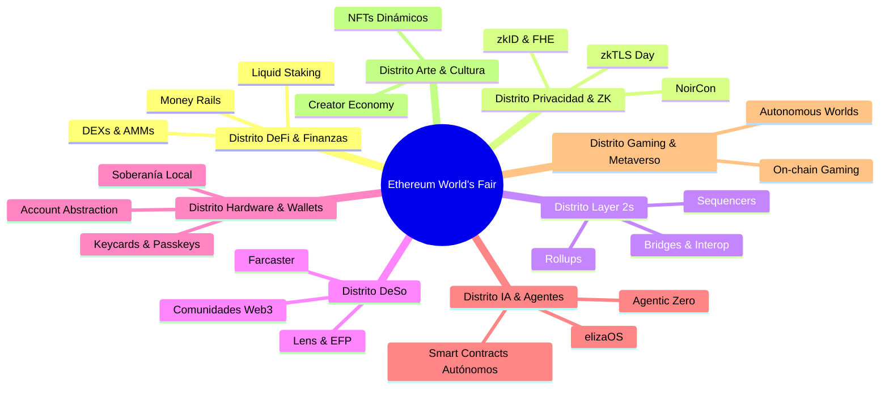

Del **17 al 22 de noviembre de 2025**, la vibrante ciudad de Buenos Aires, Argentina, se convirtió en la capital mundial del ecosistema Web3 al ser la sede oficial de la **primera Feria Mundial de Ethereum (Ethereum World’s Fair)**, enmarcada en la histórica edición de **[Ethereum Devconnect](https://devconnect.org/)**.

El icónico predio de **La Rural** en el barrio de Palermo abrió sus puertas para recibir a más de **14.000 asistentes de más de 130 países**, congregando a investigadores, desarrolladores core, fundadores, inversores y entusiastas en una experiencia inmersiva e interactiva sin precedentes en la historia de la Ethereum Foundation.

Tener la oportunidad de asistir presencialmente a este hito global como consultor e ingeniero blockchain fue una vivencia extraordinaria. A continuación, comparto una crónica detallada de mi recorrido, los proyectos más destacados con los que pude interactuar, las conversaciones mano a mano con figuras referentes de la industria y las principales conclusiones que nos deja este encuentro.

---

---

## Devconnect Argentina en Números: La Primera Feria Mundial de Ethereum

La edición de Buenos Aires marcó un antes y un después en la escala de los eventos organizados por la comunidad de Ethereum. Inspirada en las ferias mundiales históricas que exhibieron inventos revolucionarios como la electricidad o el teléfono, la **Ethereum World's Fair** estructuró el predio en distritos especializados para experimentar de primera mano la tecnología descentralizada:

| Métrica Clave | Impacto Global |
| :--- | :--- |
| **Asistentes Totales** | **+14.000 participantes** de todo el mundo |
| **Países Representados** | **+130 naciones** |
| **Equipos Expositores** | **+80 proyectos y protocolos líderes** |
| **Distritos Temáticos** | **8 áreas dedicadas en La Rural** |
| **Voluntarios del Evento** | **+200 personas** apoyando la operación |
| **Eventos en La Rural** | **+40 conferencias y tracks técnicos** |
| **Side Events en Buenos Aires** | **+500 eventos comunitarios satélite** |

---

## La Llegada a La Rural: El Ambiente y la Bienvenida

El ingreso a La Rural desbordaba energía desde el primer minuto. La ambientación temática de la Feria Mundial combinó estética retrofuturista con señalética moderna, facilitando el tránsito constante entre pabellones, auditorios y zonas de coworking colaborativo.

Al realizar el acreditamiento oficial, cada asistente recibió el kit de bienvenida con pines temáticos coleccionables y credenciales conmemorativas que representaban los distritos de la feria y los pilares fundamentales del movimiento open source.

---

## Recorrido por Stands y Ecosistemas Clave

Durante los seis días del evento, tuve la oportunidad de visitar stands de los proyectos más influyentes que están definiendo la infraestructura y la capa de aplicaciones de Ethereum.

### 1. ENS (Ethereum Name Service)
El equipo de **ENS** presentó los avances más recientes en identidad descentralizada, resolución de nombres en redes Layer 2 (L2), y su integración con pasaportes digitales e identidades criptográficas sovereign. 

### 2. Celo
En el booth de **Celo**, se discutió a fondo su transición hacia una Layer 2 alineada con el stack de Ethereum, su foco en pagos móviles en economías emergentes y casos de uso de finanzas regenerativas (ReFi) de impacto directo en la región latinoamericana.

### 3. Tally & Gobernanza de DAOs
En el espacio de **Tally**, compartí un valioso intercambio con **[Tyler (@tylerisfrisson)](https://x.com/tylerisfrisson)** sobre los desafíos actuales de la gobernanza on-chain, los mecanismos de delegación de voto y la adopción institucional de marcos de decisión descentralizados.

### 4. Rotki & Privacidad Contable
Una de las paradas obligatorias fue el stand de **Rotki**, donde conversé con su fundador **[Lefteris Karapetsas (@LefterisJP)](https://x.com/LefterisJP)** sobre la relevancia de las herramientas de gestión de portafolio y contabilidad local-first, que garantizan la privacidad absoluta de los datos financieros sin intermediarios centralizados.

---

## Encuentros y Networking con la Comunidad

Más allá de los avances técnicos presentados en los escenarios, el corazón de Devconnect reside en la calidad humana y técnica de las personas que hacen posible el ecosistema.

### Charla con Hudson Jameson
Fue un auténtico privilegio compartir un momento de conversación con **[Hudson Jameson (@hudsonjameson)](https://x.com/hudsonjameson)**, histórico referente de la Ethereum Foundation, pionero en la coordinación técnica de los EIPs (Ethereum Improvement Proposals) y uno de los divulgadores más influyentes y queridos de la comunidad cripto internacional.

### Compartiendo con Taco y Builders de la Comunidad
También pude compartir grandes momentos de distensión y debate sobre desarrollo con **[Taco (@Player1Taco)](https://x.com/Player1Taco)** y otros builders apasionados, intercambiando ideas sobre contratos inteligentes, diseño de incentivos y el futuro de las aplicaciones descentralizadas.

---

## Tracks Técnicos y Eventos Destacados de la Semana

Durante toda la semana de Devconnect, La Rural albergó más de 40 eventos y subconferencias temáticas de máximo nivel técnico:

- **Ethereum Day & ETHCon Argentina**: Conferencias magistrales sobre la hoja de ruta de Ethereum, el rol de la descentralización y la adopción en América Latina.
- **DeFi Security Summit**: Sesiones dedicadas al análisis de vulnerabilidades, auditorías de smart contracts, verificación formal y mitigación de vectores de ataque en protocolos DeFi.
- **Solidity Summit & EIP Summit**: Discusiones profundas sobre las nuevas funcionalidades del compilador de Solidity, optimización de bytecode EVM y estándares de tokens.
- **Privacidad y Pruebas ZK**: Jornadas intensivas con *NoirCon 3*, *zkTLS Day*, *zkID & Client-Side Proving Day* y *Ethereum Privacy Stack*, explorando la computación confidencial y pruebas de conocimiento cero.
- **Inteligencia Artificial y Agentes Autónomos**: Espacios como *Agentic Zero* y el auge de frameworks de agentes como *elizaOS* y arquitecturas autónomas sobre Ethereum.
- **Hackathon Ethereum Argentina (Tierra de Buidlers)**: Cientos de desarrolladores construyeron soluciones innovadoras durante fines de semana intensivos de código y mentoría.

Además, el evento contó con el apoyo de decenas de proyectos de vanguardia que impulsaron la feria, incluyendo a *Nethermind, Arbitrum, XMTP, Aztec, Gnosis, Starknet, Base, Aave, Gitcoin, Farcaster, World, Morpho, The Graph, CoW Swap, Uniswap, WalletConnect, Dappnode, Ripio, Lemon*, entre muchos otros.

---

## Reflexiones Finales y Próximo Destino

Devconnect Argentina demostró con contundencia que Latinoamérica no solo es un territorio de usuarios activos de criptoactivos, sino un polo de **desarrollo, innovación e investigación de primer nivel mundial**. La energía, la calidez de la comunidad y el rigor técnico de las ponencias dejaron una marca indeleble en todos los que formamos parte de esta fiesta tecnológica.

La Ethereum Foundation ya ha confirmado el próximo gran hito del calendario global: **[Devcon 8](https://devcon.org/)**, que tendrá lugar del **3 al 6 de noviembre de 2026 en el JIO World Center de Mumbai, India**.

> **Más información**: Puedes consultar la recapitulación oficial y grabaciones en el sitio web de **[Ethereum Devconnect](https://devconnect.org/)**.
