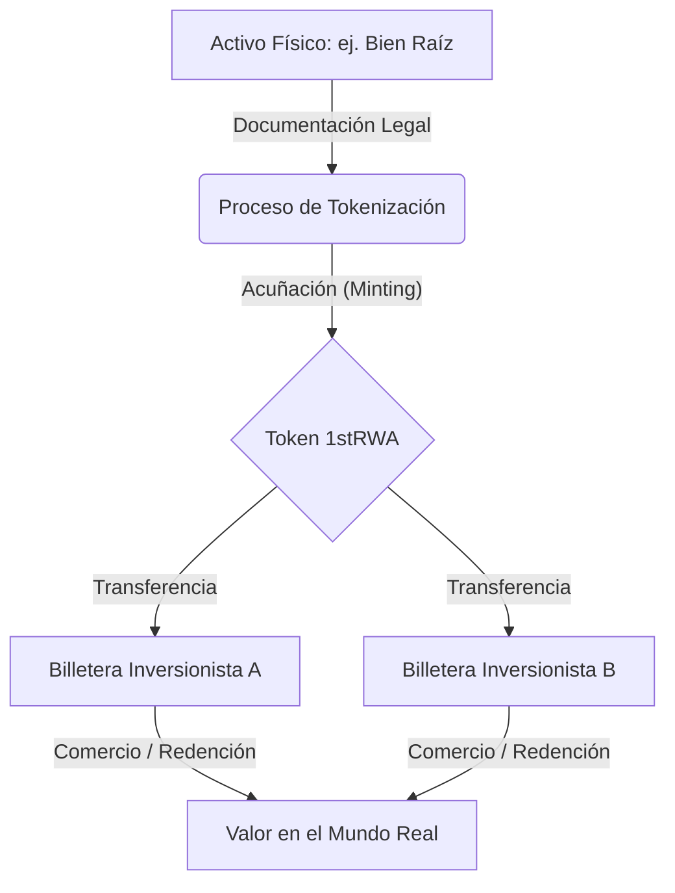

- Repositorio de código: https://github.com/cjbaezilla/Your-First-RWA-Token-Solidity-Nextjs-HandsOn-Tutorial
- Contrato RWA desplegado en Sepolia: https://sepolia.etherscan.io/address/0x4E717ea5F91Afd031D6CFbb1165Eee346D11E30D

# Introducción

Te doy la bienvenida a esta guía práctica paso a paso que te ayudará a construir tu primer token para Activos del Mundo Real (Real World Asset o RWA) desde cero. Te guiaré a través de cada concepto y fragmento de código, asumiendo que no tienes experiencia previa con la tecnología blockchain o las criptomonedas. Mi objetivo es transformar ideas complejas en explicaciones claras y directas, para que puedas crear con total seguridad tokens que cumplan con las regulaciones del mundo real.

Este tutorial se fundamenta en una premisa simple pero poderosa: se aprende haciendo. Comenzarás con un smart contract funcional que ya implementa todos los mecanismos necesarios para la tokenización de activos regulados. Explicaré cómo funciona cada parte, por qué existe y cómo se conecta con el marco más amplio del cumplimiento normativo financiero. Al finalizar, no solo habrás ejecutado un script de despliegue; comprenderás cómo diseñar tokens que cumplan con los estándares regulatorios, cómo administrar roles de gobierno y cómo construir interfaces web para que usuarios legítimos interactúen de forma segura con tu creación.

El proyecto proporciona una solución completa y lista para clonar o bifurcar (fork). El smart contract combina varias extensiones de OpenZeppelin para ofrecer capacidades que los tokens tradicionales no tienen. Descubrirás cómo el mecanismo de congelamiento inmoviliza cuentas sospechosas mientras mantiene disponibles los fondos legítimos, cómo el sistema de restricciones establece una lista de permitidos (allowlist) para inversionistas verificados, y cómo el control de acceso basado en roles distribuye la autoridad entre múltiples administradores. El dashboard complementario en Next.js demuestra cómo estas funciones del contrato se traducen en una interfaz web práctica donde los usuarios pueden emitir tokens, transferirlos y monitorear la actividad en tiempo real.

Esto no es un ejercicio teórico. El código que estudiarás está listo para producción y hereda directamente de las librerías auditadas de OpenZeppelin. El frontend utiliza Wagmi y RainbowKit para gestionar conexiones de billetera seguras. Cada línea de código cumple un propósito específico. Te mostraré el constructor donde se asignan los roles, los overrides que encadenan múltiples revisiones de seguridad, los eventos que transmiten cambios de estado críticos y los modificadores que protegen las funciones privilegiadas. Aprenderás cómo la función `_update` actúa como un guardián central, ejecutando las verificaciones de todos los contratos padre antes de que se modifique cualquier balance.

He redactado este material pensando especialmente en principiantes. Si nunca has interactuado con Ethereum, si no sabes con certeza qué es una billetera o si términos como "acuñación" (minting) y "quema" (burning) te resultan desconocidos, esta guía es para ti. Defino cada término en cuanto aparece por primera vez. Utilizo analogías cotidianas. Evito tecnicismos innecesarios sin antes explicarlos. Cuando hago referencia a conceptos como hashes keccak256 o errores personalizados, aporto el contexto necesario para que comprendas su utilidad y relevancia técnica.


## Inicio Rápido: El Panorama General

Imagina un **Token de Activos del Mundo Real (RWA)** como un "título de propiedad digital". Tradicionalmente, si eres dueño de una fracción de un inmueble o de un lingote de oro, cuentas con un contrato físico en papel. En la blockchain, representamos esa titularidad mediante un **token**.

1. **Selección**: Se identifica y valida legalmente un activo físico (como un bien raíz).
2. **Tokenización**: Creamos un token digital (por ejemplo, `1stRWA`) que representa una participación proporcional específica de dicho activo.
3. **Propiedad**: Mantienes el token en tu billetera digital, lo cual certifica tu propiedad. Si el activo subyacente incrementa su valor, tu token refleja ese beneficio.

### El Ciclo de Vida de un RWA




## Antes de Comenzar

Para seguir este proyecto e interactuar con el dashboard, necesitarás lo siguiente:

1. **Una Billetera Digital**: La opción más común es **MetaMask**. Es una extensión de navegador que funciona como tu documento de identidad y tu cuenta bancaria dentro de la blockchain.
2. **Moneda de Red de Pruebas (Sepolia ETH)**: Este proyecto se ejecuta sobre la **Red de Pruebas Sepolia** (Sepolia Testnet). Esta es una blockchain de práctica donde los fondos son gratuitos. Puedes obtener fondos mediante un "faucet" (sitio web que entrega pequeñas cantidades de ETH de prueba).
3. **Comprensión Básica del "Gas"**: Cada acción ejecutada en la blockchain (como enviar tokens o modificar configuraciones) requiere una pequeña tarifa denominada "Gas". En Sepolia, esta tarifa se paga utilizando tu ETH de prueba.

## Despliegue y Configuración

### Financiamiento de tu Cuenta de Despliegue

Para desplegar el contrato, necesitas Sepolia ETH para cubrir las tarifas de gas. El gas es la compensación que reciben los validadores de la red por procesar y registrar transacciones. En la red de pruebas Sepolia, este ETH es gratuito y carece de valor monetario en el mundo real. Puedes obtenerlo a través de faucets públicos que distribuyen ETH de prueba a cualquier persona que lo solicite.

Un faucet es simplemente un sitio web en el que introduces la dirección de tu billetera y recibes una fracción de ETH. Estas son algunas de las fuentes más confiables disponibles:

| Faucet | Cómo funciona | Cantidad entregada | Aspectos a tener en cuenta |
| :--- | :--- | :--- | :--- |
| Alchemy Sepolia Faucet | Ingresa al sitio, pega la dirección de tu billetera y solicita | 0.5 ETH diarios | Requiere una cuenta gratuita en Alchemy |
| Infura Sepolia Faucet | Inicia sesión con GitHub, introduce la dirección y reclama | 0.1 ETH diarios | Permite un reclamo diario por cuenta de GitHub |
| Chainlink Faucet | Resuelve un captcha y envía tu dirección | 0.1 ETH | No requiere cuenta, con límites por hora |
| Sepolia PoW Faucet | Resuelve un pequeño desafío computacional en el navegador | Cantidad variable según dificultad | Requiere tiempo de procesamiento en tu CPU |

Asegúrate de agregar la red Sepolia en MetaMask antes de pedir fondos. Una vez enviada la solicitud, el ETH llegará a tu billetera en un lapso de segundos a pocos minutos. Es recomendable disponer de al menos 0.5 ETH en total para cubrir los costos de despliegue y diversas transacciones de prueba. Contar con un margen adecuado evita que te quedes sin gas durante las sesiones de prueba.

### Variables de Entorno

El frontend en Next.js requiere una configuración específica para conectarse con tu contrato desplegado y con los servicios de billetera. Estos valores se almacenan en un archivo `.env.local` en la raíz del proyecto. Este archivo debe excluirse del control de versiones para resguardar cualquier credencial sensible.

Las variables de entorno fundamentales son:

| Variable | Función | Dónde obtenerla | Formato de ejemplo |
| :--- | :--- | :--- | :--- |
| `NEXT_PUBLIC_WALLET_CONNECT_PROJECT_ID` | Autentica la aplicación con WalletConnect, permitiendo la conexión de billeteras | Crea un proyecto en cloud.walletconnect.com | `a1b2c3d4e5f6...` |
| `NEXT_PUBLIC_CONTRACT_ADDRESS` | Indica al frontend la dirección exacta del contrato en la blockchain | Se copia de la salida de consola tras ejecutar el script de despliegue | `0x1234567890abcdef...` |
| `NEXT_PUBLIC_SEPOLIA_RPC_URL` (opcional) | Proporciona un endpoint directo a nodos de Sepolia para mayor estabilidad | Del panel de control de tu proyecto en Alchemy o Infura | `https://eth-sepolia.g.alchemy.com/v2/tu-api-key` |

El prefijo `NEXT_PUBLIC_` es indispensable para que Next.js exponga estas variables al navegador del cliente. Sin este prefijo, las variables solo están disponibles en el entorno del servidor y el frontend no podrá acceder a ellas.

La variable `WALLET_CONNECT_PROJECT_ID` se obtiene de forma gratuita y únicamente identifica tu aplicación; no expone claves privadas. Solo debes registrarte en WalletConnect Cloud, crear un nuevo proyecto (llamado, por ejemplo, "My RWA Token") y copiar el Project ID asignado.

La variable `CONTRACT_ADDRESS` se modifica cada vez que vuelves a desplegar el contrato. Tras ejecutar el comando `npx hardhat run scripts/deploy.js --network sepolia`, la consola imprimirá un mensaje con la dirección asignada. Copia esa dirección exacta dentro de tu archivo `.env.local`.

Si no defines estas variables, el dashboard no podrá conectarse a las billeteras ni localizar tu contrato de token, lo que provocará errores de conexión en la consola del navegador.

### Desplegando y Configurando tu Contrato

El despliegue sitúa tu contrato de token en la red de pruebas Sepolia, dejándolo disponible para interactuar. El proyecto incluye un script de despliegue listo para usar que gestiona la compilación y la publicación en un solo paso.

Abre una terminal en la raíz del proyecto y ejecuta:

```bash
npx hardhat run scripts/deploy.js --network sepolia
```

Este comando compila los contratos en Solidity, se conecta a Sepolia mediante tu RPC configurado y efectúa el despliegue utilizando la cuenta configurada por defecto en Hardhat. Al terminar, el script imprime en consola la dirección del contrato y la distribución de los roles asignados.

En cuanto veas la dirección desplegada, cópiala en tu archivo `.env.local` bajo `NEXT_PUBLIC_CONTRACT_ADDRESS`. Si realizas cambios en el contrato y vuelves a desplegar, repite este paso para actualizar la dirección.

El proceso de despliegue también indica qué cuentas reciben los cinco roles administrativos (administrador por defecto, pausador, acuñador, congelador, limitador y administrador de recuperación). Puedes usar estas direcciones para interactuar con el dashboard y probar las herramientas de administración. Por defecto, la primera cuenta de prueba de Hardhat recibe todos los roles, pero puedes modificar el script para asignar cuentas distintas a cada función.

Una vez configuradas las variables de entorno y completado el despliegue, inicia el servidor de desarrollo de Next.js:

```bash
npm run dev
```

Al visitar `http://localhost:3000/dashboard` accederás a la interfaz. Conecta tu billetera: si tu dirección coincide con alguna de las cuentas que poseen roles administrativos, las opciones avanzadas aparecerán de forma automática. Desde allí podrás acuñar tokens, transferirlos, congelar balances y monitorear el registro de actividad.

Si necesitas volver a desplegar el contrato, solo vuelve a ejecutar el comando de Hardhat, actualiza la dirección en `.env.local` y reinicia el servidor de desarrollo. Los cambios se reflejarán de inmediato. Este flujo de trabajo ágil te permite iterar con rapidez mientras observas el comportamiento real del contrato en una red en vivo.

## Términos Clave que Debes Conocer

| Término | Explicación Sencilla |
| :--- | :--- |
| **Address (Dirección)** | Tu "buzón de correo digital" (por ejemplo, `0x123...`). Es el lugar exacto donde residen tus tokens. |
| **Mint (Acuñar/Emitir)** | La creación de nuevos tokens desde cero (reservado a roles autorizados). |
| **Burn (Quemar/Destruir)** | La eliminación irreversible de tokens de circulación (habitual al redimir el activo físico). |
| **Role (Rol)** | Niveles de permisos dentro del sistema. Equivale a tener credenciales de "Admin" o "Auditor". |
| **Transaction (Transacción)** | Cualquier operación que altera el estado de la blockchain (requiere pago de gas). |
| **Smart Contract** | Un programa que reside en la blockchain y ejecuta reglas estrictas e inmutables. |

## ¿Qué es este Token?

Este token se denomina `MyFirstTokenERC20RWA`. Su nombre sintetiza sus propiedades esenciales. Sigue el estándar ERC-20, lo que significa que es plenamente interoperable con los tokens tradicionales del ecosistema como USDC o DAI. La sigla RWA corresponde a Real World Asset (Activo del Mundo Real), señalando que el token representa un bien tangible físico. Puede tratarse de derechos sobre bienes raíces, materias primas o participaciones comerciales. El token opera sobre la blockchain, pero su respaldo está vinculado a valor real fuera de ella.

El símbolo del token es `1stRWA` y se declara directamente en la función constructora:

```solidity
constructor(address defaultAdmin, address pauser, address minter, address freezer, address limiter, address recoveryAdmin)
    ERC20("MyFirstTokenERC20RWA", "1stRWA")
    ERC20Permit("MyFirstTokenERC20RWA")
{
```

Este es el símbolo con el que se identificará el activo en billeteras, exploradores de bloques y exchanges.

## ¿Qué es un Smart Contract?

Un smart contract es simplemente un programa que se ejecuta en una blockchain. Podemos imaginarlo como una máquina expendedora: una vez instalada y configurada, aplica sus reglas programadas sin que nadie pueda alterarlas de manera arbitraria. Este contrato está escrito en Solidity, el lenguaje primordial para el desarrollo en Ethereum. Al desplegar este contrato, se genera un nuevo token con el que cualquiera puede interactuar bajo las condiciones exactas aquí definidas.

## Fundamentos de Solidity: Tus Bloques de Construcción

Al estudiar Solidity, conviene abordarlo como un lenguaje estructurado con particularidades propias del entorno descentralizado. Mapearemos los conceptos fundamentales de programación a las reglas de la blockchain, destacando sus características esenciales antes de analizar el contrato de token.

### Los Contratos como Acuerdos Legales Digitales

Un smart contract opera de manera muy similar a un contrato del mundo real. Fija condiciones que todas las partes deben acatar. Una vez publicado en la blockchain, esas reglas quedan grabadas de forma inmutable. Todo usuario o contrato que interactúe con él debe regirse por su lógica. Solidity presenta una sintaxis emparentada con JavaScript y C++, pero incluye mecanismos especiales para ejecutarse en una red distribuida de nodos en lugar de un servidor centralizado.

Al escribir un contrato en Solidity, creas un programa que reside en una dirección única de la blockchain. Cualquier cuenta puede enviar transacciones a esa dirección para invocar sus funciones. El contrato mantiene su propio almacenamiento de datos que persiste entre transacciones, posibilitando sistemas automáticos y desintermediados.

### La Anatomía de un Contrato en Solidity

Analicemos un ejemplo elemental para entender la estructura base:

```solidity
// SPDX-License-Identifier: MIT
pragma solidity ^0.8.19;

contract SimpleStorage {
    // Variables de estado
    uint256 public storedNumber;
    string public storedText;
    address public owner;
    
    // El constructor se ejecuta una única vez durante el despliegue
    constructor() {
        owner = msg.sender;
        storedNumber = 42;
    }
    
    // Función pública accesible por cualquier cuenta
    function setNumber(uint256 newNumber) public {
        storedNumber = newNumber;
    }
    
    // Función de solo lectura (view): gratuita de consultar, no altera el estado
    function getNumber() public view returns (uint256) {
        return storedNumber;
    }
    
    // Función con control de acceso
    function updateText(string memory newText) public {
        require(msg.sender == owner, "Solo el propietario puede actualizar el texto");
        storedText = newText;
    }
}
```

Desglosemos cada elemento:

La primera línea define la licencia del código (en este caso, MIT), esencial para la transparencia y el código abierto. La segunda línea especifica la versión del compilador; `^0.8.19` indica compatibilidad con versiones a partir de la 0.8.19 hasta antes de la 0.9.0, garantizando un comportamiento predecible.

La cláusula `contract SimpleStorage` declara el contrato. Entre sus llaves encontramos variables de estado y funciones.

Las **variables de estado** representan la memoria permanente del contrato y se guardan directamente en el almacenamiento de la blockchain. `storedNumber` guarda un entero sin signo. La palabra clave `public` genera automáticamente una función de lectura para consultar su valor. `storedText` guarda una cadena de texto, y `owner` almacena una dirección de Ethereum.

El **constructor** es una función especial que se ejecuta únicamente en el momento en que el contrato es desplegado. En el ejemplo, registra quién desplegó el contrato (mediante `msg.sender`) y asigna un valor inicial a `storedNumber`.

A continuación se declaran tres **funciones**: `setNumber` permite a cualquiera modificar el número guardado; `getNumber` permite consultar el número sin costo de gas (al estar marcada como `view`); y `updateText` restringe la modificación del texto exclusivamente al propietario mediante la cláusula `require`.

### Variables y Tipos de Datos: ¿Qué Información Almacenan los Contratos?

Solidity dispone de diversos tipos de datos nativos que permiten optimizar el almacenamiento y el uso de gas:

| Categoría | Tipo | Descripción | Ejemplo |
| :--- | :--- | :--- | :--- |
| **Booleano** | `bool` | Valores verdadero (`true`) o falso (`false`) | `bool isActive = true;` |
| **Entero** | `uint256` | Entero sin signo de 256 bits | `uint256 count = 100;` |
| | `int256` | Entero con signo de 256 bits | `int256 temperature = -5;` |
| | `uint8` a `uint256` | Tamaños fijos en múltiplos de 8 bits | `uint8 smallNum = 42;` |
| **Dirección** | `address` | Dirección de Ethereum de 20 bytes | `address owner = 0x...;` |
| | `address payable` | Dirección habilitada para recibir ETH | `address payable recipient = ...;` |
| **Bytes** | `bytes` | Arreglo dinámico de bytes | `bytes memory data = "hola";` |
| | `bytes32` | Arreglo de tamaño fijo de 32 bytes | `bytes32 hash = keccak256(...);` |
| **Texto** | `string` | Cadena de texto codificada en UTF-8 | `string memory name = "Alice";` |

Los **booleanos (`bool`)** almacenan estados binarios y resultan ideales para banderas de control:

```solidity
bool public isActive = true;
bool public isPaused = false;
```

Los **enteros** se dividen en enteros sin signo (`uint`) y con signo (`int`). El número posterior indica la cantidad de bits. `uint256` es el tamaño estándar al corresponder con la palabra nativa de la Máquina Virtual de Ethereum (EVM):

```solidity
uint256 public totalSupply = 1000000;  // Hasta aprox. 1.16e77
uint128 public smallerNumber = 500;    // Utiliza menor espacio de almacenamiento
int256 public temperature = -15;       // Admite valores negativos
```

Las **direcciones (`address`)** identifican cuentas o contratos en Ethereum, constando de 20 bytes (160 bits). Existen direcciones estándar y `address payable`, que cuentan con métodos para transferir Ether:

```solidity
address public userWallet;                    // Solo permite consultar balances
address payable public recipient;             // Puede recibir transferencias de ETH
```

Los tipos **bytes y strings** manejan datos binarios y texto. Para valores de longitud fija de hasta 32 bytes, se recomienda `bytes32` por su eficiencia en gas:

```solidity
string public tokenName = "MyToken";
bytes32 public constant TOKEN_SYMBOL = keccak256("MYT");  // Hash de 32 bytes
```

Los **arreglos (arrays)** agrupan secuencias de un mismo tipo, pudiendo ser de tamaño fijo o dinámico:

```solidity
uint256[5] public fixedArray;           // Exactamente 5 elementos
uint256[] public dynamicArray;          // Tamaño variable
address[] public adminList;             // Lista de direcciones de administradores
```

Las **estructuras (`struct`)** permiten modelar tipos de datos personalizados:

```solidity
struct TokenHolder {
    uint256 balance;
    uint256 frozenAmount;
    bool isVerified;
    uint256 lastActive;
}

TokenHolder public holderInfo;
```

Los **mapeos (`mapping`)** funcionan como tablas de hash asociativas, vinculando una clave a un valor determinado:

```solidity
mapping(address => uint256) public balances;                    // Dirección -> Balance
mapping(address => bool) public isWhitelisted;                 // Dirección -> Estado booleano
mapping(uint256 => TokenHolder) public tokenHolders;           // ID -> Estructura de titular
```

Los mapeos son indispensables en contratos de tokens para gestionar balances, permisos y restricciones de forma eficiente.

| Tipo | Descripción | Ubicación habitual |
| :--- | :--- | :--- |
| `array` | Colección ordenada | `storage` (persistente) o `memory` (temporal) |
| `struct` | Registro estructurado | Principalmente en `storage` |
| `mapping` | Diccionario clave-valor | Exclusivamente en `storage` |

### Análisis Profundo de Funciones

Las funciones definen la lógica operativa de los contratos. Se clasifican según su visibilidad, mutabilidad y retornos:

| Aspecto | Opciones | Significado |
| :--- | :--- | :--- |
| **Visibilidad** | `public` | Invocable desde dentro o fuera del contrato |
| | `external` | Solo invocable mediante llamadas externas |
| | `internal` | Solo accesible dentro del contrato o contratos derivados |
| | `private` | Exclusiva del contrato donde se declara |
| **Mutabilidad** | `view` | Lee el estado sin modificarlo (sin costo de gas en consultas externas) |
| | `pure` | No lee ni modifica el estado |
| | `payable` | Puede recibir ETH junto con la ejecución |
| **Retorno** | `returns (tipo)` | Especifica los tipos de datos devueltos |

```solidity
function publicFunction() public {}      // Abierta a todos
function externalFunction() external {}  // Exclusiva para llamadas externas
function internalFunction() internal {}  // Contrato actual y contratos hijos
function privateFunction() private {}    // Únicamente este contrato
```

En cuanto a la mutabilidad de estado:

- `view`: Garantiza que la función solo lee datos sin alterar el estado. Las consultas directas desde billeteras son gratuitas.
- `pure`: Realiza cálculos basados únicamente en sus parámetros de entrada, sin acceder a variables de estado.
- `payable`: Habilita a la función para recibir fondos en Ether en la misma transacción.

```solidity
function getBalance(address account) public view returns (uint256) {
    return balances[account];  // Solo lectura
}

function calculateTotal(uint256 a, uint256 b) public pure returns (uint256) {
    return a + b;  // Sin acceso a variables de estado
}

function deposit() public payable {
    balances[msg.sender] += msg.value;  // Recibe Ether
}
```

Solidity permite retornar múltiples valores simultáneamente:

```solidity
function getAccountInfo(address account) public view returns (uint256 balance, uint256 frozen) {
    balance = balances[account];
    frozen = frozenBalances[account];
}
```

Los valores múltiples pueden desestructurarse fácilmente al invocarse:

```solidity
(balance, frozen) = getAccountInfo(userAddress);
```

### Variables Globales y Contexto de Transacción

Solidity provee variables globales que entregan información del entorno de ejecución:

- `msg.sender`: La dirección que invoca la función directamente.
- `msg.value`: La cantidad de wei (1 ETH = 10^18 wei) enviados en la llamada.
- `msg.data`: La carga útil completa de datos (calldata) de la transacción.
- `block.timestamp`: La marca de tiempo del bloque actual en segundos Unix.
- `block.number`: El número correlativo del bloque actual.
- `block.chainid`: El identificador único de la blockchain en ejecución.
- `tx.origin`: El emisor original que originó la transacción (se desaconseja para control de acceso debido a riesgos de phishing).

```solidity
function safeTransfer(address to, uint256 amount) public {
    require(block.timestamp >= startTime, "Aun no ha iniciado el periodo");
    require(msg.value == 0, "No envie ETH en esta llamada");
    require(balances[msg.sender] >= amount, "Balance insuficiente");
    
    balances[msg.sender] -= amount;
    balances[to] += amount;
    
    emit Transferred(msg.sender, to, amount, block.timestamp);
}
```

### Modificadores: Controles de Seguridad Reutilizables

Los modificadores permiten envolver funciones con validaciones previas o posteriores a su ejecución, funcionando como controles de acceso automatizados:

```solidity
address public owner;

modifier onlyOwner() {
    require(msg.sender == owner, "No autorizado");
    _;  // Aqui se inserta el cuerpo de la funcion original
}
```

El símbolo `_;` es indispensable: indica el punto exacto donde se ejecuta la lógica de la función protegida.

```solidity
function emergencyShutdown() public onlyOwner {
    _pause();
}

function updateParameters(uint256 newValue) public onlyOwner {
    parameters = newValue;
}
```

Los modificadores también pueden recibir argumentos:

```solidity
modifier onlyAddresses(address[] memory allowed) {
    require(allowed.length > 0, "Lista vacia");
    bool found = false;
    for (uint256 i = 0; i < allowed.length; i++) {
        if (msg.sender == allowed[i]) {
            found = true;
            break;
        }
    }
    require(found, "Emisor no autorizado");
    _;
}
```

### Eventos: El Canal de Notificación

Los eventos permiten a los contratos comunicar cambios de estado a aplicaciones externas (billeteras, indexadores y paneles web):

```solidity
event Transfer(address indexed from, address indexed to, uint256 amount);
event Approval(address indexed owner, address indexed spender, uint256 amount);
```

El atributo `indexed` guarda el parámetro en los temas ("topics") del registro de eventos, permitiendo búsquedas indexadas y filtrados rápidos por dirección.

```solidity
emit Transfer(fromAddress, toAddress, transferAmount);
```

La emisión de eventos consume sensiblemente menos gas que escribir datos en almacenamiento persistente, conformando un registro histórico inmutable para auditorías.

### Gestión de Errores y Excepciones

Solidity cuenta con mecanismos tradicionales y errores personalizados para revertir transacciones cuando no se cumplen condiciones:

- `require(condición, mensaje)`: Valida entradas y precondiciones. Si falla, revierte los cambios y reembolsa el gas no consumido.
- `assert(condición)`: Verifica invariantes internas. Si falla, indica un error crítico y consume todo el gas asignado.
- `revert()`: Cancela de inmediato la transacción revirtiendo el estado.

Los **errores personalizados (custom errors)** ofrecen una alternativa moderna y altamente eficiente en gas:

```solidity
error InsufficientBalance(address account, uint256 available, uint256 needed);
error TransferToSelf(address from, address to);
error NotAllowed(address account);
```

Se ejecutan con la instrucción `revert`:

```solidity
function transfer(address to, uint256 amount) public {
    if (balances[msg.sender] < amount) {
        revert InsufficientBalance(msg.sender, balances[msg.sender], amount);
    }
    if (msg.sender == to) {
        revert TransferToSelf(msg.sender, to);
    }
    
    balances[msg.sender] -= amount;
    balances[to] += amount;
    
    emit Transfer(msg.sender, to, amount);
}
```

Ventajas de los errores personalizados:
1. Reducen drásticamente el costo de gas al utilizar un selector de 4 bytes en vez de cadenas de texto extensas.
2. Contienen datos estructurados que las aplicaciones cliente pueden decodificar con precisión.
3. Se integran limpiamente en los recibos de transacciones y herramientas de depuración.

### Ámbitos de Datos: Storage, Memory y Calldata

Entender dónde residen los datos es vital para la optimización y corrección de un contrato:

- **Storage**: Almacenamiento permanente en la blockchain. Todas las variables de estado residen aquí. Escribir en storage tiene un costo elevado de gas (aprox. 20,000 gas para una ranura nueva y 5,000 para modificaciones).
- **Memory**: Memoria temporal que solo existe durante la ejecución de la función. Es económica y se libera al concluir la llamada.
- **Calldata**: Espacio de datos inmutable y de solo lectura donde se alojan los argumentos de funciones externas. Es la opción más económica para recibir parámetros.

```solidity
function processArray(uint256[] calldata data) external pure returns (uint256 sum) {
    for (uint256 i = 0; i < data.length; i++) {
        sum += data[i];
    }
}
```

### Herencia y Composición de Contratos

La herencia permite construir contratos complejos combinando módulos reutilizables y auditados, como los de OpenZeppelin:

```solidity
contract Parent {
    function parentFunction() public virtual returns (string memory) {
        return "parent";
    }
}

contract Child is Parent {
    function parentFunction() public virtual override returns (string memory) {
        return "child override";
    }
}
```

La palabra clave `virtual` en el contrato padre habilita la sobreescritura, mientras que `override` en el hijo confirma explícitamente la modificación del comportamiento.

En la herencia múltiple, Solidity emplea el algoritmo de linealización C3 para determinar el orden de resolución de métodos cuando se invoca `super.funcion()`:

```solidity
contract A { function f() public virtual returns (string memory) { return "A"; } }
contract B is A { function f() public virtual override returns (string memory) { return "B"; } }
contract C is A { function f() public virtual override returns (string memory) { return "C"; } }
contract D is B, C {
    // El orden de linealizacion C3 es D -> C -> B -> A
}
```

### Solidity en Perspectiva

Un contrato en Solidity es un sistema autónomo y determinista. Sus funciones operan bajo el principio de **atomicidad**: o la transacción se completa con éxito en su totalidad, o revierte por completo sin dejar cambios parciales de estado. Las limitaciones de gas impiden bucles infinitos y exigen un diseño eficiente y consciente del costo computacional.

## Entendiendo las Importaciones del Contrato

El desarrollo profesional en Solidity se basa en la reutilización de código probado. En lugar de reimplementar primitivas criptográficas y de seguridad, importamos los módulos auditados de OpenZeppelin.

### Filosofía de Módulos Estandarizados

Construir un smart contract con módulos de OpenZeppelin equivale a construir una edificación con materiales certificados y sometidos a rigurosas pruebas de esfuerzo. Cada contrato base ha sido auditado por múltiples firmas de seguridad y utilizado en miles de implementaciones en producción.

### Análisis Detallado de Cada Importación

**1. ERC20Freezable**

```solidity
import {ERC20Freezable} from "@openzeppelin/community-contracts/contracts/token/ERC20/extensions/ERC20Freezable.sol";
```

Aporta la capacidad de congelar balances de forma granular. Implementa el estándar emergente EIP-7943 para tokens fungibles con funciones de inmovilización preventiva. En activos RWA, el cumplimiento normativo exige la facultad de inmovilizar saldos ante resoluciones judiciales o investigaciones de fraude. A diferencia de un bloqueo total de cuenta, permite congelar únicamente un monto específico, dejando el resto del balance disponible.

**2. ERC20Restricted**

```solidity
import {ERC20Restricted} from "@openzeppelin/community-contracts/contracts/token/ERC20/extensions/ERC20Restricted.sol";
```

Introduce el control de acceso a nivel de participantes mediante estados de restricción por dirección. En ofertas de tokens regulados, solo los inversionistas acreditados o verificados mediante procesos KYC/AML deben estar habilitados para poseer y transferir tokens. Nuestro contrato redefine su lógica para convertirla en una lista de permitidos estricta (allowlist).

**3. AccessControl**

```solidity
import {AccessControl} from "@openzeppelin/contracts/access/AccessControl.sol";
```

Provee un esquema integral de control de acceso basado en roles con identificadores `bytes32`. Permite segmentar responsabilidades administrativas (acuñación, congelamiento, pausa, listas de permitidos) en distintas cuentas en lugar de centralizar todo el poder en una única clave privada.

**4. ERC20**

```solidity
import {ERC20} from "@openzeppelin/contracts/token/ERC20/ERC20.sol";
```

Es la base del estándar ERC-20 en Ethereum. Define el almacenamiento de balances, transferencias (`transfer`, `transferFrom`), asignaciones (`approve`, `allowance`) y los eventos `Transfer` y `Approval`.

**5. ERC1363**

```solidity
import {ERC1363} from "@openzeppelin/contracts/token/ERC20/extensions/ERC1363.sol";
```

Añade callbacks a las transferencias mediante funciones como `transferAndCall` y `approveAndCall`. Esto permite transferir tokens y ejecutar código en el contrato receptor en una única transacción atómica, simplificando pagos y depósitos.

**6. ERC20Burnable**

```solidity
import {ERC20Burnable} from "@openzeppelin/contracts/token/ERC20/extensions/ERC20Burnable.sol";
```

Permite la destrucción controlada de tokens mediante `burn` y `burnFrom`. En tokens RWA, cuando el activo subyacente se liquida o redime, los tokens asociados deben destruirse para conservar la paridad exacta entre el suministro circulante y los activos custodiados.

**7. ERC20Pausable**

```solidity
import {ERC20Pausable} from "@openzeppelin/contracts/token/ERC20/extensions/ERC20Pausable.sol";
```

Incorpora un freno de emergencia global. Cuando el contrato está pausado, se detienen todas las transferencias en la red, protegiendo a los usuarios ante eventualidades de seguridad o contingencias regulatorias.

**8. ERC20Permit**

```solidity
import {ERC20Permit} from "@openzeppelin/contracts/token/ERC20/extensions/ERC20Permit.sol";
```

Implementa el estándar EIP-2612 de aprobaciones basadas en firmas criptográficas fuera de cadena. Permite autorizar gastos mediante mensajes firmados sin costo inicial de gas para el usuario, combinando la aprobación y la transferencia en un solo paso.

### Integración Conjunta de las Extensiones

Las extensiones se articulan mediante herencia coordinada a través de la función interna `_update`:

- `ERC20` gestiona el estado base y los balances.
- `ERC20Pausable` verifica que el sistema no esté pausado.
- `ERC20Freezable` comprueba que el monto a transferir no supere el balance disponible (no congelado).
- `ERC20Restricted` verifica que emisor y receptor cuenten con autorización activa.
- `ERC20Burnable` habilita la reducción del suministro total.
- `ERC20Permit` provee autorizaciones sin gas inicial.
- `AccessControl` custodia los permisos de cada función administrativa.

### Impacto de Omitir Alguna de las Extensiones

- **Sin ERC20Freezable**: Imposibilidad de cumplir requerimientos judiciales de congelamiento preventivo sin bloquear injustamente toda la cuenta.
- **Sin ERC20Restricted**: Pérdida del control de acreditación de inversionistas, incumpliendo normativas de valores y KYC.
- **Sin AccessControl**: Centralización excesiva de facultades en un único administrador, incrementando el riesgo ante robo de claves.
- **Sin ERC20Pausable**: Carencia de un mecanismo de mitigación inmediata ante vulnerabilidades descubiertas en contratos periféricos.
- **Sin ERC20Burnable**: Ruptura del vínculo económico ante la redención de activos reales.
- **Sin ERC20Permit**: Mayor fricción y costos de gas para los usuarios al requerir transacciones de aprobación separadas.

### Estructura de Paquetes y Jerarquía de Herencia

```solidity
contract MyFirstTokenERC20RWA is
    ERC20,
    ERC20Permit,
    ERC20Burnable,
    ERC20Pausable,
    ERC20Freezable,
    ERC20Restricted,
    AccessControl
{ ... }
```

El contrato define sus roles administrativos como constantes inmutables generadas con `keccak256`:

```solidity
bytes32 public constant PAUSER_ROLE = keccak256("PAUSER_ROLE");
bytes32 public constant MINTER_ROLE = keccak256("MINTER_ROLE");
bytes32 public constant FREEZER_ROLE = keccak256("FREEZER_ROLE");
bytes32 public constant LIMITER_ROLE = keccak256("LIMITER_ROLE");
bytes32 public constant RECOVERY_ROLE = keccak256("RECOVERY_ROLE");
```

## ERC20Freezable: El Mecanismo de Congelamiento

`ERC20Freezable` permite retener saldos específicos en cuentas individuales. Los fondos inmovilizados permanecen registrados a nombre del titular, pero no pueden transferirse mientras persista la medida.

### Registro de Balances Congelados

El contrato almacena los saldos congelados en un mapeo privado:

```solidity
mapping(address account => uint256) private _frozenBalances;
```

Al ser privado, los usuarios no pueden alterarlo directamente; solo los métodos administrativos autorizados pueden actualizarlo.

### Consulta de Balances Disponibles

La función `frozen` reporta el monto congelado, mientras que `available` calcula el saldo disponible para transferir:

```solidity
function frozen(address account) public view virtual returns (uint256) {
    return _frozenBalances[account];
}

function available(address account) public view virtual returns (uint256) {
    (bool success, uint256 unfrozen) = Math.trySub(balanceOf(account), _frozenBalances[account]);
    return success ? unfrozen : 0;
}
```

El uso de `Math.trySub` evita errores de desbordamiento por debajo (underflow) si el monto congelado supera temporalmente el balance total, devolviendo 0 de forma segura.

### Fijación de Montos Congelados

La función interna `_setFrozen` modifica el registro y emite el evento correspondiente:

```solidity
function _setFrozen(address account, uint256 amount) internal virtual {
    _frozenBalances[account] = amount;
    emit IERC7943Fungible.Frozen(account, amount);
}
```

En `MyFirstTokenERC20RWA`, la función pública `freeze` está protegida con el modificador `onlyRole(FREEZER_ROLE)` e invoca internamente a `_setFrozen`.

### Aplicación en Transferencias

La validación se ejecuta en el método `_update`:

```solidity
function _update(address from, address to, uint256 value) internal virtual override {
    if (from != address(0)) {
        uint256 unfrozen = available(from);
        require(unfrozen >= value, ERC20InsufficientUnfrozenBalance(from, value, unfrozen));
    }
    super._update(from, to, value);
}
```

Si la cuenta de origen no es `address(0)` (la dirección nula usada en acuñaciones), se comprueba que el saldo disponible baste para cubrir la transferencia. De lo contrario, se revierte con el error `ERC20InsufficientUnfrozenBalance`.

## ERC20Restricted: Control de Acceso de Usuarios

`ERC20Restricted` gestiona los permisos de participación en el ecosistema, asegurando que las transacciones ocurran exclusivamente entre direcciones autorizadas.

### El Enum de Restricciones

```solidity
enum Restriction {
    DEFAULT,   // Sin calificacion explicita
    BLOCKED,   // Explícitamente bloqueado
    ALLOWED    // Explícitamente permitido
}
```

| Estado de Restricción | Significado | ¿Puede Enviar? | ¿Puede Recibir? |
| :--- | :--- | :--- | :--- |
| **DEFAULT** | Dirección aún no revisada o sin validar | No (en modo allowlist) | No (en modo allowlist) |
| **BLOCKED** | Dirección expresamente bloqueada | No | No |
| **ALLOWED** | Inversionista validado y habilitado | Sí | Sí |

### Mapeo y Eventos de Restricción

```solidity
mapping(address account => Restriction) private _restrictions;

event UserRestrictionsUpdated(address indexed account, Restriction restriction);
```

El evento emite indexada la dirección del usuario junto con su nuevo estado, permitiendo auditorías claras y trazables.

### Verificación con canTransact

```solidity
function getRestriction(address account) public view virtual returns (Restriction) {
    return _restrictions[account];
}

function canTransact(address account) public view virtual returns (bool) {
    return getRestriction(account) != Restriction.BLOCKED;
}
```

En el contrato base, `canTransact` opera como lista de bloqueo. Sin embargo, en `MyFirstTokenERC20RWA` se sobreescribe para requerir obligatoriamente `Restriction.ALLOWED`, transformándolo en una estricta lista de permitidos.

```solidity
function allowUser(address user) public onlyRole(LIMITER_ROLE) {
    _allowUser(user);
}

function disallowUser(address user) public onlyRole(LIMITER_ROLE) {
    _resetUser(user);
}
```

### Validación en `_update`

```solidity
function _update(address from, address to, uint256 value) internal virtual override {
    if (from != address(0)) _checkRestriction(from);
    if (to != address(0)) _checkRestriction(to);
    super._update(from, to, value);
}

function _checkRestriction(address account) internal view virtual {
    require(canTransact(account), ERC20UserRestricted(account));
}
```

Tanto el remitente como el destinatario son validados antes de procesar el movimiento de fondos.

## El Sistema de Roles

El sistema distribuye la gobernanza técnica entre seis roles independientes:

```solidity
bytes32 public constant PAUSER_ROLE = keccak256("PAUSER_ROLE");
bytes32 public constant MINTER_ROLE = keccak256("MINTER_ROLE");
bytes32 public constant FREEZER_ROLE = keccak256("FREEZER_ROLE");
bytes32 public constant LIMITER_ROLE = keccak256("LIMITER_ROLE");
bytes32 public constant RECOVERY_ROLE = keccak256("RECOVERY_ROLE");
```

| Rol | Facultades Operativas | Justificación Técnica y Regulatoria |
| :--- | :--- | :--- |
| **MINTER_ROLE** | Acuñar nuevos tokens respaldados | Garantiza que solo se emitan tokens cuando se incorporan nuevos activos reales a la custodia. |
| **PAUSER_ROLE** | Detener y reactivar transferencias globales | Freno de emergencia ante contingencias de seguridad o brechas en contratos externos. |
| **FREEZER_ROLE** | Congelar montos en cuentas específicas | Cumplimiento de mandatos judiciales o inmovilización preventiva ante actividad ilícita. |
| **LIMITER_ROLE** | Administrar la lista de permitidos (allowlist) | Verificación de identidad (KYC) y acreditación de inversionistas calificados. |
| **RECOVERY_ROLE** | Transferencia forzada entre cuentas | Recuperación de fondos enviados por error a contratos sin soporte o cuentas comprometidas. |
| **DEFAULT_ADMIN_ROLE** | Conceder y revocar cualquiera de los roles | Supervisión del sistema de gobernanza y rotación segura de credenciales. |

Esta separación previene puntos únicos de falla: el acuñador no puede pausar la red, el congelador no puede emitir tokens y el limitador no puede forzar transferencias.

## El Constructor: Configuración Inicial de Seguridad

El constructor se ejecuta una única vez al momento de desplegar el contrato:

```solidity
constructor(
    address defaultAdmin,
    address pauser,
    address minter,
    address freezer,
    address limiter,
    address recoveryAdmin
)
    ERC20("MyFirstTokenERC20RWA", "1stRWA")
    ERC20Permit("MyFirstTokenERC20RWA")
{
    _grantRole(DEFAULT_ADMIN_ROLE, defaultAdmin);
    _grantRole(PAUSER_ROLE, pauser);
    _grantRole(MINTER_ROLE, minter);
    _grantRole(FREEZER_ROLE, freezer);
    _grantRole(LIMITER_ROLE, limiter);
    _grantRole(RECOVERY_ROLE, recoveryAdmin);
}
```

### Inicialización de Contratos Base

Antes del cuerpo del constructor, se invocan los constructores de `ERC20` y `ERC20Permit` con el nombre `"MyFirstTokenERC20RWA"` y el símbolo `"1stRWA"`. Los demás contratos derivados (`ERC20Pausable`, `ERC20Freezable`, `ERC20Restricted`, `AccessControl`) poseen constructores sin parámetros o se inicializan a través del árbol de herencia.

### Asignación de Cuentas en el Despliegue

En el script `scripts/deploy.js`:

```javascript
const [deployer, pauser, minter, freezer, limiter, recoveryAdmin] = await ethers.getSigners();

const token = await MyFirstTokenERC20RWA.deploy(
  deployer.address,      // defaultAdmin
  pauser.address,        // pauser
  minter.address,        // minter
  freezer.address,       // freezer
  limiter.address,       // limiter
  recoveryAdmin.address  // recoveryAdmin
);
```

En entornos productivos, estas direcciones deben corresponder a billeteras multifirma (multisig como Safe) operadas por entidades independientes (equipo legal, mesa de seguridad, custodia).

### Salida de Consola tras el Despliegue

```text
MyFirstTokenERC20RWA deployed to: 0x742d35Cc6634C0532925a3b844Bc454e4438f44e
Roles:
  DEFAULT_ADMIN_ROLE: 0xf39Fd6e51aad88F6F4ce6aB8827279cffFb92266
  PAUSER_ROLE: 0x70997970C51812dc3A010C7d01b50e0d17dc79C8
  MINTER_ROLE: 0x3C44CdDdB6a900fa2b585dd299e03d12FA4293BC
  FREEZER_ROLE: 0x90F8bf6A479f320ead074411a4B0e7944Ea8c9C1
  LIMITER_ROLE: 0x15d34AAf54267DB7D58C94945C05aA69A03398AC
  RECOVERY_ROLE: 0x9965507D1a55bcC2695C58ba16FB37d819B0A4dc
```

### Solución a Problemas Comunes de Despliegue

1. **Parámetros Faltantes en el Constructor**: Se deben proporcionar exactamente las seis direcciones requeridas en el orden estipulado.
2. **Red Incorrecta**: Confirma que estás apuntando a Sepolia con `--network sepolia` y no a la red local si deseas probar en testnet pública.
3. **Fondos Insuficientes para Gas**: Asegúrate de contar con al menos 0.5 Sepolia ETH en la cuenta de despliegue.
4. **Errores de Dependencias**: Ejecuta `npm install` para garantizar que `@openzeppelin/contracts` y `@openzeppelin/community-contracts` estén instalados correctamente.
5. **Incompatibilidad de Compilador**: Verifica que el archivo `hardhat.config.js` tenga fijada la versión de Solidity coincidente con los contratos.

### Flujo de Trabajo para Despliegues en Producción

1. Configurar billeteras multifirma (Safe) para cada rol administrativo.
2. Desplegar y validar exhaustivamente en la red de pruebas Sepolia.
3. Preparar las direcciones definitivas de las multifirmas de producción.
4. Ejecutar el script de despliegue en la red principal (Mainnet).
5. Guardar el hash de la transacción y la dirección del contrato desplegado.
6. Verificar el código fuente en Etherscan para máxima transparencia pública.
7. Actualizar las variables de entorno del frontend con la dirección final.
8. Realizar pruebas integrales de extremo a extremo con montos de prueba.

## Funciones Públicas del Contrato

El contrato expone funciones administrativas protegidas por modificadores de rol, además de las funciones estándar de ERC-20:

```solidity
function pause() public onlyRole(PAUSER_ROLE) {
    _pause();
}

function unpause() public onlyRole(PAUSER_ROLE) {
    _unpause();
}

function mint(address to, uint256 amount) public onlyRole(MINTER_ROLE) {
    _mint(to, amount);
}

function freeze(address user, uint256 amount) public onlyRole(FREEZER_ROLE) {
    _setFrozen(user, amount);
}

function isUserAllowed(address user) public view returns (bool) {
    return getRestriction(user) == Restriction.ALLOWED;
}

function allowUser(address user) public onlyRole(LIMITER_ROLE) {
    _allowUser(user);
}

function disallowUser(address user) public onlyRole(LIMITER_ROLE) {
    _resetUser(user);
}

function forcedTransfer(address from, address to, uint256 amount) public onlyRole(RECOVERY_ROLE) {
    _transfer(from, to, amount);
}
```

## Funciones Internas de Sobreescritura (Override) y Cadena de Seguridad

La gestión de la herencia múltiple es uno de los puntos clave del contrato. Dado que varios contratos base definen `_update`, el compilador de Solidity requiere una especificación explícita de sobreescritura:

```solidity
function _update(address from, address to, uint256 value)
    internal
    override(ERC20, ERC20Pausable, ERC20Freezable, ERC20Restricted)
{
    super._update(from, to, value);
}
```

Al llamar a `super._update(from, to, value)`, Solidity ejecuta la cadena de linealización C3, evaluando sucesivamente cada verificación de seguridad antes de modificar los balances.

### Diagrama de la Pila de Ejecución en una Transferencia

```text
Llamada transfer() desde la billetera
    |
    v
[ERC20.transfer] - Valida balance total, invoca _update
    |
    v
[MyFirstTokenERC20RWA._update] - Inicia la cadena de overrides
    |
    v
[ERC20Pausable._update] - Verificación: ¿El contrato está en pausa?
    |
    v
[ERC20Freezable._update] - Verificación: ¿El emisor tiene balance disponible no congelado?
    |
    v
[ERC20Restricted._update] - Verificación: ¿Emisor y receptor están en la lista de permitidos?
    |
    v
[ERC20._update] - Aplica la deducción e incremento de saldos y emite Transfer
    |
    v
Transacción confirmada con éxito
```

### Trazabilidad Paso a Paso de una Transferencia

Consideremos el siguiente escenario: Alice posee 500 tokens (100 de ellos congelados, por lo que dispone de 400). Bob posee 200 tokens. Ambos están en estado `ALLOWED`. El contrato no está pausado. Alice envía 250 tokens a Bob.

1. **Iniciación**: Alice firma la transacción de transferencia en MetaMask.
2. **Recepción**: La EVM recibe la transacción e invoca `transfer(to: Bob, amount: 250)`.
3. **Validación Base ERC20**: Se comprueba que `balanceOf(Alice) >= 250` (500 >= 250) y que el destinatario no sea ella misma. Se invoca `_update(Alice, Bob, 250)`.
4. **Paso por MyFirstTokenERC20RWA**: Invoca `super._update`.
5. **Revisión de Pausa (ERC20Pausable)**: Se verifica `!_isPaused()`. La prueba pasa con éxito.
6. **Revisión de Saldo Congelado (ERC20Freezable)**: Se calcula `available(Alice) = 500 - 100 = 400`. Dado que 400 >= 250, la prueba pasa.
7. **Revisión de Restricciones (ERC20Restricted)**: Se verifica que `canTransact(Alice)` y `canTransact(Bob)` devuelvan `true` (ambos están `ALLOWED`).
8. **Actualización de Balances (ERC20 Base)**:
   - Balance de Alice: `500 - 250 = 250`.
   - Balance de Bob: `200 + 250 = 450`.
   - Se emite el evento `Transfer(Alice, Bob, 250)`.
9. **Finalización**: La transacción retorna `true` y se registra en el bloque de Sepolia.

### Comportamiento ante Fallos en las Verificaciones

- **Si el contrato está pausado**: `ERC20Pausable._update` revierte de inmediato con `"ERC20Pausable: transfer paused"`.
- **Si el saldo no congelado es insuficiente**: `ERC20Freezable._update` revierte con `ERC20InsufficientUnfrozenBalance`.
- **Si el emisor o el receptor no están autorizados**: `ERC20Restricted._update` revierte con `ERC20UserRestricted`.
- **Si el balance total es insuficiente**: La comprobación inicial en `transfer` revierte antes de iniciar la cadena.

### Comportamiento en Acuñación y Quema

- **Acuñación (`mint`)**: `from` es `address(0)`. Se omite la revisión de congelamiento para el emisor, pero se exige que el receptor esté en la lista de permitidos.
- **Quema (`burn`)**: `to` es `address(0)`. Se valida que el emisor esté en la lista de permitidos y que no intente quemar saldo congelado.

### Soporte de Interfaces Estándar

```solidity
function supportsInterface(bytes4 interfaceId)
    public
    view
    override(AccessControl, ERC1363)
    returns (bool)
{
    return super.supportsInterface(interfaceId);
}
```

Permite que billeteras y protocolos detecten automáticamente que el contrato implementa ERC-165, AccessControl y ERC-1363.

## Disposición de Almacenamiento (Storage Layout)

Al combinar múltiples contratos mediante herencia, el compilador de Solidity asigna ranuras de almacenamiento (storage slots) de 32 bytes de forma secuencial y determinista:

| Ranura (Slot) | Contrato | Variable de Estado | Tipo |
| :--- | :--- | :--- | :--- |
| **0** | `ERC20` | `_totalSupply` | `uint256` |
| **1** | `ERC20` | `_balances` | `mapping(address => uint256)` |
| **2** | `ERC20` | `_allowances` | `mapping(address => mapping(address => uint256))` |
| **3** | `ERC20Pausable` | `_paused` | `bool` |
| **4** | `ERC20Freezable` | `_frozenBalances` | `mapping(address => uint256)` |
| **5** | `ERC20Restricted` | `_restrictions` | `mapping(address => Restriction)` |
| **6** | `AccessControl` | `_roles` | `mapping(bytes32 => mapping(address => bool))` |

Las constantes (como los identificadores de roles) se incrustan directamente en el bytecode y no consumen ranuras de almacenamiento. Durante una transferencia estándar, únicamente se leen variables de control y se escriben dos ranuras: el balance del emisor y el balance del receptor.

## Patrones de Uso en el Mundo Real

1. **Respuesta ante Investigaciones**: Un oficial de cumplimiento detecta actividad anómala en una cuenta y utiliza `freeze` para inmovilizar los fondos mientras se realiza la auditoría, sin perjudicar al resto del sistema.
2. **Incorporación de Inversionistas**: Tras validar la identidad y acreditación de un usuario, el limitador ejecuta `allowUser`, habilitándolo para recibir y comercializar tokens.
3. **Respuesta ante Emergencias**: Ante una vulnerabilidad detectada en un protocolo DeFi integrado, el operador con rol pausador ejecuta `pause()` para proteger la liquidez.
4. **Recuperación de Activos**: Si un inversionista envía tokens a un contrato no compatible o pierde acceso a su cuenta, el rol de recuperación ejecuta `forcedTransfer` para restaurar los fondos a una nueva dirección verificada.

## Consideraciones de Seguridad y Gobernanza

- **Descentralización de Roles**: Ningún rol debe recaer en una sola clave privada. Se recomienda el uso exclusivo de billeteras multifirma (Safe) con esquemas de quórum (ej. 3 de 5 firmas).
- **Riesgo de Centralización**: Funciones como `pause` y `forcedTransfer` representan facultades de alto impacto que deben estar respaldadas por políticas claras de gobernanza y acuerdos contractuales legales.
- **Custodia del Activo Subyacente**: El smart contract gestiona los derechos digitales; la custodia legal y física del activo del mundo real debe estar auditada externamente por entidades fiduciarias reguladas.

## Implementación del Frontend en Next.js

El frontend desarrollado en Next.js interactúa con el contrato en Sepolia mediante **Wagmi** y **RainbowKit**.

### Configuración de Wagmi y RainbowKit

```typescript
import { getDefaultConfig } from '@rainbow-me/rainbowkit';
import { sepolia } from 'wagmi/chains';

export const config = getDefaultConfig({
  appName: 'RWA Token Dashboard',
  projectId: process.env.NEXT_PUBLIC_WALLET_CONNECT_PROJECT_ID || '',
  chains: [sepolia],
  ssr: true,
});
```

### Hook Personalizado: `useRwaToken`

Ubicado en `src/hooks/useRwaToken.ts`, encapsula todas las lecturas, escrituras y suscripciones a eventos:

```typescript
export const ROLES = {
  ADMIN: '0x0000000000000000000000000000000000000000000000000000000000000000',
  PAUSER: '0x65d175404fa3028d689658516d25816fd5656ca895101662c19e5d6d9c49caee',
  MINTER: '0x9f2df0da571034f45f091cd2003c23de3b02005f0373d5494191c0453d862f92',
  FREEZER: '0xe1db091c5213600bef1832049e6f3d9ed360e2ce1c28c89d2d0b5713437c6883',
  LIMITER: '0x272b380bf9d2d9ab04f2f099f6f34e3215904bb61480f27f00e57204481358da',
  RECOVERY: '0x8110b930d413348003612807f7c66cb17c2f0d61efb5e5fb595f560e7ee68058',
} as const;
```

#### Hooks de Lectura

```typescript
const { data: balance } = useTokenBalance(userAddress);
const { data: supply } = useTokenSupply();
const { data: isAllowed } = useIsUserAllowed(userAddress);
const { data: isPaused } = usePaused();
const { data: frozenAmt } = useFrozenAmount(userAddress);
const { data: hasMinter } = useHasRole(ROLES.MINTER, userAddress);
```

#### Funciones de Escritura

```typescript
// Acciones administrativas
mint(to, amount);
freeze(user, amount);
allowUser(user);
disallowUser(user);
pause();
unpause();
forcedTransfer(from, to, amount);

// Acciones de usuario estándar
transfer(to, amount);
burn(amount);
burnFrom(account, amount);
approve(spender, amount);
transferFrom(from, to, amount);
```

### Estructura del Dashboard

El dashboard se organiza en cuatro pestañas principales:

```typescript
type TabType = 'overview' | 'transfer' | 'supply' | 'activity';
```

#### Pestaña Overview (Resumen)

Muestra los balances del usuario, el suministro total en circulación, el monto congelado, el estado en la lista de permitidos y las tarjetas de roles detectadas para la billetera conectada.


#### Pestaña Transfer (Transferencias)

Permite ejecutar transferencias directas, conceder permisos de gasto (`approve`) y realizar transferencias delegadas (`transferFrom`). Si la cuenta no está autorizada (`!isAllowed`), la interfaz deshabilita automáticamente las acciones.


#### Pestaña Supply (Suministro)

Ofrece herramientas para acuñar nuevos tokens (visible únicamente si se posee el rol `MINTER_ROLE`) y para quemar tokens propios o autorizados.


#### Pestaña Activity (Actividad en Vivo)

Presenta un feed en tiempo real de todos los eventos emitidos por el contrato (transferencias, emisiones, cambios en listas y congelamientos) suscrito mediante `useWatchContractEvent`.


### La Experiencia del Usuario con Billeteras Web3

Para quienes interactúan por primera vez con dApps:

- **Ventana Emergente (Popup)**: Al hacer clic en acciones como "Mint" o "Transfer", MetaMask solicitará autorización explícita para firmar la transacción y abonar la tarifa de gas.
- **Estados de Confirmación**: Las transacciones atraviesan estados de "Pendiente" y "Confirmando" mientras los nodos de Sepolia procesan e incluyen la operación en un bloque.
- **Gas en Sepolia**: Aunque los fondos de prueba no tienen costo comercial, se requiere contar con Sepolia ETH en la billetera para pagar el cómputo en la red.

## Próximos Pasos

1. **Experimenta en el Dashboard**: Conecta tu billetera en Sepolia y emite tokens a tu propia dirección.
2. **Comprueba el Control de Acceso**: Intenta ejecutar una función administrativa (como `pause`) desde una cuenta no autorizada para observar cómo revierte la transacción.
3. **Examina el Código**: Revisa `MyFirstTokenERC20RWA.sol` en el repositorio para relacionar cada concepto explicado con su implementación concreta.
4. **Inspecciona en Etherscan**: Haz clic en los hashes de transacción generados para visualizarlos en el explorador público de bloques de Sepolia.

Las extensiones `ERC20Freezable` y `ERC20Restricted` proporcionan una solución sólida y elegante para la tokenización de activos del mundo real. Permiten cumplir con exigencias normativas, responder ante incidentes operativos y brindar una experiencia segura y transparente sobre la blockchain de Ethereum.
