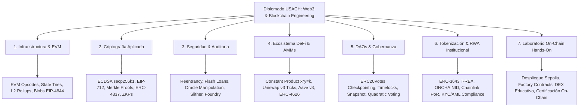
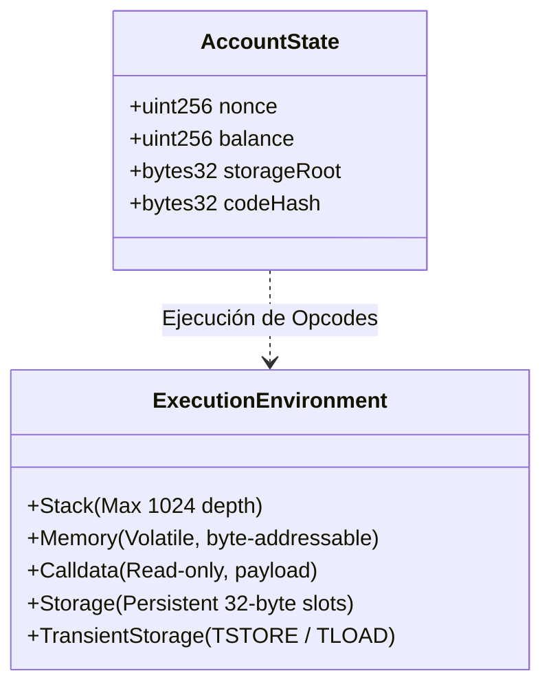
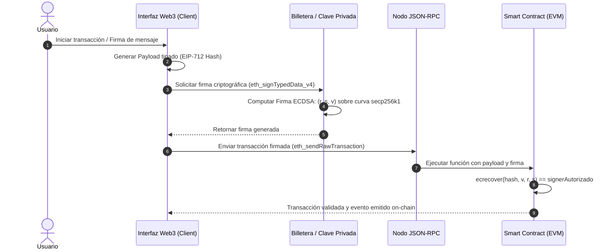
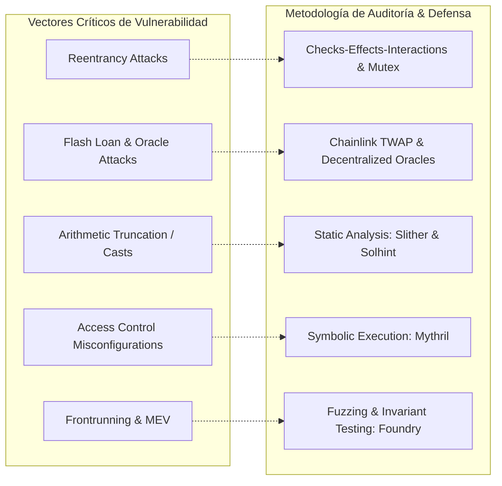
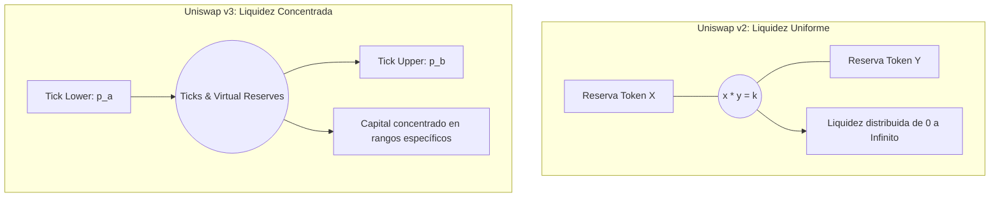
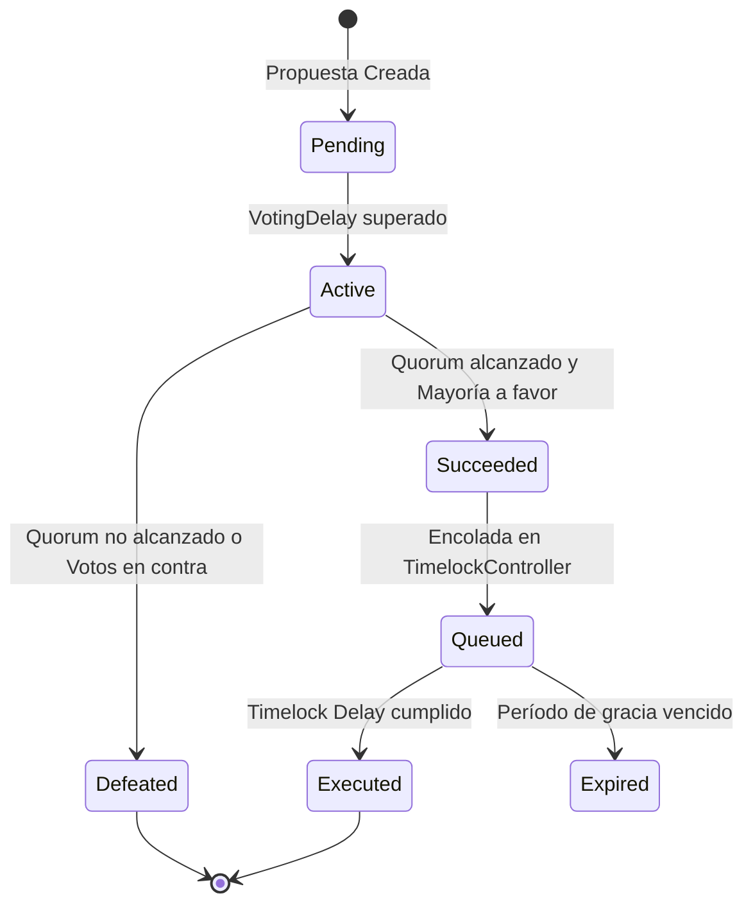
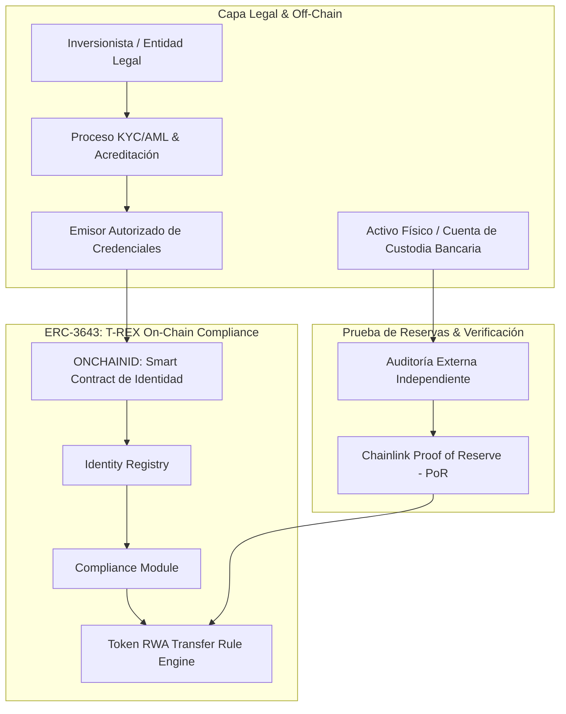
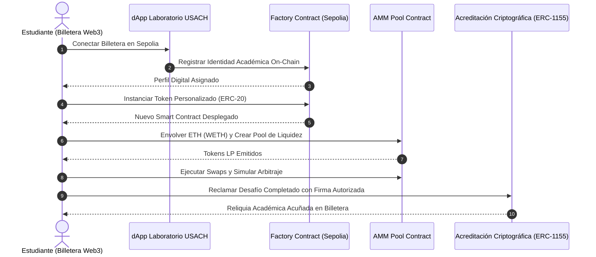

Me complace enormemente comunicar de manera oficial el inicio de mis actividades académicas como profesor en el programa de diplomado especializado de la **Universidad de Santiago de Chile (USACH)** este **15 de abril de 2026**. 

Asumir este desafío docente en una de las casas de estudios superiores más prestigiosas y con mayor tradición en ingeniería y ciencia de nuestro país representa un hito fundamental tanto en mi trayectoria profesional como en mi vocación por el desarrollo de ecosistemas tecnológicos de alto impacto. La industria de las tecnologías descentralizadas (Web3) se encuentra en un punto de inflexión histórico: la fase de experimentación puramente especulativa ha dado paso a una era de **rigor ingenieril, cumplimiento normativo, arquitecturas modulares de alto rendimiento y seguridad criptográfica de grado institucional**.

Por esta razón, la formación de profesionales capaces de liderar esta transformación exige un programa académico robusto, minucioso y profundamente práctico. No basta con comprender los conceptos a nivel divulgativo; los nuevos ingenieros, auditores y arquitectos de software deben dominar los cimientos matemáticos, los patrones de diseño en código máquina (bytecode EVM), los vectores de ataque más sofisticados y las dinámicas económicas algorítmicas que sustentan a los protocolos descentralizados.

---


---

## Estructura Curricular y Visión del Programa

El plan de estudios que he estructurado para este diplomado ha sido concebido para llevar a los alumnos desde las bases criptográficas e infraestructurales más elementales hasta el diseño, despliegue y auditoría de sistemas distribuidos complejos listos para producción. A continuación, presento un desglose técnico exhaustivo de los módulos temáticos que abordamos en el aula:



---

## 1. Arquitectura de Blockchain e Infraestructura Descentralizada

El primer gran pilar del programa se enfoca en desmitificar el funcionamiento interno de los libros mayores distribuidos y la máquina de cómputo sobre la cual se ejecutan los contratos inteligentes.

### La Ethereum Virtual Machine (EVM) como Máquina de Estados Finita
Analizamos en profundidad la EVM, una máquina de cómputo cuasi-Turing completa basada en pila (*stack machine*) con palabras de 256 bits (32 bytes). Desglosamos el ciclo de vida de una transacción y cómo el estado global de Ethereum ($\sigma$) transiciona determinísticamente mediante la función de transición de estado:

$$\sigma_{t+1} = \Upsilon(\sigma_t, T)$$

Exploramos la estructura de almacenamiento de datos subyacente basada en árboles de Merkle modificados (**Modified Merkle Patricia Tries**), examinando sus cuatro instancias críticas:
1. **State Trie**: Almacena el mapeo global de direcciones a cuentas (nonce, balance, storageRoot, codeHash).
2. **Storage Trie**: Espacio de almacenamiento persistente (`sload` / `sstore`) exclusivo de cada contrato inteligente, optimizado mediante slots contiguos de 32 bytes y reglas de *packing* de variables.
3. **Transactions Trie**: Registro criptográfico inmutable de las transacciones incluidas en un bloque determinado.
4. **Receipts Trie**: Estructura de comprobantes que almacena los registros de logs y tópicos generados durante la ejecución de los opcodes `LOG0` a `LOG4`.



### Mecanismos de Consenso y Finalidad Criptoeconómica
Revisamos la transición hacia **Proof of Stake (PoS)** mediante el motor de consenso *Gasper* (la combinación del algoritmo de elección de bifurcación *LMD-GHOST* y el protocolo de finalidad de puntos de control *Casper FFG*). Estudiamos las condiciones de penalización severa (*slashing* por doble propuesta o votos de atestación envolventes) y la dinámica económica que asegura miles de millones de dólares en valor asegurado.

### Escalabilidad Modular y Capas de Ejecución (Layer 2)
Desglosamos la transición del paradigma monolítico al paradigma modular:
- **Rollups Optimistas**: Suposición de validez económica con ventanas de disputa de 7 días, máquinas de estado de transición a prueba de fallos (*fault proofs*) interactivas tipo Cannon sobre OP Stack y Nitro sobre Arbitrum.
- **ZK-Rollups**: Pruebas criptográficas de validez instantánea utilizando *STARKs* y *SNARKs*, permitiendo una compresión masiva de datos y finalización matemática inmediata en la capa L1.
- **EIP-4844 (Proto-Danksharding)**: Transacciones con carga de datos efímera (*blob-carrying transactions* tipo `0x03`), desacoplando el costo de almacenamiento de calldata de la L2 del gas de ejecución de la L1 y reduciendo drásticamente las comisiones para los usuarios finales.

---

## 2. Criptografía Aplicada a Entornos Web3

La criptografía no es un accesorio en blockchain; es el cimiento absoluto que garantiza la identidad, la integridad de los datos, la inmutabilidad de los registros y la privacidad de los participantes.



### Curvas Elípticas y Firmas ECDSA
Abordamos la matemática de la curva elíptica **secp256k1** definida sobre el cuerpo finito $\mathbb{F}_p$ mediante la ecuación de Weierstrass:

$$y^2 \equiv x^3 + 7 \pmod p$$

Estudiamos el proceso de derivación de claves públicas $K = k \cdot G$ mediante multiplicación escalar de punto, el cómputo de la dirección de Ethereum tomando los últimos 20 bytes del hash **Keccak-256** de la clave pública, y la descomposición de firmas digitales en los tres parámetros canónicos $(r, s, v)$. Analizamos a fondo la maleabilidad de firmas criptográficas (impidiendo valores de $s$ mayores a $\frac{n}{2}$) y el uso seguro del opcode nativo `ecrecover`.

### Árboles de Merkle y Pruebas Criptográficas Eficientes
Enseñamos a estructurar **Merkle Trees** para la gestión de listas de acceso (*allowlists*) y distribuciones masivas de tokens (*airdrops*). Demostramos cómo validar la inclusión de un elemento en un conjunto de millones de registros transmitiendo únicamente una prueba de tamaño logarítmico $O(\log n)$ en lugar de almacenar arrays completos en el costoso almacenamiento `storage` del contrato:

```solidity
// SPDX-License-Identifier: MIT
pragma solidity ^0.8.28;

import {MerkleProof} from "@openzeppelin/contracts/utils/cryptography/MerkleProof.sol";

contract MerkleAirdropDistributor {
    bytes32 public immutable merkleRoot;
    mapping(address => bool) public hasClaimed;

    event Claimed(address indexed claimant, uint256 amount);
    error AlreadyClaimed();
    error InvalidProof();

    constructor(bytes32 _merkleRoot) {
        merkleRoot = _merkleRoot;
    }

    function claim(uint256 amount, bytes32[] calldata proof) external {
        if (hasClaimed[msg.sender]) revert AlreadyClaimed();

        // Cómputo del leaf hash protegido contra ataques de colisión de segundo preimage
        bytes32 leaf = keccak256(bytes.concat(keccak256(abi.encode(msg.sender, amount))));

        if (!MerkleProof.verify(proof, merkleRoot, leaf)) revert InvalidProof();

        hasClaimed[msg.sender] = true;
        emit Claimed(msg.sender, amount);
    }
}
```

### Estándar EIP-712: Hashing y Firmas de Datos Estructurados
Instruimos en la implementación de **EIP-712** para prevenir ataques de repetición (*replay attacks*) entre diferentes aplicaciones o cadenas de bloques. Estudiamos la composición de separadores de dominio (`DOMAIN_SEPARATOR`) parametrizados con `name`, `version`, `chainId` y `verifyingContract`, permitiendo a los usuarios firmar autorizaciones explícitas y legibles en sus billeteras mediante esquemas como `ERC20Permit` (EIP-2612) para transacciones sin gas nativo.

### Abstracción de Cuentas (ERC-4337) y Passkeys
Cubrimos el nuevo estándar de cuentas inteligentes que desacopla la firma criptográfica del protocolo base de Ethereum:
- Flujo de `UserOperation`, empaquetadores (*Bundlers*) y el contrato maestro `EntryPoint`.
- Contratos `Paymaster` para subsidiar comisiones de gas o permitir pagos en tokens ERC-20 (USDC, DAI).
- Integración de curvas criptográficas estándar como **secp256r1 (WebAuthn / Passkeys)** mediante verificadores modulares en smart contracts para autenticación biométrica móvil sin requerir frases semilla (*seed phrases*).

---

## 3. Seguridad Defensiva, Auditoría y Análisis de Vulnerabilidades

La inmutabilidad de los contratos inteligentes implica que un error en el código fuente no puede corregirse mediante un parche convencional una vez desplegado. La seguridad no es una etapa final; es una disciplina de diseño integral que debe regir cada línea de código.



### Anatomía de los Ataques Más Frecuentes en Smart Contracts

| Vector de Ataque | Mecanismo de Explotación | Estrategia de Mitigación / Patrón Defensivo |
| :--- | :--- | :--- |
| **Reentrancy Clásico & Cross-Function** | El contrato atacante secuestra el flujo de control mediante funciones `fallback()` o `receive()` antes de que el contrato víctima actualice su estado interno. | Patrón **Checks-Effects-Interactions (CEI)** estricto y modificadores de exclusión mutua `ReentrancyGuard`. |
| **Read-Only Reentrancy** | Manipulación de una función de lectura (`view`) en un protocolo que se encuentra en un estado transitorio incoherente para engañar a un tercer protocolo dependiente. | Bloqueo de reentrancia global o verificación de flags de estado en llamadas de solo lectura. |
| **Manipulación de Oráculos Spot vía Flash Loans** | Préstamos relámpago desbalancean artificialmente las reservas de un AMM en una sola transacción para alterar el precio de liquidación o colateral. | Uso exclusivo de oráculos descentralizados multicontrato (**Chainlink**) o medias móviles ponderadas en el tiempo (**Uniswap v3 TWAP**). |
| **Truncamiento y Desbordamiento en Conversiones** | Conversiones de tipo explícitas no seguras (ej. `uint256(amount)` a `uint64` o `int128`) que descartan bits superiores sin comprobación. | Uso de librerías tipo `SafeCast` de OpenZeppelin y validaciones de rango numérico explícitas. |
| **Frontrunning, Sándwich y MEV** | Mineros o validadores reorganizan transacciones en la mempool para extraer valor económico insertando órdenes previas y posteriores. | Establecimiento de tolerancias de deslizamiento estrictas (*slippage control*), límites de tiempo de expiración (*deadlines*) y uso de subastas privadas (MEV-Boost / Flashbots). |
| **Denegación de Servicio (DoS)** | Bucles no acotados sobre estructuras dinámicas que superan el límite de gas del bloque (`block gas limit`) o reversiones intencionales en llamadas externas. | Patrón **Pull over Push** (los usuarios reclaman sus fondos individualmente en lugar de enviarles transferencias masivas). |

### Pipeline de Auditoría Profesional y Verificación
Enseñamos a estructurar un pipeline de aseguramiento de calidad y auditoría de grado militar:
1. **Análisis Estático**: Configuración de reglas personalizadas en **Slither** para recorrer el árbol de sintaxis abstracta (*AST*), generar grafos de flujo de control (*CFG*) y detectar patrones de vulnerabilidad conocidos.
2. **Análisis Simbólico**: Ejecución de contratos mediante **Mythril** para explorar rutas de ejecución posibles utilizando solucionadores de restricciones matemáticas SMT (*Z3 Theorem Prover*).
3. **Fuzzing Basado en Propiedades e Invariantes**: Pruebas exhaustivas con **Foundry**, generando millones de entradas pseudoaleatorias para verificar que los invariantes del sistema jamás se violen bajo ninguna secuencia de llamadas.
4. **Verificación Formal**: Introducción al modelado formal con herramientas de especificación matemática tipo **Certora (CVL)** y **Halmos**.

---

## 4. Finanzas Descentralizadas (DeFi) y Mercados Algorítmicos

El módulo de DeFi analiza los protocolos que componen el sistema financiero alternativo sobre Ethereum, examinando las fórmulas matemáticas y los mecanismos de liquidez que los hacen sostenibles.

### Creadores de Mercado Automatizados (AMMs) y Mecánica de Precios
Analizamos la evolución de los AMMs desde la fórmula seminal de producto constante de Uniswap v2:

$$x \cdot y = k$$

Donde $x$ e $y$ representan las reservas de los tokens del par comercial. Demostramos la fórmula analítica para calcular el retorno exacto de un intercambio considerando una comisión de intercambio $\gamma$ (ej. $0.3\%$ o $\gamma = 0.003$):

$$\Delta y = \frac{y \cdot \Delta x \cdot (1 - \gamma)}{x + \Delta x \cdot (1 - \gamma)}$$



Profundizamos en la **Liquidez Concentrada de Uniswap v3**, donde el capital se asigna dentro de rangos de precio específicos parametrizados por *ticks* logarítmicos ($p(i) = 1.0001^i$), permitiendo una eficiencia de capital hasta 4.000 veces superior a la de un modelo tradicional. Calculamos y modelamos matemáticamente la **Pérdida Impermanente (*Impermanent Loss*)**:

$$IL(k) = \frac{2\sqrt{k}}{1 + k} - 1 \quad \text{donde } k = \frac{P_{final}}{P_{inicial}}$$

### Protocolos de Préstamos y Mercados Monetarios (Lending & Borrowing)
Estudiamos la arquitectura de protocolos como **Aave v3** y **Compound v3**:
- Modelos de tasas de interés variables dinámicas basados en curvas por tramos (*Kinked / Jump Rate Interest Models*) que ajustan la tasa de endeudamiento en función del ratio de utilización $U = \frac{TotalBorrows}{TotalLiquidity}$.
- Factor de Salud (*Health Factor*):
  $$HF = \frac{\sum (Collateral_i \times LiquidationThreshold_i)}{TotalBorrowsInETH}$$
- Mecanismos de liquidación atómica con incentivos de penalización (*liquidation bonus*) para liquidadores automatizados.

### Bóvedas de Rendimiento Estandarizadas (ERC-4626)
Analizamos el estándar **ERC-4626 (Tokenized Vault Standard)**, diseñado para unificar la representación de bóvedas de rendimiento, eliminando la fragmentación entre `cTokens`, `aTokens` y `yVaults`. Estudiamos cómo prevenir el ataque clásico de **inflación de primer depósito (*inflation attack*)** mediante la emisión de partes virtuales (*virtual shares*) o la quema inicial de depósitos muertos (*dead shares*).

---

## 5. Organizaciones Autónomas Descentralizadas (DAOs) y Gobernanza On-Chain

Las DAOs representan el paradigma de gobernanza corporativa e institucional más avanzado del entorno digital, donde las reglas de votación, ejecución presupuestaria y modificación de parámetros están codificadas en smart contracts.



### Arquitectura de Gobernanza Basada en Checkpoints
Desglosamos la arquitectura de gobernanza de **OpenZeppelin Governor** en conjunto con tokens que implementan la extensión **ERC20Votes**:
1. **Checkpointing Histórico**: Los votos no se consultan a partir del balance actual en el momento de emitir el sufragio; se recupera el balance que la cuenta poseía en el bloque exacto en que la propuesta fue registrada (`getPastVotes(account, timepoint)`). Esto neutraliza por completo los ataques de gobernanza basados en préstamos relámpago.
2. **TimelockController**: Mecanismo de retardo obligatorio entre la aprobación de una propuesta y su ejecución final en la blockchain. Este período de enfriamiento (*time delay*) otorga una salvaguarda indispensable para que la comunidad y los proveedores de liquidez puedan retirar sus activos si una propuesta maliciosa o imprevista logra ser aprobada.

### Mecanismos de Votación Avanzados
- **Votación Cuadrática (*Quadratic Voting*)**: Modelo donde el costo en tokens de emitir $V$ votos escala cuadráticamente ($C = V^2$), otorgando mayor peso a la amplitud del consenso comunitario por sobre la concentración de capital de grandes tenedores (*whales*).
- **Gobernanza Híbrida**: Integración de votación sin costo de gas mediante firmas fuera de cadena en **Snapshot**, conectadas con contratos de tesorería multifirma (**Safe**) mediante módulos de ejecución optimista como **Zodiac** y **Reality.eth**.

---

## 6. Tokenización Institucional y Activos del Mundo Real (RWA)

La convergencia entre los mercados financieros tradicionales (TradFi) y la infraestructura Web3 ocurre a través de la tokenización de activos del mundo real (**Real-World Assets - RWA**), tales como bonos del tesoro, deuda corporativa, bienes raíces fraccionados, materias primas y créditos privados.



### El Estándar ERC-3643 (T-REX: Token for Regulated EXchanges)
Para emitir activos sujetos a regulaciones de valores financieros (como la SEC en EE.UU. o la CMF en Chile), los tokens estándar como ERC-20 son insuficientes debido a que no permiten restringir transferencias a direcciones no autorizadas ni aplicar reglas de cumplimiento legal en tiempo real.

Estudiamos la arquitectura de **ERC-3643**, el estándar de referencia global para security tokens permisionados:
- **ONCHAINID**: Identidad digital autosoberana desplegada como un smart contract que almacena atestaciones criptográficas (*claims*) emitidas por entidades autorizadas.
- **Identity Registry**: Registro en cadena que vincula direcciones públicas de billeteras con sus correspondientes identidades verificadas.
- **Compliance Module**: Motor de reglas programables que valida en cada llamada a `transfer()` o `transferFrom()` condiciones como:
  - Verificación de nacionalidad y residencia fiscal.
  - Límites de inversores no acreditados por jurisdicción.
  - Períodos de bloqueo temporal (*lockup / vesting*).
  - Montos máximos de tenencia por cuenta.
- **Mecanismos de Recuperación Legal y Cumplimiento**: Funciones auditadas de transferencia forzosa (`forcedTransfer`) ante órdenes judiciales y recuperación de balances ante pérdida de claves privadas (`recoveryAddress`).

### Oráculos de Prueba de Reservas (Chainlink Proof of Reserve)
Implementamos oráculos automatizados de prueba de reservas (**PoR**) que auditan de forma continua y desintermediada los saldos bancarios o el colateral custodiado fuera de la cadena, bloqueando automáticamente la emisión (*minting*) de nuevos tokens si el respaldo fiduciario resulta inferior al circulante en la blockchain.

---

## 7. Metodología de Laboratorio y Práctica On-Chain en Ethereum Sepolia

En el diplomado aplicamos una premisa innegociable: **la teoría sin ejecución en código ejecutable es estéril**. Para consolidar estos aprendizajes, diseñé y desplegué un laboratorio práctico interactivo de finanzas descentralizadas en la red de pruebas pública **Ethereum Sepolia** ([web3-usach-lab.cbaeza.com](https://web3-usach-lab.cbaeza.com/)).



### Resultados y Métricas del Ecosistema de Laboratorio
El entorno de entrenamiento opera bajo una arquitectura 100% descentralizada y serverless (sin bases de datos centralizadas tradicionales), comunicándose directamente con la red mediante llamadas RPC:

- **+2.460 transacciones verificadas** y **+3.331 eventos on-chain** generados durante las sesiones prácticas.
- **115 contratos inteligentes individuales** instanciados dinámicamente mediante contratos factoría optimizados con *Custom Errors*.
- **98 piscinas de liquidez operativas** desplegadas en un DEX educativo de producto constante, acumulando más de **33.32 unidades de WETH** en volumen bloqueado.
- **241 reliquias y certificados académicos** acuñados mediante firmas criptográficas seguras vinculadas al dominio de la dApp, conformando un portafolio profesional inmutable y auditable en la blockchain para cada alumno.

---

## Reflexiones Finales y Compromiso con el Futuro

Iniciar este camino docente en la **Universidad de Santiago de Chile** es una oportunidad invaluable para contribuir activamente a la democratización del conocimiento tecnológico de vanguardia. América Latina cuenta con un talento excepcional en ingeniería y ciencias de la computación; dotar a nuestros profesionales de las herramientas analíticas, criptográficas y prácticas para competir y liderar a nivel global es nuestra mayor responsabilidad.

Agradezco profundamente a las autoridades de la universidad, a mis colegas docentes y, de manera muy especial, a los estudiantes que con su curiosidad, dedicación y espíritu crítico dan vida a cada una de nuestras clases.

Seguiremos construyendo, auditando y formando sobre bases sólidas. ¡Nos vemos en el aula y en la blockchain!

> **Recursos y Enlaces de Interés**:
> - Laboratorio Interactivo: [web3-usach-lab.cbaeza.com](https://web3-usach-lab.cbaeza.com/)
> - Repositorio de la dApp de Entrenamiento: [GitHub - Diplomado USACH Training DApp](https://github.com/cjbaezilla/diplomado-usach-training-dapp)
> - Repositorio de Smart Contracts: [GitHub - Diplomado USACH Contracts](https://github.com/cjbaezilla/diplomado-usach-training-dapp-contracts)
> - Perfil Académico e Institucional: [Universidad de Santiago de Chile (USACH)](https://www.usach.cl/)
