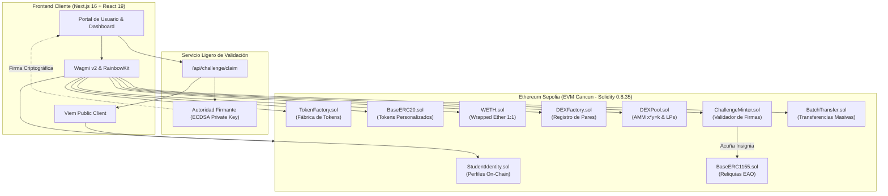
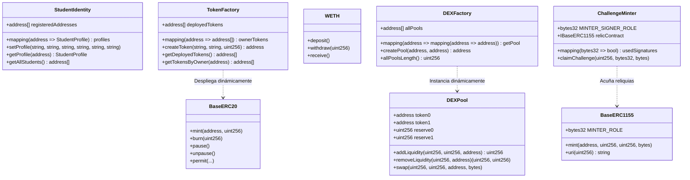
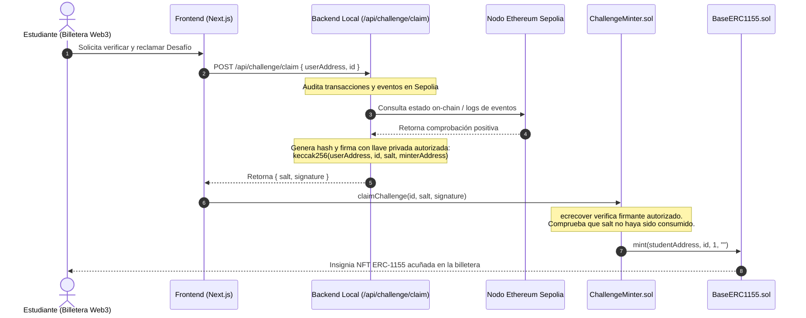

El aprendizaje efectivo de la tecnología blockchain y la ingeniería de contratos inteligentes se enfrenta a un desafío recurrente en la educación técnica: la brecha entre la teoría abstracta y la práctica operativa en entornos descentralizados reales. Con frecuencia, los programas formativos limitan la enseñanza a conceptos teóricos, diapositivas estáticas y fragmentos de código aislados que no transmiten la complejidad dinámica del ecosistema Web3.

Para resolver este obstáculo de raíz, diseñé y construí un **Laboratorio Web3 Interactivo** accesible públicamente en [web3-usach-lab.cbaeza.com](https://web3-usach-lab.cbaeza.com/) para los estudiantes del **Diplomado en Tecnologías Blockchain de la Universidad de Santiago de Chile (USACH)**. La plataforma opera de manera integral sobre la red de pruebas **Ethereum Sepolia**, eliminando intermediarios y prescindiendo por completo de bases de datos centralizadas tradicionales.

En este artículo presento en profundidad la visión pedagógica, la arquitectura técnica de contratos inteligentes en Solidity, el diseño del frontend descentralizado, el sistema de validación criptográfica de logros mediante firmas digitales ECDSA y los módulos financieros implementados en el protocolo.

---

## 🎯 Fundamentos Pedagógicos y Objetivos del Proyecto

El desarrollo en Web3 exige que los profesionales comprendan no solo la sintaxis del lenguaje de programación, sino también la interacción asíncrona con la máquina virtual (EVM), el costo del cómputo medido en gas, la inmutabilidad del estado global y los mecanismos algorítmicos que gobiernan los mercados descentralizados.

### 1. Práctica Inmersiva y Eliminación de Barreras
La dApp permite que cualquier persona interesada conecte su billetera digital (como MetaMask, Rainbow, Coinbase Wallet o WalletConnect) e interactúe de forma inmediata y directa con protocolos financieros y contratos estándar, ofreciendo un entorno de experimentación sin riesgos de capital real pero sujeto a las mismas reglas de consenso y seguridad de la red principal de Ethereum.

### 2. Paradigma Serverless 100% On-Chain
A diferencia de las aplicaciones web convencionales que dependen de servidores de bases de datos relacionales (como PostgreSQL o MongoDB), la arquitectura del portal funciona exclusivamente como un cliente estático que consulta y transmuta el estado directamente en los nodos de la red Ethereum. La blockchain actúa como la única fuente de verdad y backend nativo de toda la plataforma: perfiles de usuario, balances, fábricas de tokens, reservas de liquidez y acreditaciones académicas existen íntegramente en la cadena.

### 3. Gamificación y Transparencia Abierta
La plataforma estructura el avance a través de una senda de desafíos progresivos, perfiles públicos auditables y un ranking de liquidez en vivo, incentivando la colaboración entre pares, la transparencia y la sana experimentación técnica.

---

## 🌐 Recursos y Enlaces del Ecosistema

Todo el material del proyecto ha sido liberado bajo licencia de código abierto (Open Source) para la comunidad de desarrolladores y educadores:

* **Laboratorio Web3 en Producción (dApp):** [web3-usach-lab.cbaeza.com](https://web3-usach-lab.cbaeza.com/)
* **Repositorio del Frontend (dApp):** [github.com/cjbaezilla/diplomado-usach-training-dapp](https://github.com/cjbaezilla/diplomado-usach-training-dapp)
* **Repositorio de Contratos Inteligentes:** [github.com/cjbaezilla/diplomado-usach-training-dapp-contracts](https://github.com/cjbaezilla/diplomado-usach-training-dapp-contracts)
* **Ranking Dinámico de Proveedores de Liquidez:** [web3-usach-lab.cbaeza.com/ranking](https://web3-usach-lab.cbaeza.com/ranking)
* **Ejemplo de Perfil Público Estudiantil:** [web3-usach-lab.cbaeza.com/estudiante?address=0xaEeaA55ED4f7df9E4C5688011cEd1E2A1b696772](https://web3-usach-lab.cbaeza.com/estudiante?address=0xaEeaA55ED4f7df9E4C5688011cEd1E2A1b696772)

---

## 🏗️ Arquitectura General del Sistema

El ecosistema se divide en dos capas principales: una suite de **contratos inteligentes modulares** desplegados en Ethereum Sepolia y una **aplicación descentralizada cliente** desarrollada en Next.js y React 19.



---

## 📑 Análisis Técnico de los Contratos Inteligentes

A continuación se detalla el diseño, la lógica interna y el comportamiento de cada uno de los contratos que dan vida al laboratorio.



---

### 1. Registro de Identidad Digital Soberana (`StudentIdentity.sol`)

La identidad digital soberana permite que cada usuario vincule su dirección pública con un perfil estructurado y permanente en la cadena, sin requerir proveedores de autenticación centralizados.

```solidity
struct StudentProfile {
    string fullName;
    string institutionalEmail;
    string githubProfile;
    string socialX;
    string socialLinkedin;
    string avatarUrl;
    uint256 registeredAt;
    uint256 updatedAt;
    bool isRegistered;
}
```


#### Mecánica de Registro y Optimización de Gas:
* **Validación Temprana con Errores Personalizados:** Se comprueba que el nombre no sea una cadena vacía mediante `error InvalidName()`, lo que optimiza el consumo de gas en comparación con las cadenas de texto tradicionales de `require`.
* **Indexación On-Chain:** El contrato mantiene un arreglo dinámico `registeredAddresses` y un mapeo inverso `addressToIndex` que permite consultar la totalidad de identidades registradas mediante llamadas de solo lectura externa.
* **Emisión de Eventos:** Cada modificación emite los eventos `ProfileRegistered` o `ProfileUpdated`, permitiendo al frontend reaccionar reactivamente ante cambios en el estado.


---

### 2. Fábrica de Activos ERC-20 (`TokenFactory.sol` y `BaseERC20.sol`)

Para experimentar con economías de tokens y creación de activos fungibles, el contrato `TokenFactory.sol` implementa un generador descentralizado de contratos ERC-20 mediante el opcode `create`.


#### Características del Token Base (`BaseERC20.sol`):
* **OpenZeppelin Contracts v5.6.1:** Implementación de estándares de grado industrial.
* **Acuñación y Destrucción (`ERC20Burnable`, `mint`):** El creador del activo retiene el rol de propietario (`Ownable`), permitiéndole emitir nuevas unidades según la política monetaria diseñada para su proyecto.
* **Pausabilidad (`ERC20Pausable`):** Permite pausar transferencias en escenarios de emergencia o mantenimiento didáctico.
* **Firmas sin Gas (`ERC20Permit` - EIP-2612 / EIP-712):** Soporta aprobaciones mediante firmas criptográficas fuera de la cadena (*off-chain*), permitiendo autorizar transferencias en una sola transacción combinada sin requerir transacciones previas de aprobación de saldo (`approve`).


---

### 3. Envoltura de Ether (`WETH.sol`)

En la red Ethereum, el Ether nativo (ETH) no implementa la interfaz del estándar ERC-20, lo que impide su utilización directa dentro de piscinas de liquidez genéricas diseñadas para pares de tokens homogéneos.

El contrato `WETH.sol` resuelve esta incompatibilidad mediante un port adaptado a Solidity `0.8.35` del contrato canónico WETH9:

* **Depósito (Wrap):** Al transferir ETH a la función `deposit()` o a través de `receive()`, el contrato custodia el balance nativo y acuña tokens Wrapped Ether en paridad exacta 1:1 a favor del remitente.
* **Retiro (Unwrap):** Al ejecutar `withdraw(amount)`, el contrato destruye la cantidad correspondiente de tokens WETH del remitente y transfiere el monto equivalente de Ether nativo de regreso a la billetera.


---

### 4. Creador de Mercado Automatizado (`DEXFactory.sol` y `DEXPool.sol`)

El módulo financiero descentralizado implementa el algoritmo de **Creador de Mercado de Producto Constante** (*Constant Product Automated Market Maker*), basado en el modelo fundacional de Uniswap V2.


#### Garantía de Unicidad de Pares (`DEXFactory.sol`):
Para evitar la fragmentación de liquidez y la duplicación de piscinas para un mismo par, la fábrica ordena alfanuméricamente las direcciones de los tokens involucrados antes de instanciar el contrato del pool:

```solidity
(address token0, address token1) = tokenA < tokenB ? (tokenA, tokenB) : (tokenB, tokenA);
require(token0 != address(0), "DEX: ZERO_ADDRESS");
require(getPool[token0][token1] == address(0), "DEX: POOL_EXISTS");

DEXPool pool = new DEXPool(token0, token1);
getPool[token0][token1] = address(pool);
getPool[token1][token0] = address(pool);
allPools.push(address(pool));
```


#### Mecánica de la Piscina de Liquidez (`DEXPool.sol`):

1. **Invariante de Producto Constante:**
   El equilibrio de reservas de la piscina se rige por la ecuación fundamental:
   $$x \cdot y = k$$
   Donde $x$ e $y$ representan las reservas de `token0` y `token1` custodiadas por el contrato.

2. **Aporte de Liquidez y Emisión de Tokens LP:**
   * Al crear el pool por primera vez, las acciones de liquidez (tokens LP) se calculan mediante la media geométrica de los montos depositados:
     $$\text{LP}_{\text{inicial}} = \sqrt{\text{amount}_0 \cdot \text{amount}_1}$$
   * En depósitos posteriores, el usuario debe respetar la proporción actual de reservas ($\frac{\text{reserve}_0}{\text{reserve}_1}$) y recibe una cantidad proporcional de tokens LP:
     $$\text{LP}_{\text{emitidos}} = \min\left(\frac{\text{amount}_0 \cdot \text{LP}_{\text{total}}}{\text{reserve}_0}, \frac{\text{amount}_1 \cdot \text{LP}_{\text{total}}}{\text{reserve}_1}\right)$$


3. **Intercambio con Comisión (Swap):**
   El contrato deduce una comisión fija del **0.3%** (3 por mil) sobre el monto de entrada, la cual se acumula directamente en las reservas del pool para recompensar a los proveedores de liquidez. La fórmula para determinar la cantidad de salida ($\Delta y$) en función de la entrada ($\Delta x$) es:

   $$\Delta y = \frac{y \cdot (\Delta x \cdot 997)}{(x \cdot 1000) + (\Delta x \cdot 997)}$$


4. **Curva de Precios y Deslizamiento (Slippage):**
   La trayectoria hiperbólica del AMM ilustra cómo transacciones de gran magnitud desplazan el precio marginal y generan un deslizamiento (*price impact*) significativo cuando las reservas no son lo suficientemente profundas.


---

### 5. Validación Criptográfica y Reclamo de Reliquias (`ChallengeMinter.sol` y `BaseERC1155.sol`)

Para acreditar de forma inmutable las competencias prácticas de los estudiantes sin incurrir en costos masivos de almacenamiento en la blockchain ni permitir manipulaciones locales en el navegador, se diseñó una **arquitectura híbrida de validación off-chain y liquidación on-chain respaldada por firmas criptográficas ECDSA (EIP-191)**.



#### Prevención de Ataques de Repetición (Replay Attacks):
El contrato validador de desafíos `ChallengeMinter.sol` reconstruye el hash utilizando:
1. La dirección del remitente (`msg.sender`).
2. El identificador del desafío (`challengeId`).
3. Un valor de sal único de 32 bytes (`salt`).
4. La dirección de su propio contrato (`address(this)`), impidiendo que firmas emitidas para una red o contrato sean reutilizadas en otros despliegues.

```solidity
bytes32 messageHash = keccak256(abi.encodePacked(msg.sender, challengeId, salt, address(this)));
bytes32 ethSignedMessageHash = MessageHashUtils.toEthSignedMessageHash(messageHash);
address signer = ECDSA.recover(ethSignedMessageHash, signature);

if (!hasRole(MINTER_SIGNER_ROLE, signer)) revert InvalidSignature();
if (usedSignatures[messageHash]) revert SignatureAlreadyUsed();

usedSignatures[messageHash] = true;
relicContract.mint(msg.sender, challengeId, 1, "");
```


---

### 6. Transferencias Masivas por Lotes (`BatchTransfer.sol`)

Para optimizar el uso de gas y agilizar la distribución comunitaria de tokens entre compañeros, el contrato `BatchTransfer.sol` permite realizar envíos a múltiples direcciones en una única transacción atómica, integrando soporte para firmas `permit` bajo el estándar EIP-2612.

---

## 🏆 Senda de los 10 Desafíos Académicos

El laboratorio plantea una trayectoria curricular progresiva compuesta por diez hitos prácticos. Cada desafío superado recompensa al usuario con una **Reliquia Académica (NFT ERC-1155)** única e inmutable en su billetera, con metadatos inspirados en el patrimonio histórico y los talleres de la emblemática **Escuela de Artes y Oficios (EAO)** de la USACH:

| ID | Desafío Académico | Dificultad | Requisito Técnico Verificado On-Chain | Reliquia EAO Obtenida |
| :---: | :--- | :---: | :--- | :--- |
| **0** | Conexión de Billetera Web3 | Principiante | Conexión activa del cliente Web3 a la dApp. | *El Alambique y Recipiente (Taller EAO)* |
| **1** | Grifo Académico (Faucet) | Principiante | Balance de ETH de pruebas mayor a cero en Sepolia. | *La Turbina del Patio de Talleres* |
| **2** | Perfil Estudiantil On-Chain | Principiante | Registro activo en el contrato `StudentIdentity.sol`. | *El Tablero de Control (Central Eléctrica)* |
| **3** | Creación de Token ERC-20 | Intermedio | Despliegue de un token propio mediante `TokenFactory.sol`. | *La Sala de Exhibición (Maestría EAO)* |
| **4** | Acuñación y Transferencia | Intermedio | Acuñar tokens propios y transferir saldo a un compañero. | *La Fragua y el Yunque (Taller de Forja)* |
| **5** | Intercambio en el AMM | Intermedio | Ejecutar al menos un swap en cualquier pool del DEX. | *La Caldera Babcock & Wilcox* |
| **6** | Provisión de Liquidez | Avanzado | Aportar liquidez a un pool y recibir tokens LP. | *La Bodega del Laboratorio de Química* |
| **7** | Creación de Piscina DEX | Avanzado | Crear un nuevo pool de intercambio en `DEXFactory.sol`. | *La Máquina de Vapor Cavé à Paris* |
| **8** | Envoltura de Ether (WETH) | Principiante | Envolver ETH nativo a WETH mediante `WETH.sol`. | *La Urna Funeraria del General Las Heras* |
| **9** | Maestría On-Chain | Avanzado | 5 tokens creados + saldo en 11 tokens ajenos + liquidez en 5 pools ajenos. | *Los Taladros Mecánicos en Serie* |


---

## 💻 Interfaz de Usuario y Experiencia en la dApp

El frontend fue desarrollado utilizando las herramientas más modernas del ecosistema React y Web3:

* **Next.js 16 & React 19:** Renderizado optimizado con arquitectura basada en componentes reactivos y soporte integral para TypeScript.
* **Tailwind CSS v4 & shadcn/ui:** Sistema de diseño moderno, estilizado mediante variables nativas OKLCH y componentes de interfaz accesibles y dinámicos.
* **Wagmi v2 & RainbowKit v2:** Conectividad robusta con billeteras, gestión automática de cambios de red y sincronización reactiva del estado del usuario.
* **Viem:** Cliente ligero y tipado para consultas RPC de alto rendimiento a la blockchain.
* **Indicador en Vivo de Precio de ETH:** Ticker en tiempo real conectado a los feeds públicos de Binance (`ETHUSDT`) con actualización cada 15 segundos.

---

### Módulos Principales de la dApp

#### 1. Identidad Estudiantil y Perfiles Públicos
Permite a cada participante gestionar sus datos en la cadena y compartir una URL pública personalizada (por ejemplo, `/estudiante?address=0x...`) que actúa como un portafolio verificable donde se exhiben sus datos de contacto, insignias acumuladas, tokens creados y pools de liquidez activos.


#### 2. Portal y Fábrica de Tokens ERC-20
Permite desplegar nuevos contratos en pocos clics, consultar balances en tiempo real, acuñar nuevas unidades de suministro y realizar transferencias directas hacia otros compañeros.


#### 3. Intercambio Descentralizado y Provisión de Liquidez
Ofrece interfaces dedicadas para la conversión atómica de Wrapped Ether, el intercambio instantáneo de tokens según la curva de precios del AMM y la inyección o retiro de liquidez de manera transparente.


#### 4. Ranking de Liquidez en Tiempo Real
Un tablero dinámico que indexa los contratos de piscinas instanciados en `DEXFactory.sol` y clasifica los activos creados según la cantidad de WETH bloqueado en sus respectivos mercados. Esto introduce una dimensión de gamificación que motiva a los participantes a coordinar mercados líquidos y entender en la práctica el impacto de la profundidad de mercado.


---

## 🔍 Direcciones de Contratos Verificados en Etherscan Sepolia

Todos los contratos fueron desplegados utilizando Hardhat Ignition y cuentan con su código fuente verificado de forma pública en Etherscan:

| Contrato | Dirección en Sepolia | Hash de Transacción de Despliegue | Enlace a Código Verificado |
| :--- | :--- | :--- | :--- |
| **StudentIdentity** | `0x652b7718F130329F3eC865f418FE2a2634fb5E29` | `0xf2b1edd45b97629512e5fb519936466786e5d6135e07511c5aa968c40f10645d` | [Ver en Etherscan](https://sepolia.etherscan.io/address/0x652b7718F130329F3eC865f418FE2a2634fb5E29#code) |
| **TokenFactory** | `0x30A4CA7ad7947f7Df6fdAf0EC4D9f4540e0149bB` | `0x3bcc16c5dc5512c566525b6f3850bb5133ff691198dcbae7b35e993936791d72` | [Ver en Etherscan](https://sepolia.etherscan.io/address/0x30A4CA7ad7947f7Df6fdAf0EC4D9f4540e0149bB#code) |
| **BaseERC1155** | `0x6b727bC4560A05AEEB9c353396395B35c6Fdb57E` | `0xcdb09e648974448d8fa2dc2edeb5113fe05746377a5aaaf4e0642608df6183db` | [Ver en Etherscan](https://sepolia.etherscan.io/address/0x6b727bC4560A05AEEB9c353396395B35c6Fdb57E#code) |
| **DEXFactory** | `0x2491e5C6d2aC321f0036fF5D561b7c72086Ba5a4` | `0x3fb045aaf2617146536cca9d9a45452c53b5393f83d2acf4350d385a715f6c62` | [Ver en Etherscan](https://sepolia.etherscan.io/address/0x2491e5C6d2aC321f0036fF5D561b7c72086Ba5a4#code) |
| **WETH** | `0x3E7B9d0da44D0c4Edb60a2261f89007f05419317` | `0xefaab4f239fa40fe26d4a05b318cb3afb4cd8a6da6c76c31a9aa4bbf27224f94` | [Ver en Etherscan](https://sepolia.etherscan.io/address/0x3E7B9d0da44D0c4Edb60a2261f89007f05419317#code) |
| **ChallengeMinter** | `0xd898ecBD77E4A428e9EAC2B1E445c2628E033653` | `0xeb2cbcb2f54b7ed509c6abac3862e0672fcc1874aec68d05d319d9598402252b` | [Ver en Etherscan](https://sepolia.etherscan.io/address/0xd898ecBD77E4A428e9EAC2B1E445c2628E033653#code) |
| **BatchTransfer** | `0x3c9323F2BaDdDBB1B152feFA33FEC0b748239860` | `0xcef3bb5872b09c427b3ec68759655e05888e92edcc7eb3abccd14943010363b9` | [Ver en Etherscan](https://sepolia.etherscan.io/address/0x3c9323F2BaDdDBB1B152feFA33FEC0b748239860#code) |

---

## 💡 Conclusiones Técnicas y Filosofía Open Source

El diseño y despliegue del Laboratorio Web3 para el Diplomado de la Universidad de Santiago de Chile demuestra la viabilidad de construir plataformas educativas verdaderamente descentralizadas que operan al 100% en la cadena de bloques.

Al prescindir de bases de datos centralizadas y articular toda la persistencia mediante contratos inteligentes en Ethereum Sepolia, la plataforma expone de manera transparente los patrones de diseño en Solidity, la gestión de estados asíncronos en Web3 y la potencia de la criptografía de curvas elípticas para la validación de identidades y logros.

La totalidad del código fuente, tanto de los contratos inteligentes como de la dApp cliente, está disponible de forma abierta en los repositorios oficiales de GitHub para que cualquier desarrollador, institución o comunidad académica pueda estudiar, desplegar y adaptar este entorno en sus propios programas educativos.
