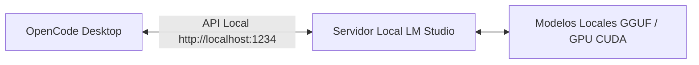

Cuando empecé a considerar la idea de armar esta guía, hubo varios factores que encajaron de inmediato. El principal motor que me impulsó fue la oportunidad de probar distintos modelos de código abierto y sin censura directamente en mi propia computadora, sin tener que gastar dinero extra en tokens de APIs en la nube. Cada vez que quería experimentar con un nuevo modelo o evaluar su rendimiento, disponer de tokens ilimitados y gratuitos hizo que todo el proceso de exploración fuera mucho más sencillo, accesible y divertido.

Otra razón fundamental fue notar que cada vez más personas me pedían alternativas frente a mis publicaciones anteriores. Como investigador independiente, necesitaba modelos que se adaptaran con mayor flexibilidad a mi propio estilo de redacción y a mi flujo de trabajo cotidiano. Tener acceso permanente a tokens locales sin costo se convirtió en un recurso en el que empecé a confiar todos los días al profundizar en nuevos experimentos y probar diferentes enfoques.

Esta guía no está pensada para quienes ya dominan todos los pormenores técnicos. Está dirigida a personas como tú, que quizás están explorando de qué se trata el movimiento del vibe coding sin contar con formación formal en ciencias de la computación o ingeniería. Mi meta fue tomar esos conceptos técnicos complejos que suelen intimidar a los principiantes y desglosarlos en explicaciones claras, amigables y verdaderamente disfrutables de llevar a la práctica.

Quería que esta experiencia se sintiera como un proceso de aprendizaje conjunto, paso a paso. Ya sea que nunca hayas escrito una línea de código o que simplemente desees descubrir lo que la inteligencia artificial local puede hacer por tus tareas diarias, me entusiasma acompañarte a lo largo de todo el camino. Lo maravilloso de este enfoque es que no necesitas ser un experto en tecnología para empezar: solo requieres curiosidad y la disposición para probar cosas nuevas.

## Lo que descubrí

Cuando comencé a preguntarme si era posible llevar la inteligencia artificial directamente a mi computadora, debo admitir que sentí una mezcla de entusiasmo y duda. La idea de contar con una IA conversacional e inteligente en mi propio escritorio, funcionando de manera 100% desconectada (offline), parecía casi demasiado buena para ser verdad. Sin embargo, lo que fui descubriendo a lo largo del proceso cambió por completo mi perspectiva sobre lo que es posible lograr con la computación personal.

La mayor sorpresa fue lo accesible y amigable que LM Studio hace toda la experiencia. Yo tenía en mente la imagen mental de que trabajar con modelos de IA implicaría líneas de comando complejas, archivos de configuración confusos y una curva de aprendizaje pronunciada que exigiría convertirme en algún tipo de especialista en sistemas. En cambio, a los pocos minutos de haber instalado el programa, ya me encontraba navegando por decenas de modelos de IA listos para usar, cada uno con descripciones claras y valoraciones de otros usuarios. La interfaz me resultó familiar, similar a cualquier otra aplicación de Windows que hubiera utilizado antes, con una organización clara y lógica. No necesité entender qué era una red neuronal ni cómo funciona el entrenamiento: bastó con hacer clic, descargar y comenzar a chatear.

Lo que realmente me asombró fue el momento exacto en que cargué mi primer modelo y le hice una pregunta. Escribí algo simple, como por ejemplo: "¿Puedes explicar qué es la fotosíntesis en términos que un niño de diez años pueda entender?". En cuestión de uno o dos segundos recibí una explicación clara, bien estructurada y reflexiva que tenía total sentido. No se limitaba a repetir una definición de libro de texto, sino que adaptaba genuinamente su respuesta para ser accesible y cercana. En ese instante lo comprendí con total claridad: no se trataba de un servicio distante en la nube procesando mis peticiones en un servidor remoto. Estaba ejecutándose allí mismo, en mi máquina, utilizando recursos que podía ver y monitorear, y la calidad de la interacción se sentía notablemente natural.

A medida que continué explorando, descubrí que la libertad de experimentar sin restricciones era sumamente liberadora. Podía probar tantos modelos diferentes como quisiera sin la preocupación de generar una factura imprevista. Podía mantener conversaciones largas y detalladas sobre cualquier tema de mi interés sin que nadie estuviera contabilizando tokens o limitando mi uso por cuotas horarias. Incluso podía trabajar completamente sin conexión a internet, lo que significaba tener interacciones de valor con la IA en un avión, en una cafetería sin señal de WiFi o en cualquier lugar al que llevara mi laptop. Comprender que la IA no tiene que ser forzosamente un servicio de suscripción mensual o una herramienta de pago por uso fue un cambio de mentalidad sumamente enriquecedor.

Otro descubrimiento transformador fue el grado de control que realmente tenía en mis manos. Podía ajustar parámetros como la temperatura para hacer que la IA fuera más creativa o más precisa según lo que necesitara en cada momento. Podía comparar distintos modelos frente a frente para determinar cuál rendía mejor en tareas específicas. Incluso podía crear mis propias aplicaciones personalizadas integrando capacidades de IA, algo que jamás me habría atrevido a intentar antes porque asumía que requería habilidades avanzadas de programación. Sin embargo, con la integración en Python que ofrece LM Studio, descubrí que podía empezar con pequeños scripts sencillos e ir construyendo progresivamente herramientas más sofisticadas que se ajustaran con exactitud a mi flujo de trabajo.

Quizás lo más relevante fue constatar que la IA local no es solo una curiosidad tecnológica, sino una herramienta sumamente práctica para la vida cotidiana. Comencé a utilizarla para toda clase de tareas: redactar correos electrónicos, generar ideas para proyectos, clarificar conceptos que estaba estudiando, recibir retroalimentación sobre mis textos e incluso sostener charlas interesantes cuando deseaba explorar un tema novedoso. La IA se convirtió en un compañero constante en mi labor diaria: siempre disponible, sin juicios y con una paciencia infinita mientras afinaba mis preguntas y exploraba diversos ángulos.

El trayecto de escéptico a entusiasta no se dio por una revelación tecnológica repentina, sino por la acumulación constante de pequeños hallazgos que hicieron cada vez mejor mi experiencia. Aprendí que los modelos de mayor tamaño suelen ser más capaces pero demandan más memoria RAM. Descubrí que ciertos modelos se especializan en redacción creativa mientras que otros destacan por su precisión fáctica. Comprendí que ejecutar modelos en local te otorga la posibilidad de ajustar y calibrar hasta encontrar la configuración perfecta para tus necesidades particulares. Cada día traía algo nuevo para probar, un nuevo modelo para evaluar o una nueva forma de emplear esta tecnología como una extensión natural de mis propias capacidades.

A lo largo de todo este recorrido, una reflexión no dejaba de repetirse en mi mente: si yo pude lograr esto, con un conocimiento técnico inicial moderado y una computadora convencional, cualquier persona puede hacerlo. Eso fue lo que me impulsó a redactar esta guía, no solo para documentar lo aprendido, sino para transmitir esa misma sensación de posibilidad. Lo que encontré no fue simplemente un software, sino una nueva manera de interactuar con la inteligencia artificial que coloca todo el poder directamente en tus manos, sin intermediarios de por medio.

## Por qué elegí la Inteligencia Artificial Local

Antes de conocer la posibilidad de ejecutar inteligencia artificial de forma local, toda mi experiencia previa con IA había estado mediada por servicios en la nube. Cada interacción implicaba enviar mis consultas y datos a centros de datos remotos, esperar su procesamiento y recibir una respuesta a través de internet. Funcionaba bien, por supuesto, y valoraba enormemente tener acceso a una tecnología tan avanzada, pero siempre existía esa persistente sensación de que algo faltaba: la sensación de estar alquilando inteligencia en lugar de poseerla.

La primera molestia constante era la velocidad. Incluso con una conexión a internet de alta velocidad, cada interacción con la IA arrastraba la latencia invisible de la red. Escribía una pregunta, presionaba Enter y debía esperar (a veces un segundo, pero frecuentemente varios segundos) a que el indicador de carga girara antes de entregar una respuesta. Esas demoras pueden parecer mínimas de forma aislada, pero a lo largo de una jornada de trabajo interactuando con la IA se acumulan y frenan el ritmo de concentración. Cuando estás resolviendo un problema, tener que hacer pausas obligadas tras cada pregunta rompe tu flujo de pensamiento. Con la IA local, esa pausa desaparece por completo: escribo y la respuesta ya comienza a generarse en el mismo instante en que retiro el dedo de la tecla Enter. La conversación se siente continua, ágil y viva de un modo que los servicios en la nube difícilmente logran igualar.

Luego estaba el factor del costo económico. Suelo ser cuidadoso con mis gastos, y me descubría a mí mismo calculando mentalmente el costo de cada llamada a una API: ¿vale la pena pedir esta aclaración?, ¿podría formular esto de manera más compacta?, ¿será mejor buscarlo por mi cuenta para no gastar saldo de la IA? Esas dudas no deberían interferir cuando estás inmerso en resolver un desafío o explorando una idea creativa. La ansiedad por consumir tokens o toparse con límites de tasa (rate limits) genera una barrera invisible que restringe lo que te atreves a intentar. Al ejecutar LM Studio localmente, esas preocupaciones desaparecen en su totalidad. Puedo tener sesiones maratónicas probando distintos planteamientos, explorando tangentes y haciendo preguntas de seguimiento sin ningún límite. La creatividad fluye con mucha mayor libertad cuando no estás pendiente de un contador de dinero. Lo que comenzó como una consideración de presupuesto evolucionó hacia una convicción: el aprendizaje y la exploración no deberían llevar un impuesto a la curiosidad.

La privacidad fue otro aspecto de peso fundamental. Cada charla mantenida con una IA en la nube implicaba que mis datos, mis consultas, mis reflexiones iniciales y mi información personal quedaban almacenadas en servidores ajenos. Las empresas cuentan con políticas de privacidad y muchas aplican buenas prácticas de seguridad, pero la realidad de fondo seguía siendo la misma: estaba compartiendo mi actividad intelectual con terceros. En ocasiones se trataba de información laboral de carácter confidencial; en otras, de reflexiones personales o proyectos creativos que aún no estaba listo para compartir públicamente. La idea de que todo eso pudiera permanecer estrictamente dentro de los límites de mi computadora personal, sin que ningún dato saliera de mi máquina a menos que yo decidiera compartirlo explícitamente, se volvió sumamente valiosa. Con la IA local se alcanza una verdadera soberanía sobre los datos: mis conversaciones me pertenecen únicamente a mí, punto final.

Y consideremos también ese instante en que la conexión a internet se interrumpe. Estás en medio de una tarea importante, necesitas asistencia, acudes a tu asistente de IA y te encuentras con el clásico mensaje de error: "no es posible conectar". Ese momento de impotencia, de quedar desconectado de una herramienta en la que confías para trabajar, resulta sumamente frustrante. Ya sea por una falla temporal del proveedor, una señal inestable o el simple hecho de estar en un sitio sin cobertura, la dependencia de una conexión continua representa una vulnerabilidad real. Al tener LM Studio funcionando en local, valoré profundamente esa independencia: puedo estar en cualquier lugar, en cualquier momento, y mi asistente de IA estará siempre listo para ayudar. ¿En un viaje en tren? Funciona sin problemas. ¿En una sala de reuniones con el WiFi bloqueado? Sigue funcionando. ¿En el extranjero sin plan de datos móviles? No hay inconveniente alguno. La tranquilidad de llevar tus herramientas contigo, siempre disponibles, es algo que solo se dimensiona plenamente cuando se experimenta.

Más allá de estos motivos prácticos, existía una razón aún más profunda que me tomó tiempo articular con claridad: creo firmemente en el principio de la autonomía personal frente a la tecnología. Nos hemos acostumbrado tanto al modelo de software como servicio (SaaS), a pagar por el acceso temporal en lugar de ser dueños de nuestras herramientas, que hemos olvidado lo que se siente tener el control total sobre nuestro entorno informático. Al ejecutar IA de forma local, no solo estás eligiendo un método de despliegue: estás fijando una postura sobre cómo debería funcionar la tecnología. Estás afirmando que las herramientas más avanzadas no deberían exigir pagos recurrentes perpetuos ni la autorización de una entidad remota. Estás recuperando la capacidad de personalizar, experimentar y superar límites sin pedirle permiso a nadie. Esta autonomía genera una relación mucho más gratificante, libre y creativa con la tecnología.

LM Studio hizo que todo esto fuera accesible de una manera que todavía hoy me impresiona. No tuve que convertirme en administrador de sistemas ni estudiar a fondo las arquitecturas internas de las tarjetas gráficas para comenzar. El software absorbe la complejidad técnica y ofrece una interfaz limpia donde basta con hacer un par de clics para tener un modelo de IA sofisticado corriendo en tu propio equipo. Esa simplicidad es clave porque demuestra que esto no está reservado únicamente para entusiastas o profesionales avanzados, sino para cualquier persona interesada en descubrir el potencial de la inteligencia artificial. La barrera de entrada se ha reducido notablemente, abriendo puertas a quienes hasta ahora se sentían al margen de la revolución de la IA.

Al mirar en retrospectiva por qué elegí la vía local, no fue un único motivo aislado el que inclinó la balanza, sino la suma de todos ellos reforzándose mutuamente: velocidad, ahorro, privacidad, confiabilidad, autonomía y accesibilidad. Todos apuntan hacia un mismo horizonte: un futuro donde las herramientas potentes de IA se democratizan y se vuelven verdaderamente personales. Elegí la IA local porque se alinea con mi visión de cómo debe operar la tecnología: al servicio del usuario, sin restricciones artificiales, respetando la privacidad por defecto y estando disponible donde y cuando sea necesaria. Tras haberlo vivido, no imagino volver al esquema anterior.

## Fase 1: Entendiendo qué es realmente LM Studio

Permíteme explicarte en detalle qué hace LM Studio en la práctica, porque una vez que comprendí este concepto, todas las demás piezas encajaron de inmediato. Quiero compartirlo en los términos más sencillos posibles, sin tecnicismos innecesarios, recordando lo intimidante que me resultaba este tema en mis primeros pasos.

Imagina una biblioteca física tradicional de tu ciudad. En esa biblioteca, en lugar de libros de historia, ciencia o literatura, tienes modelos de inteligencia artificial. Cada modelo de IA es como un libro escrito por un autor diferente, dotado de una forma particular de razonar, un estilo de comunicación propio y conocimientos especializados en determinadas áreas. Algunos de estos "libros" son folletos concisos que van directo al grano, mientras que otros son enciclopedias masivas que albergan enormes volúmenes de información. Cada uno posee sus fortalezas: uno puede ser brillante explicando temas difíciles con un lenguaje muy sencillo, otro puede destacar en la redacción creativa y otro puede ser un auténtico especialista en programación de código. Todas esas mentes diversas descansan en las estanterías, esperando a que las tomes para empezar a interactuar con ellas.

En una biblioteca física tendrías que recorrer los pasillos a pie, revisar los lomos, determinar cuál libro se ajusta a lo que buscas, pedirlo prestado en el mostrador, llevarlo a casa y sentarte a leerlo en tu mesa. LM Studio realiza todo ese proceso por ti, pero de manera digital e instantánea. La sección de catálogo te permite explorar los modelos de IA disponibles con fichas descriptivas claras, ver las valoraciones y comentarios de otros usuarios y elegir el que despierte tu interés. El préstamo se concreta con un simple clic, y en cuestión de instantes el modelo queda cargado y listo para ser utilizado en tu equipo. No hay plazos de devolución, ni multas por retrasos: tienes acceso inmediato a cuantos "libros" de IA desees explorar.

Pero aquí es donde la experiencia supera con creces a una biblioteca común: en LM Studio no te limitas a leer pasivamente esos libros, sino que dialogas activamente con ellos. Puedes formularles preguntas, pedirles aclaraciones detalladas, solicitarles que redacten un texto a tu medida o plantearles problemas lógicos para resolver. Y ellos te responden en tiempo real, adaptando cada contestación exactamente a lo que requieres. Es el equivalente a tener al autor del libro sentado frente a ti en tu escritorio, dispuesto a resolver cada duda, a explicar lo que no quede claro y a colaborar contigo en tus proyectos. Ese nivel de interactividad dinámica simplemente no existe en los libros convencionales ni en la mayoría de los recursos estáticos de internet.

Existen dos maneras bien diferenciadas de trabajar con LM Studio, y conocer ambas te permite apreciar la enorme versatilidad de esta herramienta:

1. **La interfaz visual gráfica**: Es la que utilizarás al dar tus primeros pasos. Es una aplicación clásica con ventanas, botones, paneles y menús bien organizados. Haces clic en el icono del catálogo para explorar modelos, seleccionas uno para descargarlo, pasas a la pestaña de chat para conversar y todo fluye mediante una experiencia intuitiva de apuntar y hacer clic. Me encanta esta interfaz porque no exige ningún conocimiento técnico previo: cualquier persona que nunca haya escrito una línea de código puede sentarse frente a ella y estar conversando con su primer modelo de IA en menos de cinco minutos.
2. **El acceso programático**: Consiste en la capacidad de conectar LM Studio con código en Python (o cualquier otro lenguaje) para construir aplicaciones personalizadas. Esto abre un abanico inmenso de posibilidades más allá del simple chat. Imagina que deseas crear una herramienta propia para generar nombres de proyectos, un sistema que analice documentos locales o un script que automatice tareas repetitivas cada semana. Mediante la integración por código puedes lograr todo eso. Lo grandioso es que puedes comenzar utilizando exclusivamente la interfaz gráfica para familiarizarte a tu propio ritmo, y más adelante dar el salto a la programación solo si deseas personalizar tus soluciones aún más. No hay ninguna prisa por programar: la interfaz visual es 100% completa y funcional por sí sola.

Lo que hizo que esta experiencia fuera tan gratificante para mí fue no haber necesitado conocimientos avanzados para obtener un valor real desde el primer día. Siempre esperaba toparme con alguna barrera donde tuviera que dominar conceptos complejos de aprendizaje automático, configurar servidores o depurar configuraciones engorrosas. Esa barrera nunca apareció. El software resuelve los detalles técnicos en segundo plano mientras tú te enfocas plenamente en interactuar con la IA. No necesitas saber la matemática exacta de los parámetros ni cómo opera el proceso de inferencia a bajo nivel para disfrutar de una gran experiencia: basta con tener claro lo que quieres lograr, y LM Studio te brinda las herramientas para materializarlo.

Esta accesibilidad tiene un valor incalculable porque democratiza el acceso a la IA: ya no está reservada únicamente a especialistas con títulos en ciencias de la computación ni requiere meses de estudio de tutoriales complejos. Solo necesitas curiosidad y ganas de experimentar. Y al funcionar todo de manera local en tu equipo, puedes probar cuanto quieras sin preocuparte por costos imprevistos, límites de uso ni riesgos de privacidad. Esa combinación de facilidad de uso y control total es la que convierte a LM Studio en un cambio de paradigma para quienes antes se sentían excluidos de esta tecnología.

Al recordar la primera vez que abrí LM Studio, aún tengo presente esa sensación de asombro. Tras instalarlo, explorar la interfaz y cargar mi primer modelo, me detuve a pensar: "¿de verdad está funcionando esto tan fácil?". Y en cuanto me respondió con fluidez y precisión, comprendí que estaba dando un paso hacia una forma completamente renovada de crear y trabajar. Esa sensación de autonomía y empoderamiento al tener capacidades avanzadas de IA al alcance de la mano es exactamente lo que quiero que experimentes con esta guía. LM Studio no es solo un programa; es la puerta de entrada a una relación directa y personal con la inteligencia artificial, sin intermediarios.

## Fase 2: Preparando tu computadora

Antes de instalar cualquier componente, es fundamental verificar que tu computadora cuente con las especificaciones adecuadas para realizar la tarea con fluidez. No te preocupes de más: LM Studio está diseñado para adaptarse y funcionar en una amplia gama de equipos, desde computadoras hogareñas estándar hasta estaciones de trabajo de alto rendimiento.

### Requerimientos mínimos recomendados

Esto es lo que he comprobado que funciona de manera óptima para comenzar:

#### 1. Procesador (CPU)
- Cualquier procesador multinúcleo moderno lanzado en los últimos 5 años (Intel Core i5/i7/i9 o AMD Ryzen 5/7/9) funcionará adecuadamente.
- Piensa en la CPU como el cerebro central de tu computadora: cuantos más núcleos físicos tenga, mejor podrá gestionar múltiples tareas y cálculos simultáneos.

#### 2. Memoria (RAM)
- Un mínimo de 8GB es el punto de partida básico, aunque recomiendo enfáticamente contar con **16GB o más** para una experiencia cómoda.
- La memoria RAM equivale al espacio de trabajo disponible sobre tu escritorio físico: cuanto más amplio sea tu escritorio, más modelos de gran capacidad podrás tener abiertos y listos para trabajar a la vez.

Permíteme explicar con precisión qué significa la memoria RAM al ejecutar modelos de IA localmente. RAM son las siglas en inglés de *Random Access Memory* (Memoria de Acceso Aleatorio), y se diferencia del disco duro o almacenamiento permanente de una forma crucial. Piensa en tu disco duro (o unidad SSD) como un almacén gigantesco donde residen todos tus archivos: fotos, documentos, programas y sistemas operativos se guardan allí de manera permanente hasta que decides borrarlos. Por su parte, la memoria RAM es como la superficie de tu mesa de trabajo en este instante: contiene únicamente las herramientas y papeles que estás utilizando en tiempo real.

Al abrir un programa o un archivo, este se traslada desde el almacén (disco) hacia tu mesa (RAM). Cuantas más herramientas quepan en tu mesa al mismo tiempo, más rápido y fluido podrás trabajar con ellas sin necesidad de caminar constantemente hasta el almacén para ir a buscarlas. La RAM es órdenes de magnitud más veloz que cualquier disco duro: es la diferencia entre tener un lápiz en tu mano frente a tener que levantarte y buscarlo en otra habitación cada vez que vas a escribir una palabra.

En el contexto específico de los modelos de inteligencia artificial, la memoria RAM cumple dos funciones críticas:

1. **Alojar el peso del modelo cargado**: Cuando cargas un modelo en LM Studio, este necesita ocupar un espacio físico en tu RAM para mantener activos todos esos miles de millones de parámetros que componen su red. Un modelo de 7 mil millones de parámetros (7B) suele ocupar entre 6GB y 8GB de RAM solo para estar cargado y listo para recibir preguntas. Si dispones de únicamente 4GB de RAM libres, el modelo no entrará por completo en la memoria física y el sistema operativo se verá forzado a realizar un intercambio constante de datos (*swapping*) entre la RAM y el disco duro, ralentizando enormemente el proceso.
2. **Espacio de trabajo temporal durante el razonamiento**: Mientras el modelo procesa tus consultas y genera respuestas, requiere memoria RAM adicional para almacenar:
   - El contexto acumulado de la conversación actual (todos los mensajes previos intercambiados).
   - Los cálculos intermedios que realiza la red neuronal al procesar razonamientos complejos.
   - Cualquier archivo o dato complementario que estés procesando junto a la consulta.

Cuando comencé mis pruebas con solo 8GB de RAM totales en el sistema (dejando unos 4GB libres para LM Studio), noté ciertas restricciones. Las preguntas simples y directas respondían bien, en menos de un segundo. Sin embargo, al iniciar conversaciones extensas o solicitar tareas más complejas, como analizar un texto largo o generar código estructurado, el modelo reducía su velocidad de forma notoria: respuestas que debían tomar 1 a 2 segundos pasaban a demorar 3 a 4 segundos. Esto ocurría porque el sistema se quedaba sin espacio suficiente en RAM e intercambiaba datos con el disco constantemente.

Tras actualizar mi equipo a 16GB de RAM, la mejora fue inmediata y contundente. Las mismas conversaciones que antes tardaban 3 a 4 segundos pasaron a completarse consistentemente en menos de 2 segundos. Las sesiones de chat largas mantuvieron su agilidad sin degradación, la generación de código se volvió mucho más reactiva y pude conservar un contexto de conversación mucho más amplio. Fue el equivalente a pasar de una mesa pequeña y abarrotada a un taller amplio y despejado donde todo está al alcance de la mano.

#### Guía práctica de capacidades según tu memoria RAM:

- **4GB o menos**: Puedes ejecutar modelos muy compactos (de 1B a 2B parámetros) con un rendimiento aceptable, pero los modelos más grandes tendrán dificultades notables. Las preguntas directas funcionan bien, pero las tareas complejas se vuelven lentas. Es como hacer carpintería fina en un pupitre diminuto: se puede avanzar, pero con constantes interrupciones.
- **8GB**: Es el punto de inicio para la mayoría de las personas que se adentran en la IA local. Puedes ejecutar modelos de 2B a 4B parámetros con gran solidez. Los modelos de 7B funcionarán, aunque pueden tomar 2 a 3 segundos por respuesta según las demás aplicaciones que tengas abiertas. Equivale a tener una mesa de trabajo de buen tamaño: adecuada para la mayoría de las tareas cotidianas.
- **16GB**: Es el punto óptimo (sweet spot) y mi recomendación principal para quienes buscan un uso productivo y fluido de la IA local. Permite correr modelos de 7B a 13B parámetros con total soltura y tiempos de respuesta inferiores a 2 segundos, incluso en chats extensos. Equivale a un taller espacioso y bien equipado.
- **32GB o más**: Te brinda la libertad absoluta para experimentar con los modelos abiertos más avanzados y capaces (20B, 30B, 70B en versiones cuantizadas o modelos MoE de gran tamaño), manteniendo otras aplicaciones pesadas abiertas en simultáneo. Es el entorno ideal para crear flujos de trabajo avanzados o montar servicios de IA concurrentes.

Como referencia general para estimar la RAM requerida según el tamaño de parámetros del modelo:
- **Modelos de 1B parámetros**: Requieren entre 2GB y 3GB de RAM.
- **Modelos de 4B parámetros**: Requieren entre 5GB y 6GB de RAM.
- **Modelos de 7B parámetros**: Requieren entre 8GB y 9GB de RAM.
- **Modelos de 13B parámetros**: Requieren entre 12GB y 14GB de RAM.
- **Modelos de 20B+ parámetros**: Requieren 16GB o más de RAM dedicada.

*Nota importante*: Estas cifras representan el mínimo necesario para cargar el modelo en memoria. Siempre es conveniente añadir entre 2GB y 4GB adicionales de margen para el contexto de la conversación y las tareas del propio sistema operativo.

#### 3. Almacenamiento (Disco Duro / SSD)
- Los modelos de IA ocupan espacio físico en disco: los modelos compactos rondan entre 500MB y 2GB, mientras que los más grandes pueden alcanzar varios gigabytes.
- Disponer de unos **15GB a 50GB libres** te brinda un margen cómodo para descargar, probar y alternar entre distintos modelos sin preocuparte por el espacio.

A diferencia de la RAM, el almacenamiento (tu unidad SSD o disco duro) es el lugar permanente donde quedan guardados los archivos de los modelos tras descargarlos de internet. Incluso al apagar la computadora o cerrar LM Studio, los modelos siguen estando allí listos para ser utilizados.

Dimensiones promedio de descarga en disco según el tamaño del modelo:
- **Modelos de 1B**: Ocupan entre 1GB y 2GB de espacio en disco.
- **Modelos de 4B**: Ocupan entre 2.5GB y 4GB de espacio en disco.
- **Modelos de 7B**: Ocupan entre 4GB y 6GB de espacio en disco (en formato cuantizado de 4 bits).
- **Modelos de 13B**: Ocupan entre 7GB y 9GB de espacio en disco.
- **Modelos de 20B+**: Ocupan 12GB o más.

El tipo de almacenamiento influye directamente en el **tiempo de carga inicial** del modelo (el momento en que pulsas "Load" para pasarlo del disco a la memoria RAM):
- **En un disco duro mecánico tradicional (HDD)**: Cargar un modelo de 7B puede demorar entre 15 y 30 segundos.
- **En una unidad de estado sólido (SSD)**: El mismo modelo de 7B se carga en solo 3 a 5 segundos.

Otra gran ventaja es la **portabilidad de los modelos**: los archivos descargados por LM Studio se guardan en formatos estándar (como `.gguf`). Si cambias de computadora o deseas respaldar tus modelos en un disco externo, basta con copiar los archivos sin tener que volver a descargarlos desde internet.

#### 4. Tarjeta gráfica (GPU)
- No es estrictamente obligatoria, pero resulta altamente recomendable para acelerar los tiempos de respuesta.
- Si cuentas con una tarjeta gráfica dedicada **NVIDIA** (con soporte CUDA), LM Studio puede descargar todo el cálculo matricial en ella, logrando velocidades de respuesta instantáneas.
- Las tarjetas **AMD** (mediante soporte ROCm) y los gráficos integrados modernos de Intel o AMD también son plenamente funcionales.

---

### La configuración de hardware que utilizo personalmente

Tras configurar mi propio entorno de trabajo y probar diversas combinaciones, este es el hardware que me ha brindado excelentes resultados:

- **Procesador (CPU)**: Intel Core i7 con 8 núcleos. Ofrece una base sólida para procesar cálculos secuenciales y mantener el sistema ágil durante conversaciones continuas.
- **Memoria RAM**: 16GB de RAM. Me permite cargar modelos de 7B a 8B con amplios márgenes para mantener el navegador y mis editores de código abiertos al mismo tiempo.
- **Tarjeta Gráfica (GPU)**: NVIDIA GeForce RTX con memoria VRAM dedicada. Permite que tareas que en CPU tomaban 2 a 3 segundos se completen en menos de medio segundo, ofreciendo una interactividad casi instantánea.
- **Almacenamiento**: Unidad SSD NVMe de 512GB con 20GB reservados para modelos. La velocidad de carga inicial de los modelos es de apenas unos pocos segundos.

---

### Cómo verificar las especificaciones de tu equipo en Windows

Antes de descargar modelos, te recomiendo revisar las características de tu máquina:

1. **Memoria RAM y Procesador**: Haz clic derecho sobre el botón de Inicio de Windows → selecciona **Sistema** (o abre el **Administrador de tareas** con `Ctrl + Shift + Esc` y ve a la pestaña **Rendimiento**).
2. **Tarjeta Gráfica (GPU)**: En el Administrador de tareas, dentro de la pestaña **Rendimiento**, haz clic en **GPU** para ver el modelo exacto y la cantidad de memoria de video dedicada (VRAM).
3. **Espacio en Disco**: Abre el **Explorador de archivos** y revisa el espacio disponible en tu unidad principal `C:`.

Comprender tu hardware te permitirá elegir los modelos con criterio. Si cuentas con 8GB de RAM, puedes iniciar con modelos de 2B a 4B parámetros y luego explorar modelos de 7B en cuantizaciones ligeras. Si tienes 16GB o más junto a una GPU dedicada, podrás aprovechar modelos de 7B a 13B con máxima fluidez.

## Fase 3: Instalación de LM Studio en Windows

Instalar LM Studio en Windows es un procedimiento sumamente ágil y directo, sin configuraciones ocultas ni pasos complejos.

### Paso 1: Descargar el instalador oficial
Dirígete al sitio web oficial de LM Studio ([lmstudio.ai](https://lmstudio.ai)) y descarga la versión correspondiente a Windows. El instalador pesa solo unos pocos megabytes y la descarga se completa con rapidez.

*Nota*: El sitio suele ofrecer versiones estables y versiones beta. Para un uso diario confiable, te sugiero optar siempre por la versión estable más reciente.

### Paso 2: Ejecutar el asistente de instalación
Haz doble clic sobre el archivo descargado para iniciar la instalación:
1. Acepta los términos de la licencia de uso.
2. Mantén la ruta de instalación predeterminada sugerida por el instalador.
3. El proceso de instalación tomará aproximadamente 1 a 2 minutos.

### Paso 3: Primer inicio de la aplicación
Al abrir LM Studio por primera vez, te recibirá una interfaz moderna y limpia dividida en secciones principales:
- **Discover / Models (Descubrir / Modelos)**: El catálogo integrado donde puedes buscar, filtrar y descargar modelos directamente desde repositorios como Hugging Face.
- **Chat**: La interfaz conversacional para interactuar con los modelos cargados.
- **Local Server (Servidor Local)**: El panel para activar el servidor API local compatible con OpenAI.
- **My Models (Mis Modelos)**: La sección de administración donde puedes ver los modelos descargados, verificar su peso y eliminarlos si deseas liberar espacio.

### Comprobación rápida de funcionamiento
Para verificar que todo quedó configurado correctamente:
1. Ve a la sección de búsqueda y elige un modelo ligero (de 1B a 3B parámetros).
2. Haz clic en **Download**.
3. Una vez completada la descarga, ve a la pestaña de **Chat** y selecciona el modelo en el menú superior para cargarlo (**Load**).
4. Escribe un mensaje sencillo de prueba (por ejemplo: "Hola, ¿cómo estás?") y presiona Enter.

Si el modelo responde de inmediato y con coherencia, tu instalación está 100% operativa y lista para trabajar.

## Fase 4: Explorando la biblioteca de modelos

Con LM Studio funcionando, es momento de recorrer el catálogo de modelos disponibles. Piensa en esta sección como si estuvieras recorriendo una librería repleta de opciones para cada necesidad.

### Cómo buscar y filtrar modelos

La interfaz del catálogo ofrece herramientas claras de navegación:
- **Buscador**: Ingresa palabras clave en la barra superior (por ejemplo: `coding`, `reasoning`, `creative`, `llama-3`, `qwen`, `mistral`).
- **Filtros**: Permite ordenar por compatibilidad con tu hardware, arquitectura del modelo y fecha de publicación.
- **Ordenamiento**: Puedes clasificar por cantidad de descargas, popularidad o valoraciones de la comunidad.

---

### Entendiendo el tamaño de los modelos y qué significa realmente la capacidad de "pensar"

Al explorar modelos por primera vez, surgen dos conceptos que suelen generar confusión: la **cantidad de parámetros** y lo que significa que un modelo cuente con **capacidades de razonamiento o pensamiento (*thinking*)**. Desglosemos ambos en detalle.

#### ¿Qué representa exactamente la cantidad de parámetros?

Los parámetros equivalen a las conexiones sinápticas o neuronas de la red de inteligencia artificial. Cuando se dice que un modelo posee 2 mil millones de parámetros (2B), significa que alberga 2 mil millones de valores matemáticos ajustados durante su fase de entrenamiento para almacenar conocimiento y patrones de lenguaje.

Comportamiento práctico según la cantidad de parámetros:

- **2 Mil Millones de Parámetros (2B)**: Es como un asistente muy rápido y ágil. Responde preguntas directas, resuelve operaciones matemáticas sencillas y ayuda con consultas puntuales de inmediato. Consume muy poca memoria RAM, casi no impacta los recursos del sistema y las respuestas son prácticamente instantáneas.
- **4 Mil Millones de Parámetros (4B)**: Ofrece un equilibrio superior de comprensión reteniendo gran velocidad. Puede seguir conversaciones con mayor número de pasos y estructurar explicaciones más ricas. Con 8GB de RAM es un punto de inicio ideal.
- **7 u 8 Mil Millones de Parámetros (7B / 8B)**: Es el estándar dorado para la IA local en computadoras personales. Posee la masa crítica de parámetros necesaria para sostener razonamientos complejos, explicar conceptos técnicos con claridad pedagógica, escribir código de programación, redactar textos creativos y mantener el contexto de charlas largas sin perder el hilo. Responde con gran agilidad y representa la mejor relación entre calidad y consumo de hardware.
- **13B, 20B y superiores**: Modelos diseñados para análisis exhaustivos, deducción lógica avanzada y generación de textos muy elaborados. Requieren equipos con 16GB a 32GB de RAM y preferentemente tarjetas gráficas potentes para mantener tiempos de respuesta cómodos.

---

#### ¿Qué significa realmente el "pensamiento" (*Thinking*) en los modelos de IA?

En los modelos convencionales de lenguaje, el procesamiento funciona mediante **predicción probabilística de patrones**: al formular una pregunta, el modelo evalúa cuáles son las palabras más probables que deben seguir a tu texto en base a lo aprendido en su entrenamiento, generando la respuesta de manera directa e inmediata.

Por el contrario, en los modelos dotados de **capacidades de pensamiento o razonamiento paso a paso** (como las familias de modelos de razonamiento profundo), la IA realiza una pausa computacional previa para descomponer el problema en sub-etapas, evaluar distintas alternativas lógicas y estructurar su deducción antes de redactar la respuesta final visible.

Diferencias prácticas observables:
- **Modelos estándar**: Responden en fracciones de segundo. Ofrecen respuestas directas y fluidas, ideales para redacción general, traducciones y consultas factuales cotidianas.
- **Modelos de razonamiento (*Thinking Models*)**: Toman unos segundos adicionales (2 a 5 segundos) mientras elaboran internamente una cadena de pensamiento (*Chain of Thought*). Al resolver problemas matemáticos, depurar algoritmos intrincados o planificar proyectos de múltiples fases, desglosan cada etapa con precisión metódica, cometen significativamente menos errores lógicos y explicitan el camino seguido para alcanzar la conclusión.

---

### Inferencia y Temperatura: Cómo genera sus respuestas la IA

Dos términos fundamentales para dominar el comportamiento de tus modelos son la **inferencia** y la **temperatura**.

- **Inferencia**: Es el proceso computacional que ocurre desde el instante en que presionas Enter hasta que el modelo termina de escribir. Es el momento en que la red neuronal aplica todo su entrenamiento previo sobre tus palabras para calcular y generar una respuesta original token por token. Al ejecutarse en tu propia máquina, la inferencia no depende de servidores externos ni sufre demoras de red.
- **Temperatura**: Es el parámetro numérico que calibra el grado de creatividad versus predictibilidad en la selección de palabras por parte del modelo:
  - **Temperatura Baja (0.1 a 0.5)**: El modelo se vuelve muy conservador y preciso. Escoge siempre las palabras con mayor probabilidad matemática, entregando respuestas consistentes, directas y fácticas. Es el valor ideal para escribir código, resolver dudas de sintaxis, formular consultas científicas y seguir instrucciones rígidas.
  - **Temperatura Media (0.6 a 0.8)**: El punto de equilibrio perfecto para el uso diario. Las respuestas se sienten naturales, humanas y fluidas, con calidez en la redacción y coherencia lógica impecable. Es la configuración recomendada para redactar correos, resumir artículos y mantener charlas casuales.
  - **Temperatura Alta (0.8 a 1.2+)**: El modelo asume mayores riesgos en la elección de palabras y conexiones conceptuales. Es la opción predilecta para sesiones de lluvia de ideas (brainstorming), creación literaria, generación de tramas de ficción y resolución creativa de problemas desde perspectivas no convencionales.

---

### Modelos sin censura (*Uncensored*) y experimentales (*Heretical*)

Una de las libertades más significativas que ofrece el ecosistema de la IA local es la existencia de modelos abiertos sin censura (*uncensored*) y variantes experimentales.

Los proveedores comerciales en la nube integran filtros estrictos en sus modelos para prevenir el abordaje de ciertos temas por motivos legales, de seguridad de marca o de políticas corporativas. Con frecuencia, estos filtros generan falsos positivos y provocan que la IA se niegue a responder preguntas legítimas de investigación académica, análisis de ciberseguridad, redacción de ficción madura o debates históricos complejos.

Los **modelos sin censura** son aquellos que han sido entrenados o ajustados sin esas capas restrictivas artificiales. Conservan la misma capacidad analítica y lógica que sus contrapartes convencionales, pero responden a cualquier consulta sin emitir negativas arbitrarias del tipo "no puedo ayudarte con esa solicitud". Esto resulta sumamente valioso para investigadores independientes, escritores y desarrolladores que requieren analizar temas sensibles con total objetividad y sin sesgos corporativos impuestos.

## Entendiendo las arquitecturas de modelos: MoE y SOTA

Al explorar el ecosistema de modelos de código abierto, encontrarás frecuentemente dos conceptos clave: **MoE** y **SOTA**.

### ¿Qué es la arquitectura MoE (Mixture of Experts)?
**MoE** son las siglas de *Mixture of Experts* (Mezcla de Expertos). En lugar de tener una única red neuronal densa y homogénea donde todos los parámetros se activan para cada palabra procesada, un modelo MoE se divide internamente en múltiples redes especialistas ("expertos").

Cuando formulas una pregunta, un mecanismo de enrutamiento inteligente (*router*) analiza la temática de tu consulta y activa únicamente a los expertos pertinentes (por ejemplo, el módulo de matemáticas y el módulo de lógica, dejando inactivos a los demás).

**Ventajas prácticas de MoE en el uso cotidiano**:
1. **Mayor eficiencia y velocidad**: Al activar solo una fracción de sus parámetros totales en cada token (parámetros activos), el modelo se ejecuta con notable rapidez.
2. **Menor consumo relativo de recursos**: Permite disfrutar de la calidad y el conocimiento de un modelo de gran envergadura (por ejemplo, con 8 expertos de 7B) manteniendo un consumo de cómputo ágil y fluido.
3. **Versatilidad temática superior**: Sobresale al alternar entre redacción literaria, análisis de bases de datos y traducción en una misma sesión de trabajo sin que las respuestas pierdan nitidez.

---

### ¿Qué significa la denominación SOTA (State of the Art)?
**SOTA** (*State of the Art* o Estado del Arte) hace referencia a los modelos que lideran los índices de referencia y evaluaciones comparativas de la industria en un momento determinado.

El ritmo de innovación en el código abierto es tan acelerado que los estándares SOTA evolucionan constantemente:
- **Mejor seguimiento de instrucciones (*Instruction Following*)**: Los modelos más recientes comprenden solicitudes directas en lenguaje natural sin requerir complejas técnicas de ingeniería de prompts.
- **Menor tasa de alucinación**: Validan mejor la consistencia lógica de sus afirmaciones y reconocen con mayor honestidad cuando un dato no se encuentra en su conocimiento.
- **Gestión prolongada del contexto**: Mantienen la coherencia temática a lo largo de chats con más de 50 o 100 intercambios sin olvidar datos fijados al comienzo de la conversación.

La combinación de una arquitectura **MoE** con un nivel de rendimiento **SOTA** representa el punto óptimo para la IA local: máxima capacidad de razonamiento con una eficiencia de hardware sobresaliente.

## Entendiendo las capacidades de herramientas (Tool Use) en LM Studio

Uno de los avances más trascendentales en la interacción con modelos locales es la incorporación de **capacidades de herramientas** (*Tool Calling* o *Function Calling*).

### ¿Qué implica que un modelo tenga soporte para herramientas?
Sin soporte de herramientas, un modelo de IA se comporta como un interlocutor brillante pero puramente conversacional: puede explicarte con sumo detalle cómo escribir un archivo o cómo calcular una estadística, pero no puede ejecutar la acción en tu sistema.

Con soporte para herramientas, el modelo se transforma en un **agente inteligente**: puede solicitar formalmente la ejecución de acciones específicas en tu computadora mediante funciones predefinidas (leer archivos del disco, ejecutar código, consultar bases de datos locales o buscar información en la web) y utilizar los resultados obtenidos para continuar su tarea de manera autónoma.

### Cómo opera el flujo de herramientas en 5 pasos:
1. **Instrucción del usuario**: Le solicitas una tarea concreta (por ejemplo: "Lee el archivo de notas de esta carpeta, extrae los puntos clave y genera un documento de resumen").
2. **Planificación de la IA**: El modelo comprende que para responder no basta con redactar texto, sino que requiere acceder al sistema de archivos.
3. **Llamada a la función**: El modelo genera una solicitud estructurada indicando qué archivo desea leer.
4. **Ejecución local**: El entorno seguro de LM Studio o tu script en Python ejecuta la lectura del archivo en tu máquina.
5. **Generación del resultado**: El modelo recibe el contenido del archivo, lo analiza y procede a redactar y guardar el resumen final.

---

### Casos de uso prácticos que he implementado:

- **Análisis y síntesis de documentos extensos**: En lugar de leer manualmente un documento técnico de 50 páginas, le solicito al modelo que lea el archivo localmente y elabore un resumen ejecutivo de una página con los puntos críticos.
- **Depuración automatizada de código**: Le proporciono la ruta de un script que presenta errores; el modelo lee el código fuente, localiza la falla de sintaxis, aplica la corrección y ejecuta pruebas unitarias para validar que el arreglo funcione.
- **Organización inteligente de archivos**: Solicitarle que ordene carpetas con cientos de fotografías o documentos distribuyéndolos en subcarpetas estructuradas por año y mes en base a sus metadatos.

---

### Visión y capacidades multimodales (Reconocimiento de imágenes)

Los modelos multimodales integran visión artificial directamente en su arquitectura. Esto significa que puedes arrastrar una imagen, captura de pantalla o diagrama a la ventana de chat y el modelo podrá interpretarla con asombrosa agudeza:

1. **De diseño visual a código funcional**: Tomas una captura de pantalla de la interfaz de una página web o un boceto dibujado a mano en una libreta, lo adjuntas al chat y le pides: "Genera el código HTML y CSS con Tailwind para maquetar esta interfaz". El modelo analiza la disposición espacial, tipografías y colores para crear el código base listo para usar.
2. **Extracción y análisis de documentos escaneados**: Puedes subir facturas, contratos escaneados o recibos en formato de imagen y formular preguntas precisas como: "¿Cuál es el monto total a pagar y la fecha límite de vencimiento?".
3. **Diagnóstico visual de errores**: Cuando aparece una ventana de error en tu sistema o un mensaje en la terminal que no puedes copiar como texto, basta con tomar una captura de pantalla. El modelo lee el error visual, diagnostica el origen de la falla y sugiere los pasos exactos para solucionarlo.

Todo esto ocurre con **absoluta privacidad**: las imágenes jamás se suben a servidores de terceros ni salen de tu máquina.

---

## Formatos de cuantización de modelos: Qué significan realmente para tu experiencia

Al navegar por los modelos disponibles en LM Studio o en plataformas como Hugging Face, te toparás con siglas como **GGUF**, **GPTQ** y **AWQ**, acompañadas de términos como `Q4_K_M`, `Q5_K_S` o `Q8_0`.

### ¿Por qué existe la cuantización?
Un modelo de 7 mil millones de parámetros almacenado en su precisión matemática original de 32 bits de coma flotante (*FP32*) ocupa aproximadamente 14GB a 28GB de almacenamiento y requiere una cantidad similar de memoria para operar.

La **cuantización** es el proceso de reducir la precisión matemática de esos valores (pasando de 16/32 bits a 4, 5 u 8 bits por parámetro) mediante algoritmos inteligentes. Esto reduce drásticamente el peso del archivo y el consumo de RAM sin sacrificar perceptiblemente la inteligencia o la coherencia de las respuestas.

---

### Comparativa de los tres formatos principales:

#### 1. GGUF (El estándar universal para IA Local)
Desarrollado a partir del proyecto `llama.cpp`, GGUF es el formato predilecto para ejecutar modelos en computadoras personales.
- **Compatibilidad total**: Funciona con extrema eficiencia tanto en procesadores CPU como en tarjetas gráficas GPU de NVIDIA, AMD o Apple Silicon.
- **Flexibilidad**: Permite descargar un único archivo que contiene los pesos cuantizados junto a todos los metadatos necesarios para que LM Studio lo configure automáticamente.
- **Variantes escalonadas**: Ofrece distintos niveles de compresión (`Q4`, `Q5`, `Q6`, `Q8`) para elegir el balance exacto según la memoria RAM disponible.

#### 2. GPTQ (*General Post-Training Quantization*)
- Formato optimizado específicamente para aceleración mediante GPUs NVIDIA.
- Permite cargar modelos rápidamente en la memoria de video (VRAM) en versiones de 4 u 8 bits, con excelente rendimiento en consultas generales.

#### 3. AWQ (*Activation-aware Weight Quantization*)
- Algoritmo de cuantización avanzado que protege con mayor precisión los parámetros que se activan con más frecuencia durante el razonamiento.
- Suele ofrecer una calidad de razonamiento ligeramente superior en tareas complejas de deducción lógica y programación frente a formatos más antiguos.

---

### Guía práctica para elegir la cuantización adecuada (Niveles GGUF):

- **Q2 y Q3 (2 y 3 bits)**: Compresión muy agresiva para equipos con memoria extremadamente limitada. Se percibe cierta pérdida de matices en las respuestas.
- **Q4_K_M (4 bits - Recomendado para la gran mayoría)**: Es el punto de equilibrio predilecto. Reduce el peso del modelo en un 70% frente al original y retiene prácticamente el 98% de la capacidad conversacional y lógica. Es la opción recomendada para comenzar.
- **Q5_K_M y Q6_K (5 y 6 bits)**: Excelente opción si cuentas con 16GB o más de RAM y deseas un punto extra de fidelidad para tareas de redacción y programación avanzada.
- **Q8_0 (8 bits)**: Calidad idéntica a la versión original no cuantizada, con un 50% de reducción de tamaño.
- **Q16 (16 bits)**: Precisión total de punto flotante sin compresión.

---

## Fase 5: Descargando tu primer modelo

Para descargar tu primer modelo en LM Studio, sigue estos sencillos pasos:

1. Ingresa a la sección **Discover** o utiliza el buscador superior.
2. Escribe el nombre del modelo deseado (por ejemplo, un modelo de 7B u 8B en versión `Q4_K_M.gguf`).
3. Revisa la ficha descriptiva para confirmar el tamaño en gigabytes y los requerimientos de memoria.
4. Haz clic en el botón **Download**.
5. Podrás seguir la barra de progreso mientras el archivo se transfiere a tu equipo.
6. Al finalizar, el modelo quedará guardado localmente y listo para usarse.

### Qué compone internamente a un modelo descargado:
- **Archivos de pesos (*Weights*)**: La estructura neuronal que contiene el conocimiento aprendido por el modelo.
- **Tokenizador (*Tokenizer*)**: El módulo encargado de traducir tus palabras escritas a identificadores numéricos que la red neuronal procesa, y de reconvertir los números resultantes en texto legible.
- **Configuración de contexto (*Config*)**: Los parámetros que definen el tamaño de ventana de atención y la plantilla de chat (*chat template*).

---

## Fase 6: Probando modelos con la interfaz de chat

La pestaña de **Chat** es el entorno donde interactuarás diariamente con tus modelos.

### Iniciando una conversación:
1. Selecciona el modelo descargado en el menú desplegable superior y haz clic en **Load Model**.
2. Escribe tu mensaje en la caja de texto inferior.
3. Presiona **Enter** para enviar.

### Pruebas recomendadas para evaluar tu modelo:
- **Preguntas y respuestas directas**: "¿Cuáles son los tres principios fundamentales de la termodinámica?".
- **Redacción creativa**: "Escribe un microrrelato sobre un relojero que descubre cómo reparar minutos perdidos".
- **Generación y explicación de código**: "Crea una función en Python para validar correos electrónicos usando expresiones regulares y explica cada línea".
- **Diálogo continuo con contexto**: Realiza preguntas de seguimiento para verificar cómo el modelo recuerda los detalles expuestos previamente en la conversación.

### Consejo para conversaciones muy extensas:
Si mantienes una sesión de chat con más de 20 o 30 mensajes consecutivos sobre un tema complejo, es una excelente práctica pedirle al modelo: *"Resume los puntos acordados hasta ahora en tres viñetas"*. Puedes copiar ese resumen e iniciar un chat nuevo con esa base limpia para mantener la máxima velocidad y nitidez de respuesta.

---

## Fase 7: Potenciando tu flujo de trabajo con OpenCode Desktop

Una de las formas más productivas de aprovechar LM Studio es conectarlo con **OpenCode Desktop**, una aplicación de escritorio diseñada para asistir a los desarrolladores en la escritura, análisis y depuración de código de forma completamente local y privada.

### Cómo funciona la integración técnica:
LM Studio incluye un servidor local que expone una interfaz API idéntica a la de OpenAI en la dirección `http://localhost:1234/v1`. OpenCode Desktop se conecta a esa dirección local, permitiéndote utilizar toda la potencia de tus modelos descargados directamente en tu entorno de programación:

### Ventajas directas para el desarrollo:
1. **Soberanía y confidencialidad total**: Tu código fuente, claves de configuración y proyectos propietarios nunca salen de tu computadora hacia servidores externos.
2. **Sin costos por token**: Puedes analizar repositorios completos, solicitar refactorizaciones de archivos extensos y generar pruebas unitarias de manera ilimitada.
3. **Asistencia adaptada a tu nivel**: Puedes pedirle a la IA que te explique fragmentos de código complejos con metáforas sencillas o que te guíe paso a paso en la resolución de fallas.

---

## Fase 8: Maximizando el rendimiento de tu hardware

Para obtener la máxima velocidad posible de tu equipo al ejecutar modelos locales, la **aceleración por GPU** es el elemento determinante.

### CPU vs. GPU: ¿Por qué la diferencia de velocidad es tan notable?
- **La CPU (Procesador Central)**: Cuenta con pocos núcleos (4 a 16 núcleos) de altísima potencia diseñados para resolver tareas de manera secuencial (una tras otra). Al procesar los miles de millones de cálculos matemáticos simultáneos que demanda una red neuronal, la CPU debe calcular cada token paso a paso.
- **La GPU (Tarjeta Gráfica)**: Contiene miles de núcleos de procesamiento en paralelo (núcleos CUDA en NVIDIA) junto a un ancho de banda de memoria de video (VRAM) sumamente veloz. Esto le permite resolver simultáneamente las operaciones matriciales del modelo, incrementando la velocidad de generación de texto entre 5x y 10x frente a la CPU sola.

### Activación de GPU en LM Studio:
1. Abre el menú lateral de configuración de LM Studio.
2. En la sección de **Hardware Acceleration**, activa la casilla **GPU Acceleration**.
3. LM Studio detectará automáticamente tu tarjeta NVIDIA o AMD y te permitirá definir cuántas capas de la red neuronal (*GPU Offload*) deseas transferir a la memoria de la tarjeta gráfica.

---

## Conclusión: Tu viaje en la Inteligencia Artificial Local comienza hoy

Al repasar todo este recorrido, la conclusión más importante es evidente: **la inteligencia artificial local es mucho más accesible, potente y gratificante de lo que solemos imaginar**.

Lo que inició como la curiosidad de probar si era posible ejecutar modelos avanzados en una computadora personal se ha convertido en un pilar esencial de mi flujo de trabajo como desarrollador e investigador.

### Resumen de ventajas de la IA Local:
- **Privacidad inviolable**: Tus datos, preguntas y código permanecen exclusivamente bajo tu control.
- **Velocidad y disponibilidad continua**: Sin tiempos de espera en colas remotas y con funcionamiento 100% operativo sin internet.
- **Cero costos recurrentes**: Sin suscripciones mensuales ni tarifas por consumo de tokens.
- **Libertad absoluta de experimentación**: Posibilidad de elegir modelos sin censura, arquitecturas MoE y calibrar cada ajuste a tu medida.

El ecosistema de la inteligencia artificial de código abierto avanza a pasos agigantados. Ya sea que decidas utilizar LM Studio para explorar modelos conversacionales, conectar OpenCode para programar o automatizar tareas mediante herramientas locales, tienes en tus manos una tecnología que te otorga independencia y control pleno sobre tus herramientas digitales.

Recuerda que cada experto comenzó dando exactamente el mismo primer paso que estás por dar tú. Comienza con un modelo ligero, explora a tu propio ritmo y disfruta del apasionante proceso de descubrimiento. Tu camino en la inteligencia artificial local comienza con un simple clic.
