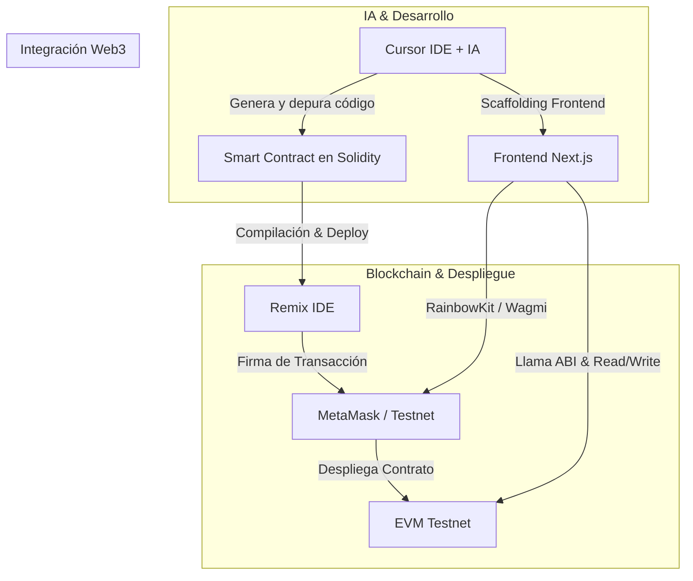

El desarrollo en **Web3** y la creación de aplicaciones descentralizadas (**dApps**) solían tener una curva de aprendizaje intimidante para muchos programadores. Entre entender la sintaxis de Solidity, configurar proveedores RPC, gestionar billeteras y conectar contratos inteligentes con interfaces modernas de React, el proceso requería dominar múltiples capas técnicas en simultáneo.

Hoy, la combinación de herramientas modernas como el editor de código asistido por inteligencia artificial **Cursor**, entornos de compilación rápida como **Remix IDE**, y bibliotecas de interfaz como **RainbowKit** y **Next.js**, permite acelerar drásticamente el ciclo de vida del desarrollo.

En este artículo y conversatorio técnico junto a mi amigo **Cristian ([@CaBsCrypto](https://twitter.com/CaBsCrypto))**, abordamos el desarrollo de una aplicación descentralizada de principio a fin, guiada por IA en Cursor y desplegada en una red de prueba pública.

---

## Video Completo del Tutorial y Conversatorio

A continuación puedes ver la sesión completa en formato de charla distendida, donde cubrimos cada detalle técnico en vivo:

<iframe src="https://www.youtube-nocookie.com/embed/IGxbLn8NNJI" title="Tu primer Smart Contract con IA en Cursor Desde 0: Solidity, NextJs, Metamask, Rainbowkit, Remix" allow="accelerometer; autoplay; clipboard-write; encrypted-media; gyroscope; picture-in-picture; web-share" allowfullscreen></iframe>

> **Canal de YouTube**: Puedes ver más contenidos y suscribirte en [@cjbaezilla](https://www.youtube.com/@cjbaezilla) y seguir a Cristian en su canal [@cabscrypto](https://www.youtube.com/@cabscrypto).

---

## Arquitectura General de la dApp

El flujo de trabajo abarca desde la concepción del contrato inteligente hasta su integración reactiva en el frontend:



---

## Pila Tecnológica Utilizada

| Herramienta | Rol en el Proyecto |
| :--- | :--- |
| **Cursor IDE** | Editor potenciado con IA para autocompletado inteligente, refactorización y depuración en tiempo real. |
| **Solidity (v0.8.x)** | Lenguaje orientado a contratos para la Ethereum Virtual Machine (EVM). |
| **Remix IDE** | Entorno de desarrollo basado en navegador para compilar, probar y desplegar contratos en testnets sin fricción. |
| **MetaMask / Rainbow** | Billeteras Web3 para gestionar claves criptográficas y firmar transacciones en la red. |
| **Next.js (App Router)** | Framework React full-stack para construir una interfaz moderna, rápida y optimizada. |
| **RainbowKit + Wagmi** | Conector de wallets y hooks reactivos para interactuar con la blockchain desde React. |

---

## 1. Maximizando el Flujo de Trabajo con Cursor en Web3

**Cursor** es un fork de VS Code optimizado de forma nativa para interactuar con modelos de lenguaje de última generación (como Claude 3.5 Sonnet y GPT-4o). En el contexto de Web3, Cursor ofrece tres ventajas clave:

1. **Contexto Profundo del Código (`@Files`, `@Folder`, `@Docs`)**: Puedes referenciar contratos anteriores, archivos ABI o documentación oficial de librerías para que la IA genere código adaptado exactamente a tu estructura.
2. **Edición Multi-archivo con Composer (`Ctrl+I` / `Cmd+I`)**: Permite generar tanto el contrato en Solidity como los componentes React que consumirán su ABI en una sola instrucción coordinada.
3. **Reglas de Proyecto (`.cursorrules`)**: Puedes definir un conjunto de estándares de seguridad para que la IA priorice patrones seguros (como Checks-Effects-Interactions, OpenZeppelin, etc.).

### Configuración sugerida para `.cursorrules` en proyectos Web3:

```text
Eres un desarrollador senior especializado en Web3, Solidity y Next.js.
- Prioriza versiones de Solidity 0.8.20 o superiores.
- Aplica siempre buenas prácticas de seguridad: previene reentrancy, valida entradas con require/custom errors y optimiza el consumo de gas.
- Para el frontend, utiliza Next.js App Router, TypeScript, Tailwind CSS, Wagmi v2 y RainbowKit.
- Documenta las funciones con especificación NatSpec en Solidity.
```

---

## 2. Creación del Smart Contract en Solidity

Con la ayuda de Cursor, diseñamos un contrato inteligente sencillo pero robusto para gestionar mensajes y registros en cadena.

```solidity
// SPDX-License-Identifier: MIT
pragma solidity ^0.8.20;

/**
 * @title MensajeriaWeb3
 * @dev Contrato de ejemplo para registrar y leer mensajes en blockchain
 */
contract MensajeriaWeb3 {
    // Variable de estado para almacenar el último mensaje
    string private s_mensajeActual;
    address public immutable i_propietario;
    uint256 public s_totalMensajes;

    // Eventos para indexación en frontend y exploradores
    event MensajeActualizado(address indexed autor, string nuevoMensaje, uint256 timestamp);

    // Errores personalizados (ahorro de gas)
    error MensajeVacio();
    error SoloPropietario();

    constructor(string memory _mensajeInicial) {
        i_propietario = msg.sender;
        s_mensajeActual = _mensajeInicial;
        s_totalMensajes = 1;
        emit MensajeActualizado(msg.sender, _mensajeInicial, block.timestamp);
    }

    /**
     * @notice Retorna el mensaje actual almacenado
     */
    function obtenerMensaje() external view returns (string memory) {
        return s_mensajeActual;
    }

    /**
     * @notice Actualiza el mensaje en la blockchain
     * @param _nuevoMensaje Nuevo texto a registrar
     */
    function actualizarMensaje(string memory _nuevoMensaje) external {
        if (bytes(_nuevoMensaje).length == 0) {
            revert MensajeVacio();
        }

        s_mensajeActual = _nuevoMensaje;
        s_totalMensajes += 1;

        emit MensajeActualizado(msg.sender, _nuevoMensaje, block.timestamp);
    }
}
```

---

## 3. Despliegue en Red de Pruebas con Remix IDE

Para desplegar el contrato sin necesidad de configurar scripts complejos de Hardhat o Foundry en las primeras etapas, utilizamos **Remix IDE**:

1. **Pegar el código en Remix**: Abre [remix.ethereum.org](https://remix.ethereum.org) y crea el archivo `MensajeriaWeb3.sol`.
2. **Compilación**: En la pestaña *Solidity Compiler*, selecciona la versión del compilador correspondiente (ej. `0.8.20`) y presiona **Compile**.
3. **Financiamiento de la Billetera**: Obtén tokens de prueba desde un Faucet oficial (por ejemplo, Sepolia ETH o Polygon Amoy MATIC).
4. **Despliegue con MetaMask**:
   - En la pestaña *Deploy & Run Transactions*, cambia el Environment a **Injected Provider - MetaMask**.
   - Ingresa el parámetro inicial del constructor (ej. `"¡Hola Web3!"`).
   - Haz clic en **Deploy** y confirma la transacción en tu billetera.
5. **Guardar el Contrato y ABI**: Una vez confirmada la transacción, copia la **Contract Address** y el **ABI** generado en Remix.

---

## 4. Creación del Frontend con Next.js y RainbowKit

En la segunda mitad del video, integramos el contrato desplegado dentro de una interfaz de usuario creada con **Next.js**, **RainbowKit** y **Wagmi**.

### A. Configuración de RainbowKit y Wagmi (`config/wagmi.ts`)

```typescript
import { getDefaultConfig } from "@rainbow-me/rainbowkit";
import { sepolia, polygonAmoy } from "wagmi/chains";

export const config = getDefaultConfig({
  appName: "DApp Cursor Tutorial",
  projectId: "TU_PROJECT_ID_DE_WALLETCONNECT",
  chains: [sepolia, polygonAmoy],
  ssr: true,
});
```

### B. Componente Principal de Interacción

```tsx
"use client";

import { useState } from "react";
import { useReadContract, useWriteContract, useWaitForTransactionReceipt } from "wagmi";
import { ConnectButton } from "@rainbow-me/rainbowkit";
import { CONTRACT_ADDRESS, CONTRACT_ABI } from "@/config/contract";

export default function DAppInterface() {
  const [nuevoTexto, setNuevoTexto] = useState("");

  // Lectura del mensaje actual desde el Smart Contract
  const { data: mensajeActual, refetch } = useReadContract({
    address: CONTRACT_ADDRESS,
    abi: CONTRACT_ABI,
    functionName: "obtenerMensaje",
  });

  // Escritura de transacción en el Smart Contract
  const { data: hash, writeContract, isPending } = useWriteContract();

  // Esperar confirmación de la transacción en la blockchain
  const { isLoading: isConfirming, isSuccess: isConfirmed } = useWaitForTransactionReceipt({
    hash,
  });

  const handleActualizar = async (e: React.FormEvent) => {
    e.preventDefault();
    if (!nuevoTexto.trim()) return;

    writeContract({
      address: CONTRACT_ADDRESS,
      abi: CONTRACT_ABI,
      functionName: "actualizarMensaje",
      args: [nuevoTexto],
    });
  };

  return (
    <div className="max-w-xl mx-auto p-6 bg-slate-900 border border-slate-800 rounded-2xl text-white">
      <div className="flex justify-between items-center mb-6">
        <h1 className="text-xl font-bold">DApp con Cursor & Next.js</h1>
        <ConnectButton />
      </div>

      <div className="p-4 bg-slate-800/60 rounded-xl mb-6 border border-slate-700">
        <span className="text-xs uppercase tracking-wider text-slate-400">Mensaje en Blockchain</span>
        <p className="text-lg font-semibold text-cyan-400 mt-1">
          {mensajeActual ? String(mensajeActual) : "Cargando mensaje..."}
        </p>
      </div>

      <form onSubmit={handleActualizar} className="space-y-4">
        <input
          type="text"
          value={nuevoTexto}
          onChange={(e) => setNuevoTexto(e.target.value)}
          placeholder="Escribe un nuevo mensaje para la red..."
          className="w-full px-4 py-3 bg-slate-800 border border-slate-700 rounded-xl focus:outline-none focus:border-cyan-500"
        />
        <button
          type="submit"
          disabled={isPending || isConfirming || !nuevoTexto}
          className="w-full py-3 bg-gradient-to-r from-cyan-500 to-blue-600 font-semibold rounded-xl hover:opacity-90 disabled:opacity-50 transition"
        >
          {isPending ? "Firmando en Wallet..." : isConfirming ? "Confirmando en Bloque..." : "Actualizar en Blockchain"}
        </button>
      </form>

      {isConfirmed && (
        <div className="mt-4 p-3 bg-emerald-950/60 border border-emerald-800 rounded-xl text-emerald-300 text-sm">
          ¡Transacción confirmada exitosamente! Recarga para ver el cambio.
        </div>
      )}
    </div>
  );
}
```

---

## 5. Conclusiones y Aprendizajes

1. **La IA como copiloto, no como piloto ciego**: Cursor agiliza enormemente la escritura del boilerplate, la tipificación de interfaces de TypeScript para Web3 y la resolución de errores comunes de compilación. Sin embargo, el criterio del desarrollador sigue siendo indispensable para revisar los permisos, la lógica de negocio y las implicaciones de gas en Solidity.
2. **Ecosistema Web3 unificado**: La integración de **RainbowKit** con **Wagmi v2** y **Next.js** proporciona la mejor experiencia tanto para los usuarios finales (conexión fluida de múltiples billeteras como MetaMask, Rainbow, Coinbase Wallet) como para los desarrolladores (manejo de estados reactivos nativo de React).
3. **Prototipado a velocidad récord**: Lo que anteriormente tomaba días de configuración ahora puede desarrollarse y probarse en una sola tarde de trabajo enfocado.